# Advanced Maps

[](https://github.com/Jin1c-3/obsidian-advanced-maps/actions/workflows/ci.yml)
[](LICENSE)

**English** · [简体中文](README.zh-CN.md)

Adds to Obsidian's built-in **Maps** view instead of replacing it: GPX tracks,
geotagged photos, Chinese coordinate systems, inline maps, and four ways to fill
in a note's coordinates. Everything the built-in view already does — markers,
icons, colours, tiles, popups — stays the built-in view doing it. No Leaflet, no
vendored map library, no runtime dependencies.

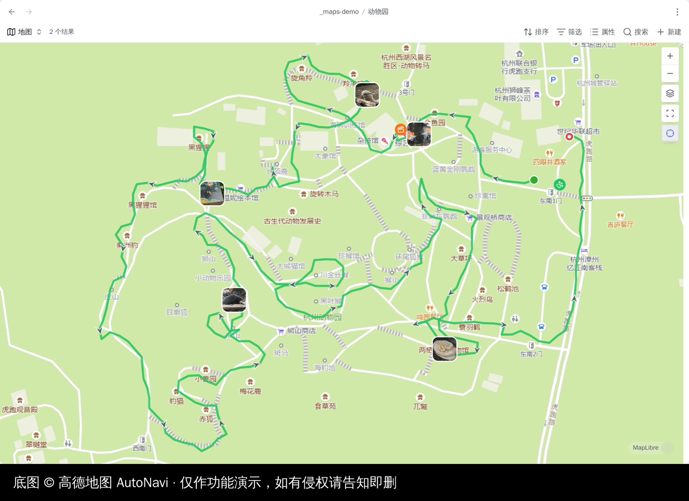

## What it fixes

| Problem                                                               | What this plugin does                                                             |
| --------------------------------------------------------------------- | --------------------------------------------------------------------------------- |
| A note has a `.gpx` attached, and the map shows only a pin.           | Draws the track, in that note's colour, with start/end pins and direction arrows. |
| The `.gpx` knows how far you walked, and nothing tells you.           | Distance, ascent, moving time and pace, with a hoverable elevation profile.       |
| Mainland basemaps aren't WGS-84, so every pin floats a few streets.   | Converts on the way to the map and back. Nothing on disk changes.                 |
| The map opens on the whole world.                                     | Auto-frames markers _and_ tracks, and gets out of the way once you pan.           |
| `![[track.gpx]]` renders as a link.                                   | Renders it as a real map, inline.                                                 |
| A map beside the note you are editing drifts away from it.            | Press ⊹ and it follows the note you switch to. The base's query is never touched. |
| A trip note is about six places, and a note holds one coordinate.     | One line embeds a map of the notes around it. Drag a note in and it appears.      |
| A share link, and you have to dig the numbers out — in which datum?   | Paste it. WGS-84 comes out, whatever went in.                                     |
| Filling in coordinates by hand.                                       | Search a place name, or take it from where you are — on desktop too.              |
| A geotagged photo just sits in the vault, its location unread.        | Draws its own pin from its EXIF GPS tags, its own thumbnail as the icon.          |
| Nine notes at one address are one pin, and eight of them unclickable. | Zoom in and they fan out onto a ring, each one its own pin again.                 |

## Requirements

Obsidian 1.13.1+, **Bases** enabled, and the first-party **Maps** plugin — that
is the view this one extends. Without it Advanced Maps says so and does nothing.

## Install

**From a release.** Drop `main.js`, `manifest.json` and `styles.css` from
[Releases](https://github.com/Jin1c-3/obsidian-advanced-maps/releases) into
`<vault>/.obsidian/plugins/advanced-maps/` and enable it.

**With BRAT.** Add `Jin1c-3/obsidian-advanced-maps`.

## Pins that share a spot

Notes written about one address share its coordinate exactly, and pins that
share a coordinate are one pin: whichever note is on top opens, and the rest
cannot be reached at all. Zoom past 15 and they fan apart onto a ring around
the spot, one pin each, so any of them can be hovered and opened. Zoomed out
they close back into a single pin, because at that scale the ring would be a
lie about where they are.

The ring is drawn on screen only — no note is moved, nothing is written, and
"Copy coordinates" still answers the coordinate the note actually holds.
**Fan out pins that share a spot** turns it off.

## Tracks

Attach a `.gpx`, `.geojson`, `.kml` or `.tcx` to a note and any map view whose
base includes that note draws the track. Nothing to configure, and no need to
widen a filter to let attachments into the result set.

The `!` decides whether the note also gets a map of its own: `![[walk.gpx]]`
gives you the line on every base map **and** an inline map in the note;
`[[walk.gpx]]` — or a `track: "[[walk.gpx]]"` property — gives you only the line.

Every track carries a start pin, a differently-shaped end pin, and arrows showing
which way it went. Named waypoints show their name on hover, inline. **Show track
markers** turns all of it off.

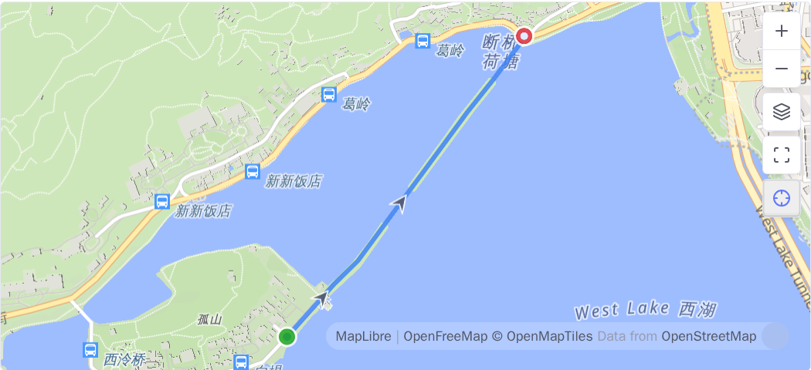

## Photos

A photo with a GPS tag is a track with one point in it, so it gets a pin the
same way a `.gpx` gets a line — link or embed a `.jpg`, `.png`, `.webp`,
`.heic`, `.heif` or `.avif` that carries one, and any map view whose base
includes that note draws it. The photo's own embedded thumbnail becomes its
icon on the map once it has decoded; a plain dot stands in until then, and
whenever the tags carried no thumbnail at all.

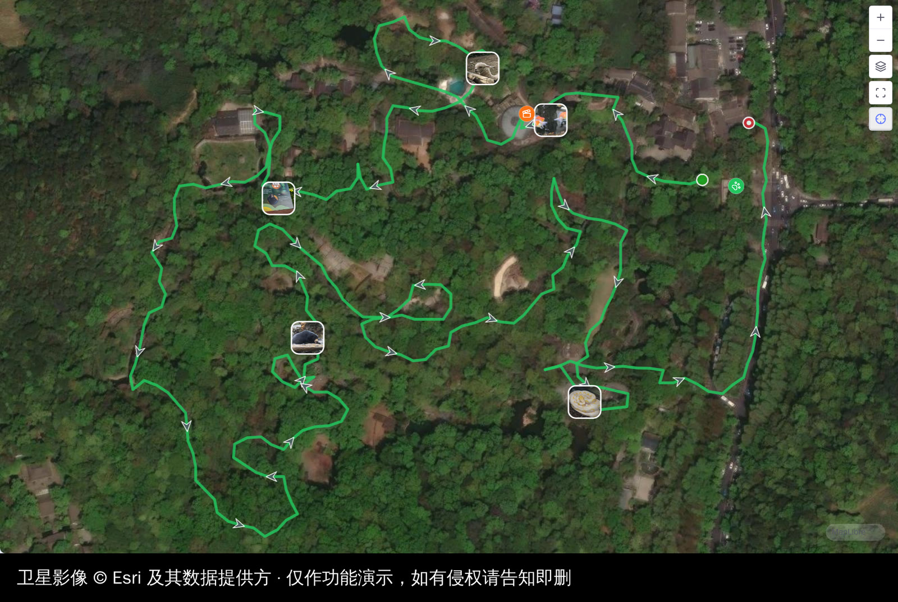

Zoomed out, a cluster of nearby photos thins on its own rather than piling
into an unreadable stack, and comes back the moment you zoom in far enough to
give them room. **Show photos on the map** and **Show photo thumbnails** turn
either half off; **Photo coordinate system** says what datum an unlabelled
photo's coordinate is written in — WGS-84 by default, which is both what the
EXIF specification calls for and what real phones measured against it turned
out to write.

An inline `![[track.gpx]]` map draws the photos of the note it sits in, so a
walk and the pictures taken on it are one map. The distance, ascent and
elevation profile underneath still measure the track alone.

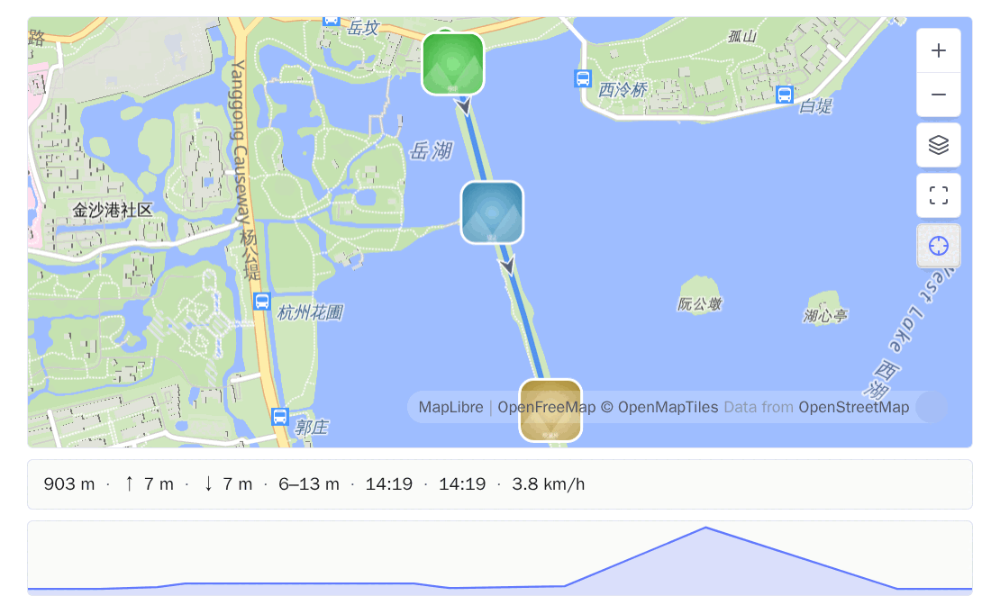

Hovering a photo shows its note's card, the same one hovering a track shows.
Clicking it shows the photo, full size, with an **Open note** row underneath —
one note often holds a dozen photos, and opening the note would throw away
which of them you pointed at. It opens in a pop-up rather than a tab because
clicking a map makes that map's pane the active one, so opening the picture in
a pane would replace the map you clicked on. Hold Ctrl/Cmd to get the image
file in a new tab anyway.

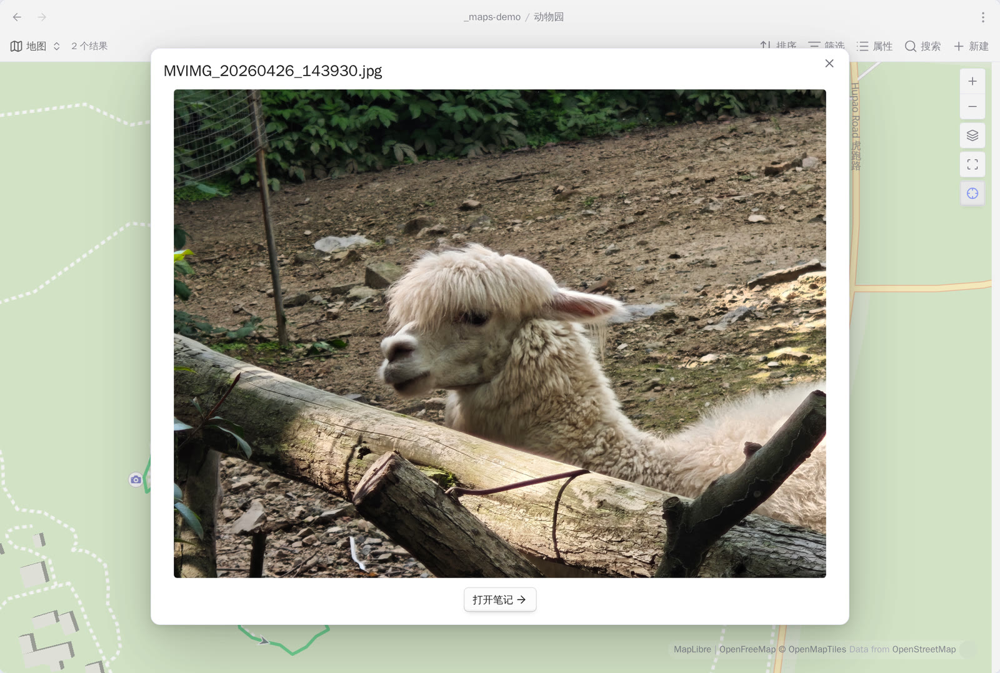

_Set coordinates from a photo_ reads the same tag straight into a note's
`coords` property, for a note that should carry its own coordinate rather than
only draw the photo's.

Only the first few kilobytes of a photo are ever read — never the picture
itself, and never the vault. A photo is read, never written to.

## Inline maps

The same embed renders as a real map in the note — pan it, zoom it, switch its
background — with the numbers the file was carrying all along underneath.

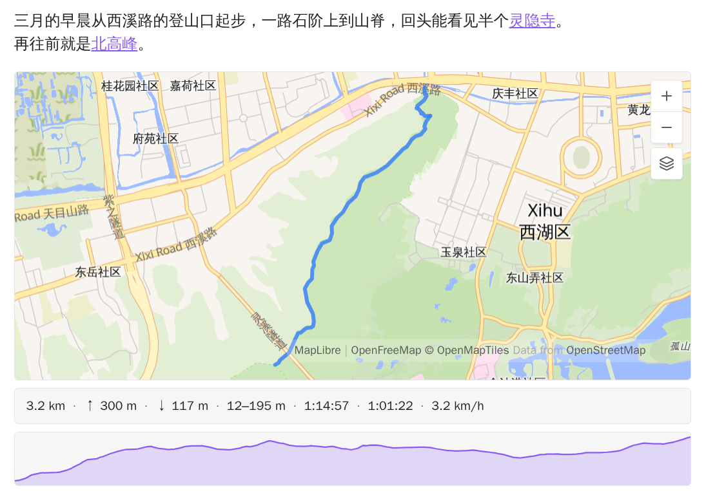

Distance, ascent and descent, elevation range, elapsed and moving time, pace.
Whatever the file does not record is left out rather than shown as zero. Hover
any number to see what it is; hover the profile and a point moves along the track
on the map, and the other way round. Both the line and the profile can be
switched off.

Two numbers are set the careful way: **ascent** ignores drift under 5 m, because
raw GPS elevation is noisy enough to invent hundreds of metres of climb, and
**moving time** counts anything above 0.9 km/h, low enough that walking up steps
still counts as walking.

## View options

The built-in options are untouched; two groups are appended — **Tracks** behind
Markers, **Coordinate system** behind Background.

| Option                 | Meaning                          |
| ---------------------- | -------------------------------- |
| Line width             | Track stroke width               |
| Line opacity           | Track stroke opacity             |
| Max zoom when fitting  | Upper bound for auto-fit         |
| Tile coordinate system | Blank follows the plugin setting |

## Coordinate systems

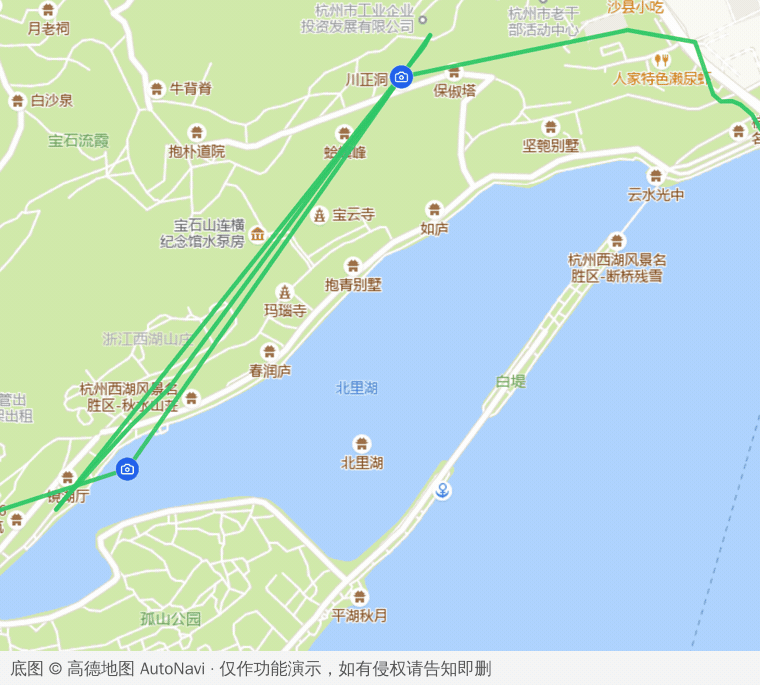

Both frames are the same `.gpx` on the same tiles. Off, the walk runs over 宝石山;
on, it lands on 白堤 — about 520 m, and every pin moves with it.

Leave it on **Auto** and the system is read off the tile URL: mainland hosts
serving GCJ-02 or BD-09 are recognised by name, everything else is WGS-84. Set a
default in settings, or force one per view when a proxied URL can't reveal where
it came from.

## Open a spot in another map app

Right-click a map. Alongside the built-in items is _Open in external map_.

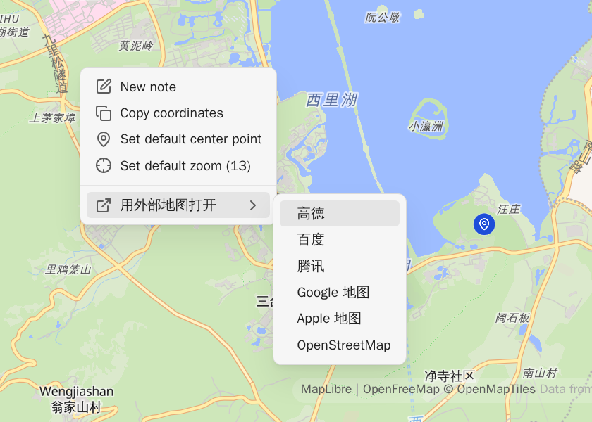

Each app is sent the datum it expects, converted from the spot you clicked:
GCJ-02 to Amap and Tencent, BD-09 to Baidu, WGS-84 or GCJ-02 to Google and Apple
depending on whether the point is inside China. That is the whole difficulty —
the same six links built naively land wrong in three different ways, none of them
visible until you are standing in the wrong street.

Reorder the six under **Open in external map** in settings, switch off the ones
you never reach for, or switch all six off and nothing is added to the menu.
**Your own** starts empty; an entry is a name, a URL and the datum that URL
expects:

```
https://ul.waze.com/ul?ll={lat},{lng}&navigate=yes      WGS-84
https://www.bing.com/maps?cp={lat}~{lng}&lvl=16         WGS-84
om://map?v=1&ll={lat},{lng}                             WGS-84
```

App schemes work too — `waze://`, `iosamap://`, `comgooglemaps://`. The datum is
stated rather than guessed, because a mirror of a Chinese provider looks like an
ordinary host and getting it wrong does not fail, it just puts the pin a few
streets away.

## One base, reused everywhere

**You keep a single `.base` file, and every map in the vault is that base seen
through a different filter.** Pick it once under **Base file path** — the box
lists the `.base` files in your vault. From then on it answers all three
questions a map has to settle:

| Question                     | Where the answer lives                                             |
| ---------------------------- | ------------------------------------------------------------------ |
| Which notes count as places? | The base's own filters — a folder, a tag, a property               |
| What does a pin look like?   | The base's formulas, through **Marker icon** and **Marker colour** |
| Where is the coordinate?     | The map view's **Coordinates** property                            |

Tune the look once and every map follows, retroactively, because none of them
carry a copy of your base — they reference it. Several unrelated sets of places?
A base each is fine; **Base file path** just names the one the commands use.

### Open in map

Notes carrying the coordinate property (`coords` by default) get an _Open in map_
entry on their ⋮ menu. It is your base, with your filters and icons — the camera
moves to that note and its popup opens. Nothing is copied or rewritten.

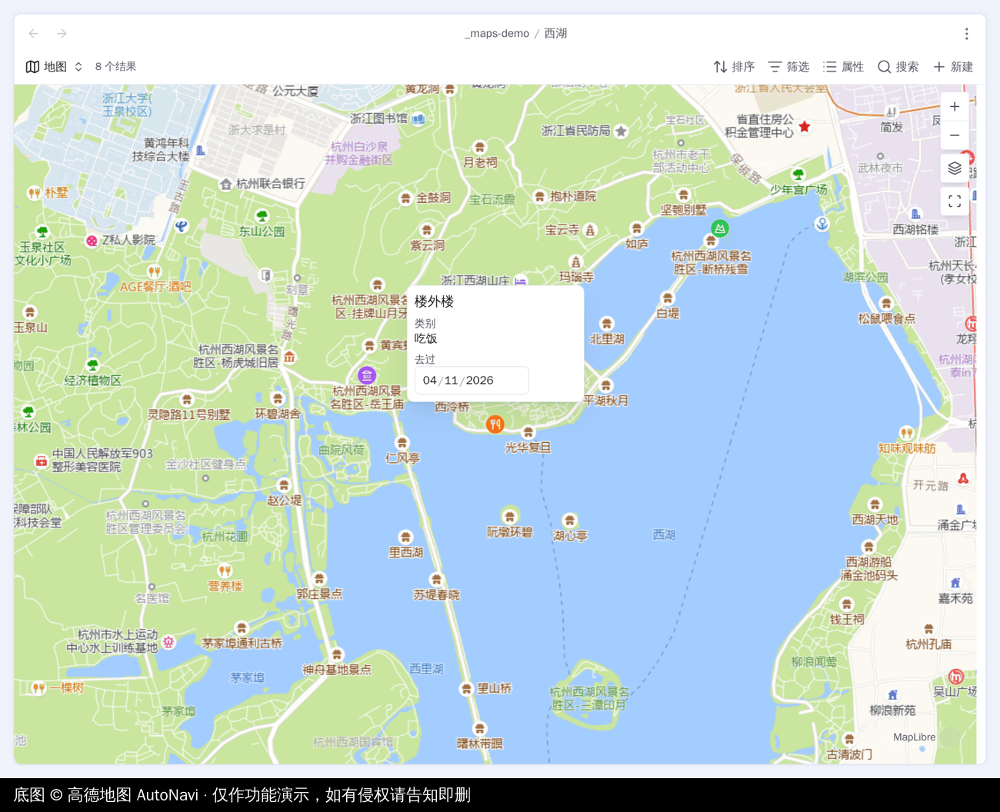

**Open in** picks where it lands. **A tab** opens the base file itself, reusing a
tab already showing it, so pressing this on one note after another is a single
map that keeps moving — and because it is the real file, changes you make on the
map are kept. **A pop-up** leaves your layout alone, at the cost of having
nowhere to write a view option back to.

### Follow the active note

Every map carries a ⊹ button next to zoom-to-fit. Press it and that map pans to
whichever note you switch to and opens its popup. Your zoom is left alone, and
the base's query is never touched: only the camera moves.

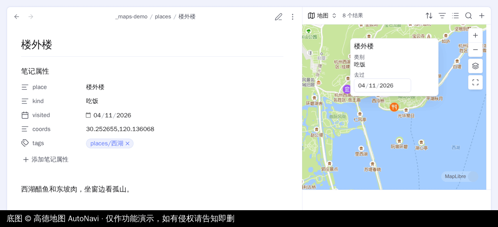

It is per map, not per plugin — a map in a sidebar and a map in the tab beside
your note can follow while the one you are reading in another tab sits still.
A following map also stays out of your way: the popup opens without taking the
caret out of your editor, and clicking a pin opens that note **in the pane the
map is following** rather than replacing the map with it. **New maps follow the
active note** sets which way the button starts.

### A map of the notes around a note

_Insert a map of the notes around this one_ writes a single line into the note
you are in:

```
![[places.base#Around]]
```

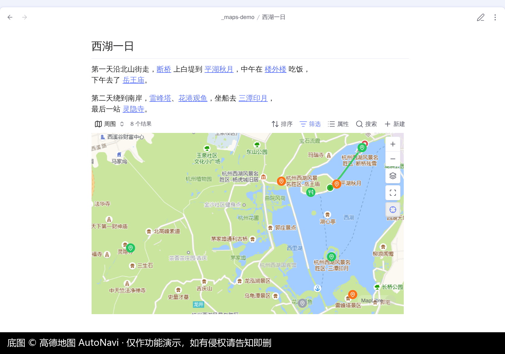

It is a view in your own base, filtered to the notes this one **links to**, the
notes **that link to it**, and the note itself. Drag a note into the body —
Obsidian makes a link, the way it always does — and it appears on the map. Delete
the link and it goes. There is no list to keep: the links around the note _are_
the map.

The view is added to the base the first time and referenced after that, so a
later change to the base reaches every map already inserted. Two edges: **the
link names the view**, so renaming it in Bases makes inserted maps stop resolving
quietly, and **the base's own filters still apply**, so a note kept outside a
folder-scoped base can collect other notes onto a map but not put itself on one.

## Filling in coordinates

### From a map link

A location almost never arrives as a coordinate — it arrives as a share link.
_Set coordinates from a map link_ takes one and fills the property.

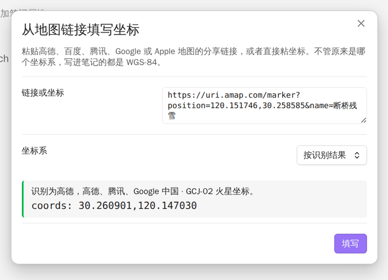

It reads the share links the common mainland and international apps produce, plus
`geo:30.26,120.15`, DMS (`30°15'39"N 120°08'49"E`) and plain `30.26,120.15`. Each
shape is read by its own rules, because they disagree about both axis order and
datum. Whatever goes in, **WGS-84 comes out**, and the datum is shown before
anything is written.

The box opens with your clipboard already in it. Shortened links hold no
coordinate until they are resolved, and this plugin will not quietly hand your
link to a third party to do it.

### By searching for the place

_Search for a place and set coordinates_ looks a name up and writes what comes
back, in your own Obsidian language.

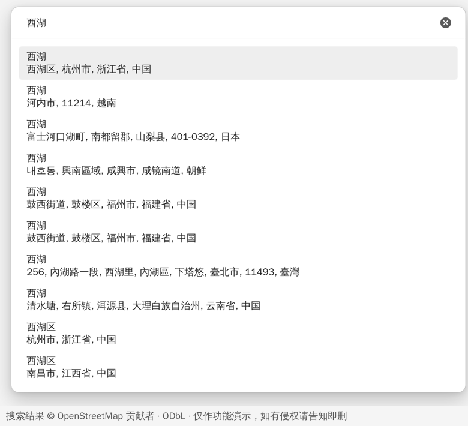

Two sources: an open worldwide one that needs no signing up but is thin on
mainland places, and a mainland one that needs a free web-service key and knows
them far better. A source that answers in GCJ-02 is converted on the way in.

The key goes in **secret storage** (Obsidian's own — never synced or committed,
and stays on the one device) or in **plugin settings** (one entry covers every
device, in plain text). New installs start on secret storage; a key you had
before this existed stays where it was until you move it.

### From coordinates, backwards

_Fill place name from coordinates_ reads the coordinate property and writes back
an address, into **Place property** (default `location`). It reuses whichever
provider and key place search is set up with. Point both settings at the same
property and it refuses rather than overwriting the coordinate it just read.

### From where you are

Switch on **Enable location** and a note whose coordinate property is _present
but empty_ gets filled in with where you are — give a template an empty `coords:`
and every note made from it is stamped. Something already there is never
overwritten, and a note without the property never gains one. _Fill coordinates
from current location_ overwrites on demand.

Values are written as `lat,lng` in WGS-84. Paths matching **Skip paths
containing** (default `templates`) are left alone. It works on desktop as well as
mobile, where the plugins before this one gave up — current Chromium asks the
operating system, so no API key is involved. That still needs the OS location
service on, so the plugin asks once and stops asking for the session if the
platform refuses.

## What leaves your vault

Your notes and your tracks never go anywhere on their own. The one exception is a
coordinate you deliberately hand to _Fill place name from coordinates_.

| When                                       | What goes out                                               | To                                      |
| ------------------------------------------ | ----------------------------------------------------------- | --------------------------------------- |
| Any map is on screen                       | Tile requests, so your IP and the area you are looking at   | Whichever background the view is set to |
| You type in the search box                 | The words you typed, your language, your key if you set one | The search source you picked            |
| You run _Fill place name from coordinates_ | The one coordinate you ran it on                            | The search source you picked            |
| You pick _Open in external map_            | The one spot you right-clicked, in that browser tab         | The map app you chose, in your browser  |
| You switch on **Enable location**          | Nothing leaves — the fix comes from the operating system    | —                                       |

No telemetry, no update ping, no server of its own. Two things worth knowing if
you are deploying this for other people: a search key appears in the request URL
wherever you keep it — secret storage keeps it out of the settings file, not out
of the query — and a note's coordinate history can be personal information in a
way a note's text is not.

## Attribution

The screenshots were taken against third-party basemaps and search services to
show what the plugin does; each image carries its source. The demo notes behind
them are synthetic, and the West Lake places and trail are openly published data.
The zoo photographs and the track through them are the author's own — one
afternoon, animals in a public zoo — and nothing else personal is shown.

The plugin ships no map data of its own. It draws whatever tiles the view is
configured with, and their copyright and licensing are the tile provider's and
the user's. If you hold rights in anything reproduced here and would rather it
were not, [open an
issue](https://github.com/Jin1c-3/obsidian-advanced-maps/issues) and it will be
removed promptly.

## Development

```bash
git clone https://github.com/Jin1c-3/obsidian-advanced-maps
cd obsidian-advanced-maps
npm install
cp .env.example .env      # point OBSIDIAN_PLUGIN_DIR at a vault
npm run dev               # watch, rebuild into that vault, hot-reload
npm run check             # prettier, eslint, tsc, vitest — the same set CI runs
```

`npm run dev` drops a `.hotreload` marker beside the build, which is what
[pjeby/hot-reload](https://github.com/pjeby/hot-reload) watches for. You need a
vault with **Bases** on and the first-party **Maps** plugin installed.

- [ROADMAP.md](ROADMAP.md) — what might come next, and what deliberately will not.
- [CLAUDE.md](CLAUDE.md) — architecture, the internals this leans on, and the
  non-obvious things not to undo.
- [CONTRIBUTING.md](CONTRIBUTING.md) — setup, tests, house rules, translations.

New language: one object in `src/i18n.ts` plus one line in `LOCALES`. English is
the source of truth and its keys are the type, so a missing entry is a compile
error.

## Licence

[MIT](LICENSE).
