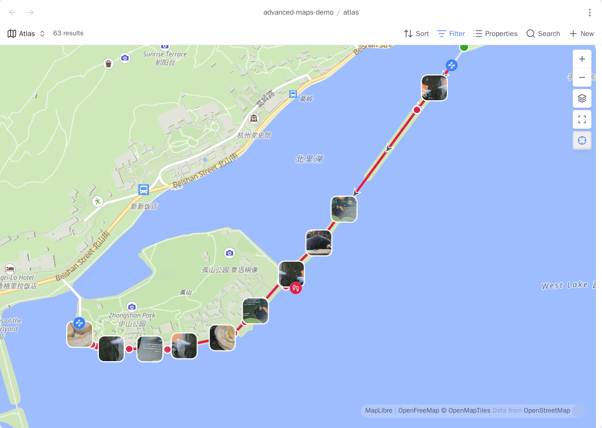

# Advanced Maps

[](https://github.com/Jin1c-3/obsidian-advanced-maps/actions/workflows/ci.yml)
[](LICENSE)

**English** · [简体中文](README.zh-CN.md) · [User guide](https://jin1c-3.github.io/obsidian-advanced-maps/en/) ([in this repository](docs/guide/en/README.md))

Turn Obsidian's native **Maps** view into a photo atlas, a route viewer, and a
map of the notes connected to the one you are reading.

Advanced Maps reads GPS from whole photo folders, draws GPX/GeoJSON/KML/TCX
routes and areas, and creates an **Around** view from ordinary Obsidian links. It
extends the first-party Maps view instead of replacing it: MapLibre,
backgrounds, markers, popups, and every built-in map option remain native. No
Leaflet, no bundled renderer, no runtime dependencies.



_One Base, one map: the pins are place notes coloured by a Base formula,
thumbnails are photos placed by their own EXIF, and the line is a `.gpx` a note
links to. 63 results._

## Three workflows

| Use Advanced Maps as… | Put this in the Base                                                             | What appears                                                                 |
| --------------------- | -------------------------------------------------------------------------------- | ---------------------------------------------------------------------------- |
| **A map photo album** | A photo folder, including a link to an external album                            | Every photo with readable GPS, at its EXIF location                          |
| **A route viewer**    | Notes linked to `.gpx`, `.geojson`, `.kml`, or `.tcx` files—or those files alone | Routes, areas, markers, photos, elevation, and statistics a Base can sort on |
| **An Around map**     | Your place-note collection                                                       | The current note, its links and backlinks, plus their tracks and photos      |

These compose. One map can show place notes, a multi-day route, and every
geotagged photo taken along it.

## Advanced Maps and Map View

[Map View](https://github.com/esm7/obsidian-map-view) is the other map plugin for
Obsidian, and it is a whole GIS: its own map view, its own query language,
display rules, an edit mode, routing, and a Bases view of its own. Advanced Maps
is a different shape. It has no map view of its own at all — it adds to the one
the Obsidian developers ship with Bases, and it bundles no renderer.

Map View's own [comparison with the native Maps view](https://esm7.github.io/obsidian-map-view/vs-obsidian-maps/)
is a fair one, and the column it marks unsupported is the clearest description of
what this plugin is for:

| Native Maps on its own | With Advanced Maps                                                                                                                |
| ---------------------- | --------------------------------------------------------------------------------------------------------------------------------- |
| No paths               | GPX, GeoJSON, KML and TCX, linked from a note or mapped as files, with areas, direction arrows, elevation profiles and statistics |
| No geocoding           | Place search and reverse geocoding, through OpenStreetMap or Amap                                                                 |
| Display only           | Coordinates entered from the map, a pasted map link, a photo's EXIF, a search result, or the device's own position                |
| No offline usage       | A folder of tiles already on disk as the background of every map, with no request leaving the machine                             |

Markers stay native throughout, which is the whole point of extending rather than
replacing: Bases formulas still decide their icon and colour, filters still work,
and every built-in view option is still there.

**Map View is the better choice** if you want several locations in one note,
inline geolocations in the body text, marker display rules, built-in routing, or
a map that does not need Bases at all. Advanced Maps does none of those, and
[ROADMAP.md](ROADMAP.md) records which of them are deliberate non-goals and why.
Both read a `lat,lng` coordinate from front matter, so one property can feed
either.

## Requirements and install

Advanced Maps requires Obsidian 1.13.1 or newer with **Bases** enabled and the
first-party **Maps** plugin installed. Without that native view, it reports or
skips the unavailable enhancement and leaves Obsidian usable.

Install it from inside Obsidian: open **Settings → Community plugins**, turn off
**Restricted mode** if it is on, select **Browse**, search for `Advanced Maps`,
then **Install** and **Enable**. The store listing is
[community.obsidian.md/plugins/advanced-maps](https://community.obsidian.md/plugins/advanced-maps).

For a build the store does not have yet, copy `main.js`, `manifest.json`, and
`styles.css` from [Releases](https://github.com/Jin1c-3/obsidian-advanced-maps/releases) into
`<vault>/.obsidian/plugins/advanced-maps/`, or add
`Jin1c-3/obsidian-advanced-maps` in BRAT.

## Quick start

Save this as `atlas.base`, replace the folder paths, open it, and choose its map
view:

```yaml
filters:
  or:
    - file.inFolder("places")
    - file.inFolder("assets/onedrive/Pictures")
views:
  - type: map
    name: Atlas
    coordinates: coords
    trackWeight: 4
    trackOpacity: 85
    fitMaxZoom: 16
```

The first branch maps notes whose `coords` property holds a coordinate. The
second maps supported photos directly from their GPS metadata. See
[Getting started](docs/guide/en/getting-started.md) for the Base boundary, view
keys, supported photos, and the next recipes.

## User guide

| Topic                                                                 | Covers                                                                            |
| --------------------------------------------------------------------- | --------------------------------------------------------------------------------- |
| [Getting started](docs/guide/en/getting-started.md)                   | Installation, Base boundaries, first map, view keys                               |
| [Photo maps](docs/guide/en/photo-maps.md)                             | Photo folders, OneDrive, linked photos, thumbnails, index                         |
| [Tracks and areas](docs/guide/en/tracks-and-areas.md)                 | Route links, inline maps, GPX/GeoJSON/KML/TCX, polygons, statistics as properties |
| [Around and navigation](docs/guide/en/around-and-navigation.md)       | Around views, reusable Base, Open in map, follow, measuring, shared pins          |
| [Places in and out](docs/guide/en/places-in-and-out.md)               | Importing a file of placemarks as notes, exporting a Base as GPX/KML/CSV          |
| [Offline basemap](docs/guide/en/offline-basemap.md)                   | Named tile packs already on disk, picked from the map, with their own zoom bounds |
| [Coordinates and services](docs/guide/en/coordinates-and-services.md) | WGS-84/GCJ-02/BD-09, external maps, search, geocoding, location                   |
| [Reference and privacy](docs/guide/en/reference-and-privacy.md)       | Supported inputs, option ownership, operational limits, network disclosure        |

Notes, tracks, and photo contents do not leave on their own. The plugin has no
telemetry, update ping, or server; the
[privacy reference](docs/guide/en/reference-and-privacy.md#what-leaves-your-vault)
lists the requests made when you use maps or external services.

## Project documentation

- [CONTRIBUTING.md](CONTRIBUTING.md): setup, testing, pull requests, and releases.
- [OpenSpec capabilities](openspec/specs): stable technical contracts.
- [CHANGELOG.md](CHANGELOG.md): released behavior.
- [ROADMAP.md](ROADMAP.md): possible future work and deliberate non-goals.

## Licence

[MIT](LICENSE).
