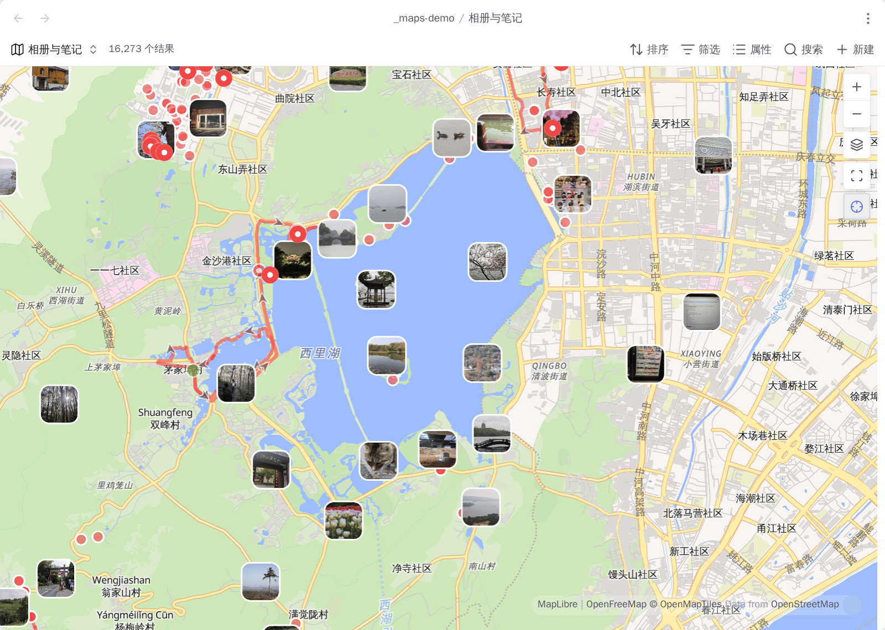
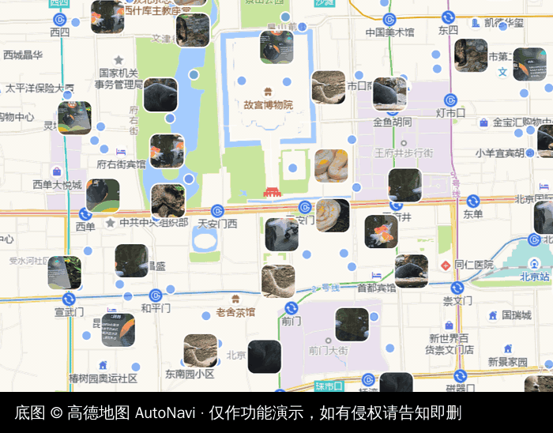

# Advanced Maps

[](https://github.com/Jin1c-3/obsidian-advanced-maps/actions/workflows/ci.yml)
[](LICENSE)

[English](README.md) · **简体中文**

把 Obsidian 原生的 **Maps** 视图变成地图相册、轨迹浏览器，以及「本篇相关笔记」的地图。

Advanced Maps 可以直接读取整个照片目录的 GPS，绘制 GPX/GeoJSON/KML/TCX 轨迹，并根据
普通的 Obsidian 双链生成**周围**视图。它增强第一方 Maps，而不是替换它：MapLibre、底
图、图钉、气泡和所有内置地图选项仍由原生视图负责。没有 Leaflet，没有自带渲染器，也没
有运行时依赖。



_一个 base，一张地图：红色图钉是地点笔记，缩略图是照片按自己的 EXIF 落点，线是某篇笔记
链接的 `.gpx`，共 16,273 条结果。_

## 三个核心用法

| 把 Advanced Maps 当作…… | Base 里筛选什么                                                        | 地图上出现什么                                                     |
| ----------------------- | ---------------------------------------------------------------------- | ------------------------------------------------------------------ |
| **地图相册**            | 一个照片目录，也可以是指向 OneDrive 等库外目录的软链接                 | 每张带可读 GPS 的照片，按 EXIF 位置显示自己的缩略图                |
| **轨迹浏览器**          | 链接了 `.gpx`、`.geojson`、`.kml` 或 `.tcx` 的笔记，或这些轨迹文件本身 | 轨迹、方向箭头、起终点、照片、距离、爬升、时间、配速和高程         |
| **周围地图**            | 平时使用的地点笔记集合                                                 | 只显示本篇、它链接的笔记、链接到它的笔记，以及这些笔记的轨迹和照片 |

三者可以叠加：同一张地图同时显示地点笔记、多日 GPX 轨迹，以及沿途拍下的所有定位照
片。


## 环境要求与安装

需要 Obsidian 1.13.1 或更高版本，并启用 **Bases** 和第一方 **Maps** 插件。找不到原生
视图时，插件会说明缺什么，然后安静退场，而不是加载一半。

- **Release：**从 [Releases](https://github.com/Jin1c-3/obsidian-advanced-maps/releases)
  下载 `main.js`、`manifest.json` 和 `styles.css`，放进
  `<库>/.obsidian/plugins/advanced-maps/`，然后启用插件。
- **BRAT：**添加 `Jin1c-3/obsidian-advanced-maps`。

## 选择你需要的 Base 配方

Base 的筛选器决定地图的边界。Advanced Maps 再把命中的每篇笔记展开成它链接的轨迹和照
片。照片文件本身也可以直接成为 Base 结果——整目录地图相册就是这样实现的。

下面每段都是完整的 `.base` 文件。复制到库根目录、打开文件并切换到地图视图即可。之后
仍然可以在 Bases 界面里继续修改筛选器和视图选项。

### 渲染整个照片目录，并与地点笔记同图显示

复制为 `地图相册.base`，把两个目录替换成自己的路径：

```yaml
filters:
  or:
    - file.inFolder("places")
    - file.inFolder("assets/onedrive/Pictures")
views:
  - type: map
    name: 地图相册
    coordinates: coords
    trackWeight: 4
    trackOpacity: 85
    fitMaxZoom: 16
```

第一个分支提供地点笔记，笔记的 `coords` 属性变成普通图钉；第二个分支直接提供照片文
件。支持 JPG、JPEG、PNG、WebP、HEIC、HEIF 和 AVIF。

视图里的后三个键，就是本插件追加到 Bases 界面**轨迹**和**坐标系**分组下的选项。不写这
些键时，由插件设置决定：

| 键             | 视图中的选项 | 含义                         |
| -------------- | ------------ | ---------------------------- |
| `trackWeight`  | 线宽         | 轨迹线宽                     |
| `trackOpacity` | 线条透明度   | 轨迹线透明度                 |
| `fitMaxZoom`   | 自动缩放上限 | 自动取景最多放大到哪一级     |
| `coordSystem`  | 瓦片坐标系   | 留空则跟随插件默认值，见下文 |

这里的「所有照片」准确地说是**所有带可读 GPS 元数据的照片**。没有 GPS 的文件没有诚实
的位置可放，所以仍会留在 Base 结果中，但地图不会编造图钉。带 GPS 却没有可用内嵌缩略
图的照片仍会显示为普通圆点。

#### 把 OneDrive 等库外相册接进 Obsidian

不用把照片复制进库。在库内建立一个指向外部目录的软链接，让 Obsidian 建立索引，再把这
个库内路径写进 Base 筛选器即可。

macOS 或 Linux：

```bash
mkdir -p "/path/to/MyVault/assets/onedrive"
ln -s "/path/to/OneDrive/Pictures" "/path/to/MyVault/assets/onedrive/Pictures"
```

Windows PowerShell（目录联接通常不需要符号链接可能要求的管理员权限）：

```powershell
$vault = "C:\Users\you\Documents\MyVault"
New-Item -ItemType Directory -Force -Path "$vault\assets\onedrive"
New-Item -ItemType Junction `
  -Path "$vault\assets\onedrive\Pictures" `
  -Target "$env:USERPROFILE\OneDrive\Pictures"
```

然后重新加载库，在 Base 里使用：

```yaml
- file.inFolder("assets/onedrive/Pictures")
```

这是桌面文件系统配置。每台需要看到相册的桌面设备都要建立对应链接；移动端不能复用桌面
链接。请让云端文件保持本机可读，避免链接形成目录循环，并把源目录当作外部数据：先确认
自己的备份与同步服务如何处理目录链接，不要默认库会覆盖它。Advanced Maps 只读照片，绝
不会修改照片。

首次扫描每张照片最多只读开头 64 KiB。解析出的坐标、时间、方向和缩略图可用性会被缓
存，之后打开大型相册时，无需再次读取每一个没有变化的文件。

### 只渲染命中笔记所链接的照片

不要把照片目录放进 Base，只筛选笔记：

```yaml
filters:
  and:
    - file.inFolder("places")
views:
  - type: map
    name: 地点
    coordinates: coords
    trackWeight: 4
    trackOpacity: 85
    fitMaxZoom: 16
```

然后在命中的笔记里链接照片：

```markdown
---
coords: 30.2600,120.1500
---

[[IMG_1234.jpg]]
[[IMG_1235.heic]]
```

正文普通链接、`![[IMG_1234.jpg]]` 这种嵌入，以及属性里的文件链接都算。同一张解析成功的
照片只参与一次。Base 不需要包含附件目录；只有希望照片本身也显示在笔记里时，才需要加
`!` 做实际嵌入。


### 只保留一张地图，不让 GPX 再生成一张内联地图

使用普通链接，不加 `!`：

```markdown
---
coords: 30.215709,120.130799
---

[[track.gpx]]
```

只要 Base 包含这篇笔记，地图就会画出轨迹；在笔记正文里，`track.gpx` 仍是普通链接，因此
屏幕上只有原来的那一张地图。写在属性里也一样：

```yaml
track: '[[track.gpx]]'
```

只有确实想在正文里再放一张独立轨迹地图时，才使用嵌入：

```markdown
![[track.gpx]]
```

| 写法                     | Base 或周围地图 | 笔记里的内联轨迹地图 |
| ------------------------ | --------------- | -------------------- |
| `[[track.gpx]]`          | 绘制轨迹        | 无                   |
| `track: "[[track.gpx]]"` | 绘制轨迹        | 无                   |
| `![[track.gpx]]`         | 绘制轨迹        | 有                   |

### 只显示本篇相关笔记的位置与路线

先在 Advanced Maps 设置中选好复用的 **Base 文件路径**，再运行**插入本篇相关笔记的地
图**。命令会按需向该 Base 添加「周围」地图视图，并插入：

```markdown
![[places.base#周围]]
```

这个视图只保留：

- 放置嵌入的本篇笔记；
- 本篇链接到的笔记；
- 链接到本篇的笔记。

这些命中笔记所链接的轨迹和照片随后照常绘制。因此一篇旅行索引可以简单到：

```markdown
# 西湖周末

[[断桥]]
[[雷峰塔]]
[[灵隐寺]]
[[weekend.gpx]]

![[places.base#周围]]
```

`weekend.gpx` 没有 `!`，所以正文只有一张周围地图，GPX 线画在这张地图上，不会在链接下
面再生成第二张地图。


周围视图取「关联关系」与 Base 全局筛选条件的交集。被 Base 排除的笔记不会被周围视图强
行带回来。嵌入还保存了视图名；如果重命名视图，已有嵌入也要同步修改。

## 照片地图会做什么

照片坐标在库中保持 WGS-84，只在地图边界与笔记图钉、轨迹一起换算到底图坐标系。某台相
机把未标注的坐标写成了非标准格式时，可以用**照片坐标系**强制指定 WGS-84 或 GCJ-02。

缩小地图时，互相碰撞的缩略图会稳定地变稀疏，不会堆成看不清的一团；每张已定位照片仍有
一个圆点。放大后，有空间的缩略图会回来。**在地图上显示照片**和**显示照片缩略图**可以
分别关闭这两个图层。



悬停照片会显示它所属笔记的卡片（如果有）。点击会在地图上方打开原图，并提供**打开笔
记**；Ctrl/Cmd 点击则在新标签页打开图片文件。


**从照片填写坐标**可以把同一个 GPS 标签写进当前笔记的 `coords` 属性。**清空照片索
引**只会删除可重建缓存；地图继续工作，并在需要时重新读取元数据。

## 轨迹地图会做什么

链接的 GPX、GeoJSON、KML 和 TCX 会继承所属笔记的图钉颜色。轨迹带有不同的起点与终点
标记、方向箭头和具名途经点；**显示轨迹标记**可以关闭这些附加元素。


内联的 `![[track.gpx]]` 是一张实时地图，下面显示距离、累计爬升与下降、海拔范围、总时
长与移动时间、配速和高程剖面。源文件没有的数据直接省略，不会显示成 0。悬停剖面时，地
图上的游标会沿轨迹移动，反过来也一样。


累计爬升会忽略 5 米以内的变化，抑制 GPS 漂移；移动时间统计 0.9 km/h 以上的速度，让慢
走和爬楼梯仍然算作移动。

内联轨迹地图还会绘制宿主笔记链接的定位照片。下方统计仍然只描述轨迹本身。


## 一个 Base，处处复用

在 Advanced Maps 设置里指定一次 **Base 文件路径**和**视图名称**。同一个 Base 随
后驱动「在地图中打开」、跟随当前笔记和周围嵌入。

| 问题                         | 由什么决定                                     |
| ---------------------------- | ---------------------------------------------- |
| 哪些笔记或直接照片文件参与？ | Base 筛选器                                    |
| 笔记图钉长什么样？           | Base 公式和地图视图的**标记图标**/**标记颜色** |
| 笔记坐标在哪个属性？         | 地图视图的**坐标**属性                         |

### 在地图中打开

带坐标属性（默认 `coords`）的笔记，菜单里会出现**在地图中打开**。它打开配置好的 Base，
把镜头移到这篇笔记并弹出气泡。**打开方式**可以选择普通标签页——直接打开 Base 文件本
身，在地图上改动的视图选项会被保存；也可以选择弹窗——不打乱当前布局，但改动没有地方
写回去。


### 跟随当前笔记

按下「缩放到全部」旁边的 ⊹，这张地图就会跟随你切换的笔记。它保留当前缩放，也不会改写
Base 查询。


## 位置重合的图钉

近距离下，完全相同坐标的笔记会散成一圈，让每个图钉都能单独悬停和打开；缩小后又合回真
实的共享位置。笔记不会被写入，复制坐标的结果也不会变化。**散开位置重合的图钉**可以关
闭它。

## 坐标系

库里的坐标和轨迹文件始终保持 WGS-84。**自动**会识别常见国内瓦片服务，只在地图边界换
算为 GCJ-02 或 BD-09。可以全局指定默认值，也可以在代理 URL 隐藏了服务商时，按视图强
制指定。


## 在其他地图应用里打开

右键地图，选择**用外部地图打开**。高德、百度、腾讯、Google、Apple Maps 和
OpenStreetMap 会收到各自真正期望的坐标系。内置服务可以排序或关闭，自定义 URL 可以使
用 `{lat}` 和 `{lng}`：

```text
https://ul.waze.com/ul?ll={lat},{lng}&navigate=yes      WGS-84
https://uri.amap.com/marker?position={lng},{lat}        GCJ-02
om://map?v=1&ll={lat},{lng}                             WGS-84
```

`waze://`、`iosamap://` 这类应用协议在装了对应 App 的设备上同样可用。坐标系需要明写而
不是猜测：国内服务商的镜像域名看上去和普通站点没有区别，猜错也不会报错，只会把图钉放
到隔壁几条街。


## 不用手打坐标

- **从地图链接设置坐标**认识常见国内外分享链接、`geo:` URI、度分秒和普通
  `lat,lng`，会先预览并始终写入 WGS-84。
- **搜索地点并设置坐标**可以使用开放的全球服务，也可以使用你自己的高德 key。
- **从坐标填写地名**把当前坐标反向解析到指定地名属性。
- **用当前位置填写坐标**向操作系统询问位置，桌面端和移动端都可用，也不需要任何 API
  key。打开**启用定位**后，存在但为空的 `coords:` 可以自动填写，已有值绝不会被覆盖；
  **跳过路径包含**（默认 `templates`）保证模板里的空值仍然是空的。


## 什么会离开你的库

笔记、轨迹和照片内容不会自行离开。插件没有遥测、更新检查或自己的服务器。

| 什么时候         | 出去的是什么                           | 去哪里             |
| ---------------- | -------------------------------------- | ------------------ |
| 地图显示在屏幕上 | 瓦片请求：你的 IP 与查看区域           | 选中的底图服务     |
| 搜索地点         | 搜索词、语言和配置的 key               | 选中的地理编码服务 |
| 反向解析坐标     | 你请求的那一个坐标                     | 选中的地理编码服务 |
| 打开外部地图     | 点击的坐标                             | 你选择的地图应用   |
| 使用设备定位     | 插件不发送任何内容；位置由操作系统提供 | —                  |

搜索 key 可以放进 Obsidian secret storage，让它不进入同步的插件设置；也可以为了跨设备方
便放在插件设置里。无论存在哪里，请求服务商都会在查询时收到它。

## 版权与致谢

截图只使用第三方底图和搜索服务来演示插件，服务商署名保留在画面中。所有截图都不含人脸
和可辨认人物：第一张来自作者本人的库，并在 Base 里把有人物照片的日期过滤掉了；其余截
图要么是合成的演示笔记，要么是作者自己拍的动物园照片，只有动物。缩略图变稀疏那张动图
同样是演示数据：把这些照片复制到真实地标坐标上，好让一张图说明大型相册的效果，而不用
公开任何人去过哪里。

Advanced Maps 不附带任何地图数据。底图版权、许可和测绘要求属于所选服务商与使用者。如
果你持有此处复现内容的权利并希望移除，请
[提交 issue](https://github.com/Jin1c-3/obsidian-advanced-maps/issues)。

## 开发

```bash
git clone https://github.com/Jin1c-3/obsidian-advanced-maps
cd obsidian-advanced-maps
npm install
cp .env.example .env      # 把 OBSIDIAN_PLUGIN_DIR 指向测试库
npm run dev               # 监听、构建、部署并热重载
npm run check             # 格式、lint、类型、测试、构建、冒烟检查
```

完整流程见 [CONTRIBUTING.md](CONTRIBUTING.md)，稳定技术契约见
[OpenSpec capabilities](openspec/specs)，接下来可能做什么、以及明确不做什么见
[ROADMAP.md](ROADMAP.md)。

新增一种语言，只需要在 `src/i18n.ts` 里加一张完整的表和它的 `LOCALES` 条目。英文是唯
一真实来源，它的键就是类型，所以漏写一条会直接编译报错，而不是显示成空白。

## 许可

[MIT](LICENSE)。
