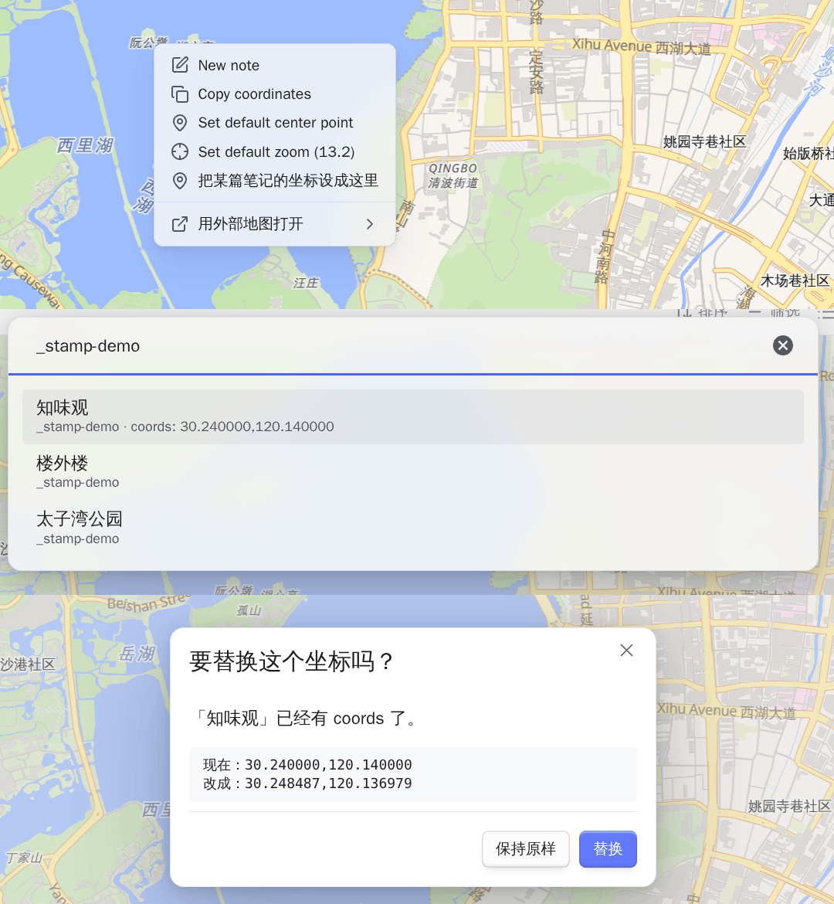

# Coordinates and map services

**English** · [简体中文](coordinates-and-services.zh-CN.md) · [Guide index](README.md)

## Coordinate systems

Vault coordinates and supported track files stay WGS-84. **Auto** recognizes
common mainland tile hosts and converts only at the map boundary for GCJ-02 or
BD-09 basemaps. A default can be set globally or forced per map view when a
proxy URL hides the provider.


## Open a spot in another map app

Right-click a map and choose **Open in external map**. Amap, Baidu, Tencent,
Google, Apple Maps, and OpenStreetMap receive the datum each expects. Providers
can be reordered or disabled, and custom URL templates can use `{lat}` and
`{lng}`:

```text
https://ul.waze.com/ul?ll={lat},{lng}&navigate=yes      WGS-84
https://www.bing.com/maps?cp={lat}~{lng}&lvl=16         WGS-84
om://map?v=1&ll={lat},{lng}                             WGS-84
```

App schemes such as `waze://` or `iosamap://` work on a device that has the app.
State the datum instead of guessing it: a mirror of a mainland provider looks
like any other host, and a wrong guess does not fail—it places the pin a few
streets away.


## Place a note you already wrote

The map's right-click menu can create a note at the spot you clicked. **Set a
note's coordinates here** is the other half: you wrote the note months ago
without a coordinate, and you are looking straight at where it belongs.

Right-click the spot, choose it, and pick the note. Each row shows its folder
and, when the note already has a coordinate, the value it holds — so a fuzzy
match is checked before it is taken, not after. Choosing a note with no
coordinate writes immediately; choosing one that already has a coordinate names
the old value and the new one first, because frontmatter has no undo.

Your templates are left out of the list, read from the folder the core
**Templates** plugin names. A template is not a place, and a coordinate written
into one would go into every note stamped from it afterwards.

Only the coordinate property is written. If the note is not in that map's own
query the pin will not appear, which is Bases filtering rather than a failure —
the notice names the note and the value either way.



## Set coordinates from a map link

**Set coordinates from a map link** understands common mainland and
international share links, `geo:` URIs, degrees/minutes/seconds, and plain
`lat,lng`. It previews the result and always writes WGS-84.


## Search and reverse geocoding

- **Search for a place and set coordinates** uses an open worldwide provider or
  Amap with your own key.
- **Fill place name from coordinates** reverse-geocodes the current coordinate
  into the configured place property.


Search and reverse geocoding send a query to the selected provider. See
[Reference and privacy](reference-and-privacy.md) for exactly what leaves the
vault and where a provider key can be stored.

## Device location

**Fill coordinates from current location** asks the operating system on desktop
and mobile, so no API key is involved. With **Enable location**, a
present-but-empty `coords:` property can be filled automatically without
overwriting an existing value. **Skip paths containing** (default `templates`)
keeps the blank in a template blank.
