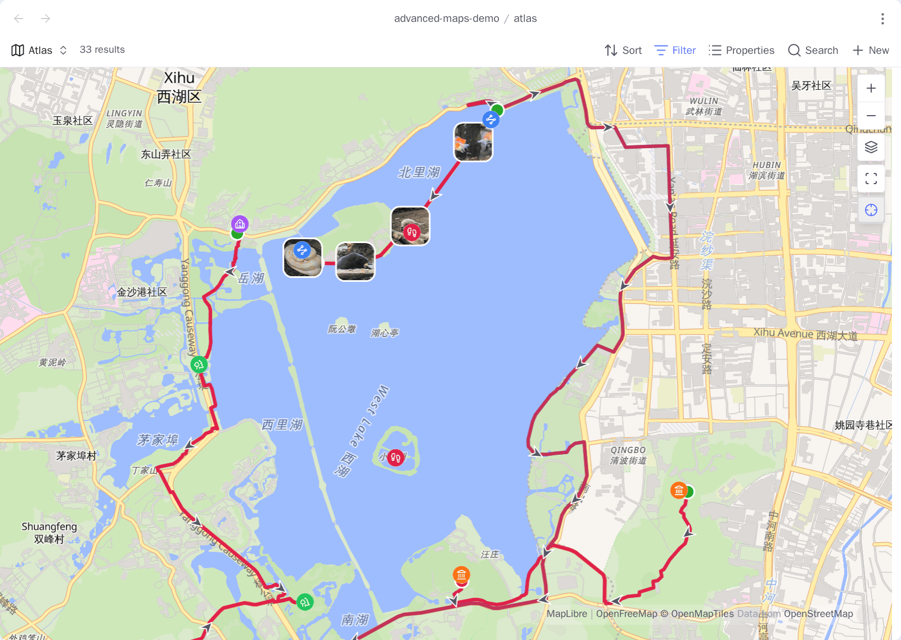

# Advanced Maps user guide

<!-- nav:start -->

**English** · [简体中文](../zh-cn/README.md) · [Project home](../../../README.md)

<!-- nav:end -->

Advanced Maps extends Obsidian's native Maps view with photo albums, linked
tracks and areas, Around views, map navigation, and coordinate tools. Start with
[Getting started](getting-started.md) for a complete Base you can copy, then use
the topic pages below as recipes and reference.

## Choose a workflow

| I want to…                                                                           | Read                                                    |
| ------------------------------------------------------------------------------------ | ------------------------------------------------------- |
| Install the plugin and make my first map                                             | [Getting started](getting-started.md)                   |
| Map a photo folder or the photos linked from notes                                   | [Photo maps](photo-maps.md)                             |
| Draw GPX, GeoJSON, KML, TCX, areas, or inline route statistics                       | [Tracks and areas](tracks-and-areas.md)                 |
| Map the notes connected to this one, open notes in a Base, or follow the active note | [Around and navigation](around-and-navigation.md)       |
| Bring a file of saved places into notes, or take a Base's places back out            | [Places in and out](places-in-and-out.md)               |
| Draw the basemap from a folder of tiles already on disk, with no network at all      | [Offline basemap](offline-basemap.md)                   |
| Align mainland basemaps, parse map links, search places, or open another map app     | [Coordinates and services](coordinates-and-services.md) |
| Check supported files, option ownership, privacy, operational limits, or attribution | [Reference and privacy](reference-and-privacy.md)       |

The workflows compose. A single Base can show place notes, a multi-day route,
and every geotagged photo along it.

## Maintainer documentation

User-facing behavior belongs in this guide. See
[CONTRIBUTING.md](../../../CONTRIBUTING.md) for setup and pull-request workflow,
[OpenSpec capabilities](../../../openspec/specs) for stable technical contracts,
[CHANGELOG.md](../../../CHANGELOG.md) for released behavior, and
[ROADMAP.md](../../../ROADMAP.md) for possible future work.
