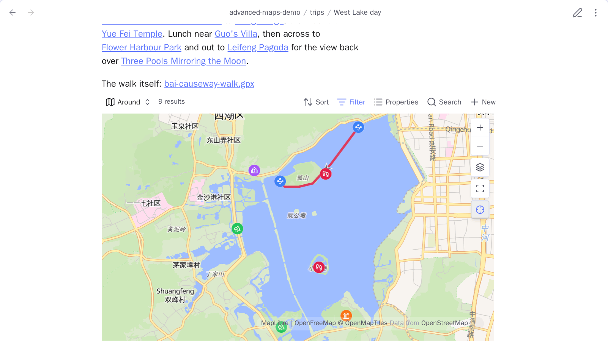
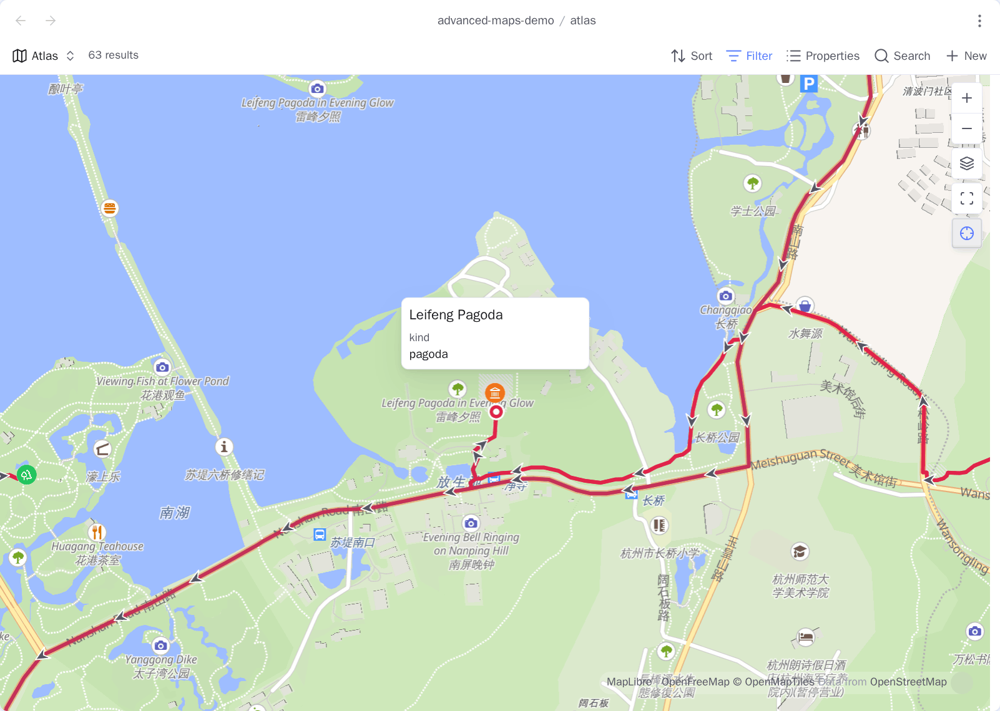
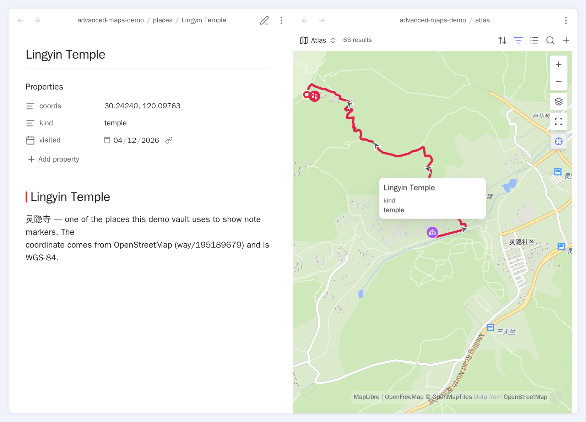
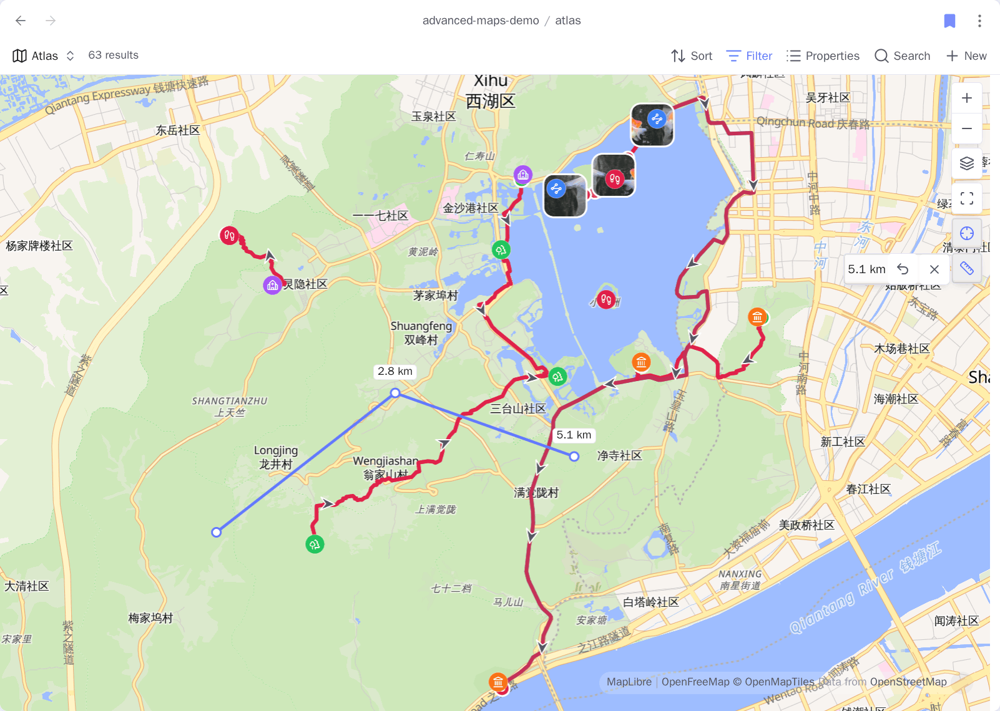
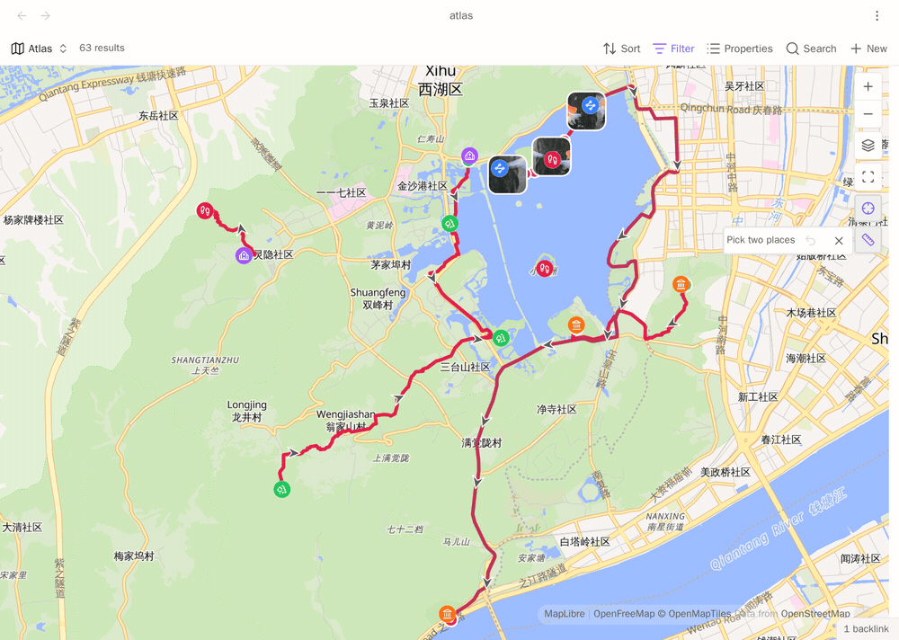

# Around views and navigation

<!-- nav:start -->

**English** · [简体中文](../zh-cn/around-and-navigation.md) · [Guide index](README.md)

<!-- nav:end -->

One Base can do three jobs: draw the notes around the one you are reading, open a
note inside its whole collection, and follow you as you switch notes. Set it up
once, under **Open in map**, and all three use it.

A Base is an Obsidian file that collects the notes and files you filter for, and
shows them as a table or a map.

## Show only the notes around the current note

In Advanced Maps settings, open **Open in map** and pick your reusable Base under
**Base file**. Then run **Insert a map of the notes around this one**. The command
adds an `Around` map view to that Base if the Base does not have one, and inserts:

```markdown
![[places.base#Around]]
```

The Around view keeps only three kinds of notes:

- the note the embed sits in;
- the notes it links to;
- the notes that link back to it.

Tracks and photos linked from those notes are drawn as usual. A trip index can be
as short as:

```markdown
# West Lake weekend

[[Broken Bridge]]
[[Leifeng Pagoda]]
[[Lingyin Temple]]
[[weekend.gpx]]

![[places.base#Around]]
```

`weekend.gpx` has no `!`, so the note shows one Around map and the route is drawn
on it. Adding the `!` would put a second, separate map under the link.



The Around view keeps the notes your Base already matched. A linked note that the
Base's filter leaves out stays left out. The embed stores the view name, so if you
rename the view you have to update the embeds that name it.

Turn **Insert a map of nearby notes** off under settings → **Open in map** and the
editor's right-click menu carries no item of this plugin's, and the command leaves
the command palette. Maps you already inserted keep drawing. What the switch
removes is the offer to write another one.

## Reuse one Base everywhere

Set **Base file** and **View name** once, under Advanced Maps settings → **Open in
map**. The same Base then powers Open in map, Follow active note, and Around
embeds.

| Question                                       | Decided by                                                                |
| ---------------------------------------------- | ------------------------------------------------------------------------- |
| Which notes or direct photo files participate? | Base filters                                                              |
| What does a note marker look like?             | Base formulas and the map view's **Marker icon**/**Marker color** options |
| Where is a note's coordinate?                  | The map view's **Marker coordinates** property                            |

## Open the current note in that map

Notes carrying the coordinate property — `coords` by default — get an **Open in
map** item in their menu. It opens the Base you configured, moves the map to that
note, and opens its popup.

**Open in** chooses where: a normal tab opens the Base file itself and keeps any
view option you change there, while a pop-up window leaves your layout alone but
has nowhere to write a change back to.

Turn **Open a note in map** off on the same settings page and no note carries the
item, and the command leaves the palette with it. The Base file stays configured,
because the map of nearby notes uses the same one.



## Follow the active note

Select the ⊹ control next to zoom-to-fit and the map follows the notes you switch
between. It keeps the current zoom level and does not change the Base's query.

**New maps start following**, under settings → **Map buttons**, decides which way
that button points on a map that has just opened. The choice is not remembered
after the map closes. Turn **Follow the active note** off on the same page and the
button is removed from every open map, not just the next one.



## Measure a distance

Select the ruler control under ⊹ and the map becomes a measuring surface. Click —
or tap, on a phone — to drop a point. Each point after the first is labelled with
its distance from the start. On a desktop, a dashed line follows your pointer with
the running total, and a readout opens beside the ruler showing the points you
have actually placed. A phone has no pointer to lead that dashed line, so the
readout and the labels are all it shows you.

Take back the last point with ↺ or **Backspace**. Select the ruler again and the
readout folds away, leaving the measurement on the map. Select it once more to
bring the readout back, showing whatever you have measured by then. You can keep
placing points while it is folded.

Put the tape away with ✕ or **Escape**. Nothing is written to any note, and the
measurement is gone once you stop.

Turn **Measure distance** off under settings → **Map buttons** and the ruler
control goes with it.



While the tape is out, clicks belong to it. Clicking a pin adds a point instead of
opening that note, and no popup covers the ground you are measuring across. A
double-click places two points instead of zooming in. Taps work the same way: a
double-tap places two points rather than zooming.

Bring the pointer near something already on the map and a ring appears on it: a
note's pin, a route's waypoint or its start and end pin, a photo's position, or a
point you placed earlier in the same measurement. Click and your point lands on
that thing's own coordinate instead of on the pixel you hit. That is what makes
"how far is this note from that photo" exact, and what lets a route close on the
place it started. The point you placed last is never snapped to, because a leg
from a point to itself measures nothing. Hold **Alt** while you point and click to
skip all of it and measure the bare ground.



On a phone the point still lands on the thing's own coordinate, but there is no
ring to aim by, because the ring is drawn by hovering. Put your tap on the marker,
waypoint, or photo itself rather than near it. **Alt** has no equivalent there, so
to measure the ground beside something, tap further away from it.

The tape measures straight-line distance between the places you clicked. That is
not the distance along a road or a path. For that, save the route as a track file
and read [its statistics](tracks-and-areas.md). On a Chinese basemap the tape
measures the real coordinates behind the shifted map, so your measurement does not
change when you switch the background under it.

## Pins at the same coordinate

At close zoom, notes that share an exact coordinate fan out into a ring, so you
can pick out and open each marker by pointer or by tap. Zoom out and they close
back to the shared point they really have. Nothing is written to the notes, and
copied coordinates stay the same. **Fan out overlapping pins** turns this off.
