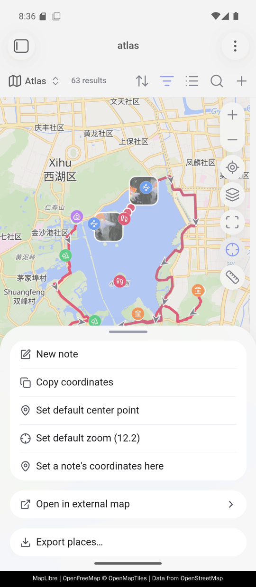

# Coordinates and map services

<!-- nav:start -->

**English** · [简体中文](../zh-cn/coordinates-and-services.md) · [Guide index](README.md)

<!-- nav:end -->

## Coordinate systems

Vault coordinates and supported track files stay WGS-84. **Auto** recognizes
common mainland tile hosts and converts only at the map boundary for GCJ-02 or
BD-09 basemaps. A default can be set globally or forced per map view when a
proxy URL hides the provider.


## Open a spot in another map app

Right-click a map — long press it on a phone — and choose **Open in external
map**. Amap, Baidu, Tencent, Google, Apple Maps, and OpenStreetMap receive the
datum each expects. Providers can be reordered or disabled, and custom URL
templates can use `{lat}` and `{lng}`:

```text
https://ul.waze.com/ul?ll={lat},{lng}&navigate=yes      WGS-84
https://www.bing.com/maps?cp={lat}~{lng}&lvl=16         WGS-84
om://map?v=1&ll={lat},{lng}                             WGS-84
```

**Offer external maps** at the top of that page switches all of it off at once:
right-clicking a map then offers no external app, and the order you arranged and
the ones you already switched off are kept for when you want them back.

> [!WARNING]
> App schemes such as `waze://` or `iosamap://` work only when the corresponding
> app is installed. Set the datum explicitly instead of guessing: a mirror of a
> mainland provider looks like any other host, and a wrong choice does not
> fail—it puts the pin a few streets away.


## Place a note you already wrote

The map's own menu can create a note at the spot you clicked. **Set a note's
coordinates here** is the other half: you wrote the note months ago without a
coordinate, and you are looking straight at where it belongs.

Right-click the spot — long press it on a phone — choose it, and pick the note.
Each row shows its folder and, when the note already has a coordinate, the
value it holds — so a fuzzy match is checked before it is taken, not after.
Choosing a note with no coordinate writes immediately; choosing one that
already has a coordinate names the old value and the new one first, because
frontmatter has no undo.

Your templates are left out of the list, read from the folder the core
**Templates** plugin names. A template is not a place, and a coordinate written
into one would go into every note stamped from it afterwards.

Only the coordinate property is written. If the note is not in that map's own
query the pin will not appear, which is Bases filtering rather than a failure —
the notice names the note and the value either way.

Switch **Set a note's coordinates from the map** off under settings → **Map
buttons and menu** and the map's menu drops the item. The rest of that menu is
unchanged, down to the coordinate it hands the items that stay.


On a phone the same menu opens on a long press, as a sheet from the bottom of
the screen. Everything this guide asks you to right-click a map for is in it:
**Set a note's coordinates here**, **Open in external map** with its list of
providers, and **Export places…**.



## Set coordinates from a map link

**Set coordinates from a map link** understands common mainland and
international share links, `geo:` URIs, Plus Codes, degrees/minutes/seconds, and
plain `lat,lng`. It previews the result and always writes WGS-84.

A Plus Code — `8FVC9G8F+6W`, on its own or as a `plus.codes` link — is read as
WGS-84, which is what the format is defined on. Codes that name no single place
are refused with the reason: a short code such as `9G8F+6W` has dropped the
digits that say which part of the world it is in, and a padded one such as
`8FVC0000+` stands for a region kilometres across.


## Search and reverse geocoding

- **Search for a place and set coordinates** uses an open worldwide provider or
  Amap with your own key.
- **Fill place name from coordinates** reverse-geocodes the current coordinate
  into the configured place property.


Search and reverse geocoding send a query to the selected provider. See
[Reference and privacy](reference-and-privacy.md) for exactly what leaves the
vault and where a provider key can be stored.

## Device location

**Fill coordinates from current location** asks the operating system on desktop
and mobile, so no API key is involved. With **Use device location**, a
present-but-empty `coords:` property can be filled automatically without
overwriting an existing value. **Skip these folders** is a list of paths that are
never stamped, `templates` to begin with, and each row suggests folders from your
vault as you type. Empty the list and nothing is skipped.
