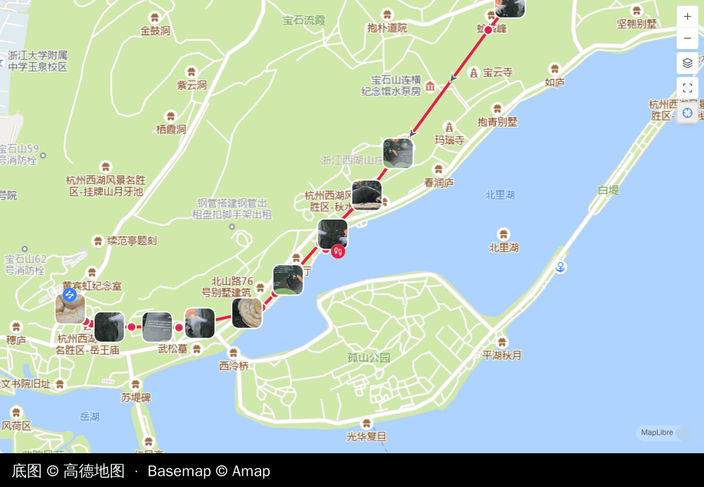
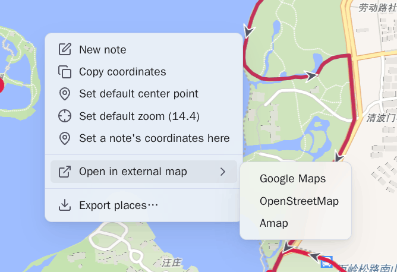
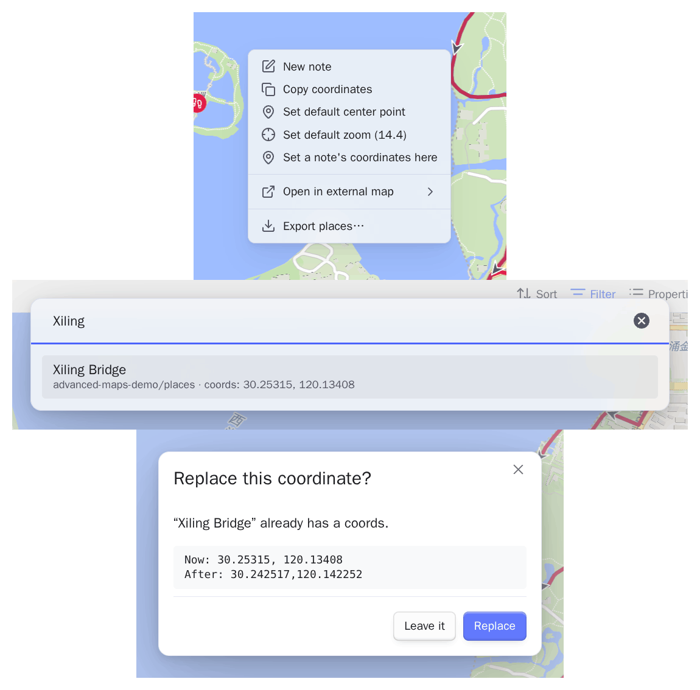
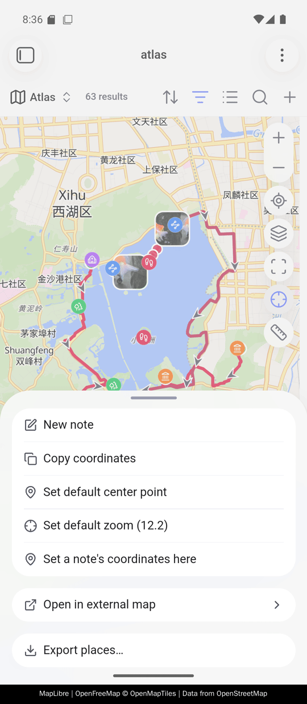
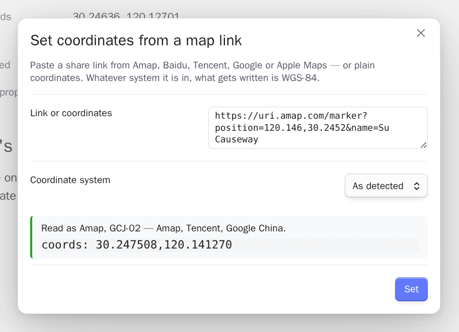
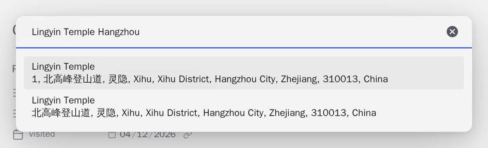

# Coordinates and map services

<!-- nav:start -->

**English** · [简体中文](../zh-cn/coordinates-and-services.md) · [Guide index](README.md)

<!-- nav:end -->

A coordinate can be written three ways. WGS-84 is what GPS, phone photos, and
GPX files record, and it is what your notes hold. GCJ-02 and BD-09 are the
coordinates Chinese map providers publish, shifted a few hundred metres. This page
covers lining the two up, and the services that read or write a coordinate.

## Coordinate systems

Your notes and track files stay WGS-84. **Auto** recognises common Chinese tile
hosts and converts only at the map's edge, so your pins land on the roads the
basemap draws. Set a default for every map, or override it per map view, when a
proxy URL hides which provider you are using.



## Open a spot in another map app

Right-click a map — long press it on a phone — and choose **Open in external
map**. Amap, Baidu, Tencent, Google, Apple Maps, and OpenStreetMap each receive
the coordinate system they expect. You can reorder the providers or disable them,
and add your own with a URL template using `{lat}` and `{lng}`:

```text
https://ul.waze.com/ul?ll={lat},{lng}&navigate=yes      WGS-84
https://www.bing.com/maps?cp={lat}~{lng}&lvl=16         WGS-84
om://map?v=1&ll={lat},{lng}                             WGS-84
```

**Offer external maps**, at the top of that page, turns all of it off at once.
Right-clicking a map then offers no external app, and the order you arranged and
the providers you disabled are kept for when you want them back.

> [!WARNING]
> App schemes such as `waze://` or `iosamap://` work only when that app is
> installed. Set the coordinate system explicitly instead of guessing. A mirror of
> a Chinese provider looks like any other host, and a wrong choice does not fail —
> it puts your pin a few streets away.



## Place a note you already wrote

The map's own menu can create a note where you clicked. **Set a note's
coordinates here** is the other half: you wrote the note months ago, without a
coordinate, and you are looking straight at where it belongs.

Right-click the spot — long press it on a phone — choose it, and pick the note.
Each row shows the note's folder and, if the note already has a coordinate, the
value it holds, so you can check a close match before you take it. Choosing a note
with no coordinate writes at once. Choosing one that already has a coordinate
shows the old value and the new one first, because a frontmatter edit has no undo.

Your templates are left out of the list. The list skips the folder the core
**Templates** plugin names, because a coordinate written into a template would
land in every note stamped from it afterwards.

Only the coordinate property is written. If the note is not in that map's own
query, its pin will not appear. That is your Base's filtering, not a failure, and
the notice names the note and the value either way.

Turn **Set a note's coordinates from the map** off under settings → **Map buttons
and menu** and the map's menu drops the item. The rest of the menu is unchanged,
down to the coordinate it hands the items that stay.



On a phone the same menu opens on a long press, as a sheet from the bottom of the
screen. Everything this guide asks you to right-click a map for is in it:
**Set a note's coordinates here**, **Open in external map** with its list of
providers, and **Export places…**.



## Set coordinates from a map link

**Set coordinates from a map link** reads the share links of common Chinese and
international map apps, `geo:` URIs, Plus Codes, degrees/minutes/seconds, and a
plain `lat,lng`. It shows you the result before writing, and always writes WGS-84.

A Plus Code — `8FVC9G8F+6W`, on its own or as a `plus.codes` link — is read as
WGS-84, which is the coordinate system the format is defined on. A code that names
no single place is refused, with the reason. A short code such as `9G8F+6W` has
dropped the digits that say which part of the world it is in, and a padded one
such as `8FVC0000+` stands for a region kilometres across.



## Search and reverse geocode

- **Search for a place and set coordinates** looks a place up and writes its
  coordinate. It uses an open worldwide provider, or Amap with your own key.
- **Fill place name from coordinates** does the reverse: it turns the coordinate
  you are looking at into an address, in the place property you configured.



Both send a query to the provider you selected. See
[Reference and privacy](reference-and-privacy.md) for exactly what leaves your
vault and where a provider key can be stored.

## Device location

**Fill coordinates from current location** asks your operating system where you
are, on desktop and on mobile, so no key or account is involved. With **Use device
location** on, an empty `coords:` property can be filled automatically. An existing
value is never overwritten.

**Skip these folders** lists the paths that are never stamped. It starts as
`templates` and suggests folders from your vault as you type. Empty the list and
nothing is skipped.
