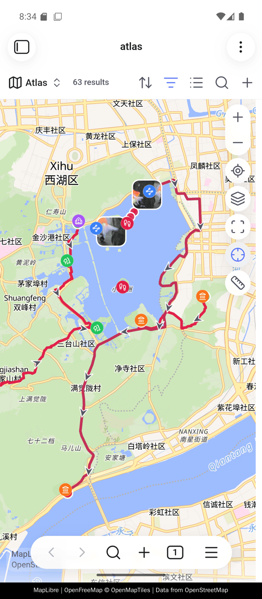

# Getting started

<!-- nav:start -->

**English** · [简体中文](../zh-cn/getting-started.md) · [Guide index](README.md)

<!-- nav:end -->

## Requirements

Advanced Maps requires Obsidian 1.13.1 or newer with **Bases** enabled and the
first-party **Maps** plugin installed. It extends that native registration
instead of replacing it: MapLibre, backgrounds, controls, markers, popups, and
built-in map options remain native. If the expected Maps view is unavailable,
Advanced Maps reports or skips the unavailable enhancement and leaves Obsidian
usable.

## Install

Advanced Maps is in Obsidian's community plugin store.

1. Open **Settings → Community plugins**.
2. If Obsidian is in **Restricted mode**, turn it off. Obsidian first explains
   what a community plugin can do on your device, then asks you to **Allow
   community plugins**.
3. Beside **Community plugins**, select **Browse**, and search for
   `Advanced Maps`.
4. Select **Install**, then **Enable**.

The store listing is also readable on the web at
[community.obsidian.md/plugins/advanced-maps](https://community.obsidian.md/plugins/advanced-maps).

<details>
<summary>Installing a build the store does not have yet</summary>

- **Release:** copy `main.js`, `manifest.json`, and `styles.css` from
  [Releases](https://github.com/Jin1c-3/obsidian-advanced-maps/releases) into
  `<vault>/.obsidian/plugins/advanced-maps/`, then enable the plugin.
- **BRAT:** add `Jin1c-3/obsidian-advanced-maps` as a beta plugin.

</details>

## On mobile

Advanced Maps runs in the Obsidian mobile app, and draws there what it draws on
the desktop: note markers with their icons and colours, GPX, GeoJSON, KML and
TCX routes with direction arrows, photo thumbnails at the positions their EXIF
gives, the tape measure, and inline `![[track.gpx]]` maps with their statistics
and elevation profile.



A phone has no mouse, so two words in this guide need translating as you read.

- **Long press** wherever a page says right-click. That opens the map's own
  menu, and a file's menu in the file explorer.
- **Tap** wherever a page says hover. A tap opens a route's popup and moves the
  elevation profile's cursor. Two of them go further than a hover did: a tap on
  a note's marker opens that note instead of previewing it, and a tap on a photo
  opens the photo itself, which carries **Open note** inside it.

One feature is desktop-only. An [offline basemap](offline-basemap.md) is not
read on a phone, whatever path you give it; the map keeps its usual background
and nothing else changes.

## How a Base becomes a map

A Base filter is the boundary of a map. Advanced Maps expands each matched note
into its linked tracks and photos. A supported photo or track file can also be a
Base result itself, which is what makes whole-folder photo atlases and
file-oriented route collections possible.

The snippet below is a complete `.base` file. Save it as `atlas.base` in the
root of your vault, replace the two folder paths, open it, and choose its map
view. You can keep editing filters and view options in the Bases interface.

```yaml
filters:
  or:
    - file.inFolder("places")
    - file.inFolder("assets/onedrive/Pictures")
views:
  - type: map
    name: Atlas
    coordinates: coords
    trackWeight: 4
    trackOpacity: 85
    fitMaxZoom: 16
```

The first branch supplies notes whose `coords` property becomes a normal marker.
The second supplies photo files directly. JPG, JPEG, PNG, WebP, HEIC, HEIF, and
AVIF are supported.

“Every photo” means every photo with readable GPS metadata. A file with no GPS
remains in the Base results but gets no fabricated marker. A photo with GPS but
no usable embedded thumbnail still gets a plain dot.

## View keys added by Advanced Maps

The last three keys in the example are options the plugin appends to the Bases
interface under **Tracks** and **Coordinate system**. Leave them out to follow
the plugin settings.

| Key            | Option in the view     | Meaning                               |
| -------------- | ---------------------- | ------------------------------------- |
| `trackWeight`  | Line width             | Track stroke width                    |
| `trackOpacity` | Line opacity           | Track stroke opacity                  |
| `fitMaxZoom`   | Max zoom when fitting  | How far automatic framing may zoom in |
| `coordSystem`  | Tile coordinate system | Blank follows the plugin default      |

## Where to go next

- Use [Photo maps](photo-maps.md) for linked photos, external folders, display
  controls, and the photo index.
- Use [Tracks and areas](tracks-and-areas.md) to choose between a normal link and
  an inline map.
- Use [Around and navigation](around-and-navigation.md) to configure one reusable
  Base for note navigation.
- Use [Coordinates and services](coordinates-and-services.md) when the basemap
  datum or an external service matters.
