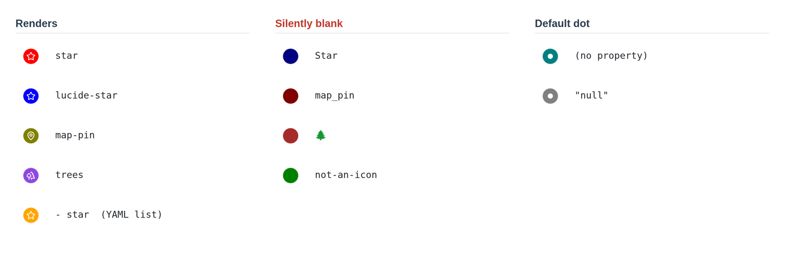

# Marker icons and colors in a Bases map

<!-- nav:start -->

**English** · [简体中文](../zh-cn/marker-icons-and-colors.md) · [Guide index](README.md)

<!-- nav:end -->

Every note can carry its own icon and its own color on a map. This page shows
where to set them, which icon names draw something, and what to check when a
marker does not look right.

**Marker icon** and **Marker color** are Obsidian's own map options. They work
whether or not Advanced Maps is installed, and installing it changes nothing
about how you set them. Obsidian ships a worked example of the basics in the
[Maps plugin's example vault](https://github.com/obsidianmd/obsidian-maps/tree/main/examples).

## Where the options live

Open a Base, switch to its map view, click the view name, and open **Markers**.
A Base is an Obsidian file that collects notes and files you filter for, and
shows them as a table or a map.

Both options take a **property**, not a literal value. Any note property or Base
formula works, as long as its value reads as plain text. Note properties come
from frontmatter, the properties block at the top of a note.

| Option           | Give it                                             | It expects                                                                                                         |
| ---------------- | --------------------------------------------------- | ------------------------------------------------------------------------------------------------------------------ |
| **Marker icon**  | a property such as `note.icon` or `formula.My icon` | the name of an icon from Lucide, the icon set Obsidian's markers use — [Lucide library](https://lucide.dev/icons/) |
| **Marker color** | a property such as `note.color`                     | any CSS color value                                                                                                |

A note with neither property still gets a marker: a small dot on a circle filled
with `--bases-map-marker-background`, the map's default marker color.

## Icon names that render, and names that go blank

> [!WARNING]
> An icon name has to match Lucide's own spelling exactly. When it does not, the
> marker is a filled circle with no icon inside. Nothing is written to the
> console.



| Value in the property                  | What you get                                                                |
| -------------------------------------- | --------------------------------------------------------------------------- |
| `star`                                 | the Lucide `star` icon                                                      |
| `lucide-star`                          | the same icon — the `lucide-` prefix is accepted                            |
| `map-pin`                              | the Lucide `map-pin` icon                                                   |
| a YAML list whose one item is `star`   | the `star` icon — a single-item list reads as its own text                  |
| `Star`                                 | **filled circle with no icon** — names are case-sensitive                   |
| `map_pin`                              | **filled circle with no icon** — Lucide separates words with `-`, never `_` |
| `🌲`                                   | **filled circle with no icon** — emoji are not icon names                   |
| any name Lucide does not have          | **filled circle with no icon**                                              |
| the property is absent or empty        | the default dot                                                             |
| the literal text `null` or `undefined` | the default dot                                                             |

A filled circle with no icon points to a misspelled name. A dot means the value
is missing. The marker tells you which one to check.

## Colors

**Marker color** is passed to CSS untouched, so every form CSS understands works:

```yaml
color: red
color: '#e03131'
color: rgb(224 49 49)
color: var(--color-purple)
```

A `var()` color is resolved against the current theme, so it follows light and
dark mode by itself. Obsidian's own accent and color variables are the easiest
way to stay consistent with the rest of the app.

> [!WARNING]
> A value CSS cannot parse is not reported either. `not-a-color`, `#zzz`, and a
> `var()` naming a variable that does not exist all resolve to the **theme's
> text color** — a near-black marker in a light theme, a near-white one in a
> dark theme. An unexpected flat color usually means the value is invalid; a
> missing property is different and gives you the default blue instead.

The glyph _inside_ the marker is not per-note. Every icon is drawn in
`--bases-map-marker-icon-color`, one value for the whole map, which a CSS snippet
can restyle:

```css
.workspace-leaf-content[data-type='bases'] {
  --bases-map-marker-icon-color: #fff8e7;
}
```

## Driving both from a formula

A Base formula is a small expression that gives every note a value it does not
store. A formula gives every note an icon without any note storing one, which is
why these options take a property rather than a value.

Decide from another property:

```js
if(note.rating >= 4, "star", "circle")
```

Inherit from a linked note, so that changing one type note restyles every marker
that points at it:

```js
list(type)[0].asFile().properties.icon;
```

Then select the formula as the property. In the `.base` file it reads:

```yaml
formulas:
  Rated icon: if(note.rating >= 4, "star", "circle")
views:
  - type: map
    name: Map
    coordinates: note.coordinates
    markerIcon: formula.Rated icon
    markerColor: note.color
```

Some notes may already carry `Star` or an emoji. A formula that maps those values
onto real Lucide names fixes every marker at once, and no note has to be edited.

## With Advanced Maps installed

Advanced Maps adds layers to the native map; native markers stay as they are.
Your icons and colors are drawn by Obsidian exactly as configured. Two
interactions are worth knowing:

- Note markers that would overlap are fanned out into rings, and each one keeps
  its own icon and color. The spread is a screen-space offset — a marker's stored
  coordinate never changes, and **Fan out overlapping pins** turns it off. See
  [Around views and navigation](around-and-navigation.md).
- Photo thumbnails and track lines are separate layers, so a Base holding notes,
  photos and a GPX file shows all three without your markers changing.

## When a marker looks wrong

| Symptom                                | Cause                                                                     |
| -------------------------------------- | ------------------------------------------------------------------------- |
| Filled circle, nothing inside          | The icon name is not a Lucide name. Check case and `-` versus `_`.        |
| A dot where you expected an icon       | The property is empty for that note, or resolves to `null`.               |
| Every marker is the same color         | **Marker color** is unset, so the map's default is used for all of them.  |
| A flat near-black or near-white marker | The color value is not valid CSS, so it resolved to the theme text color. |
| Nothing changed after editing a note   | The property is set but not selected under **Markers**.                   |
