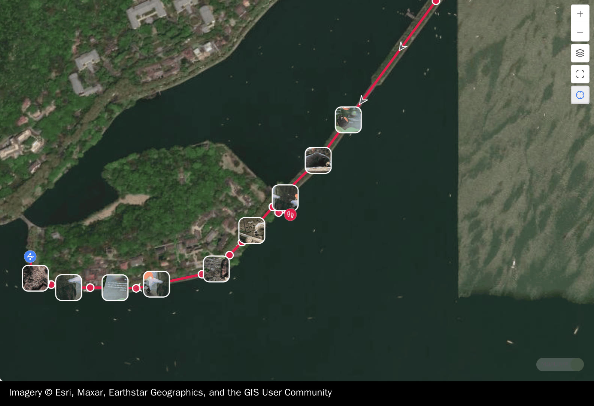
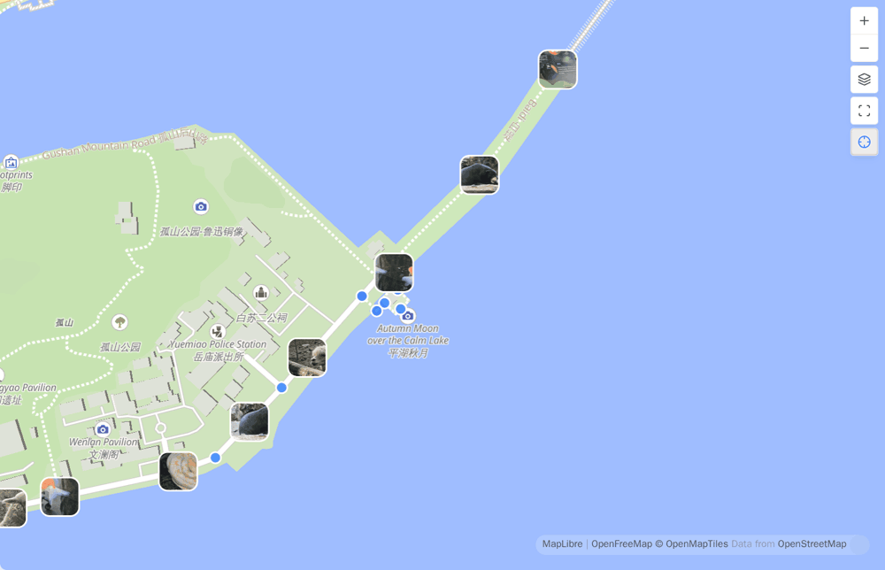
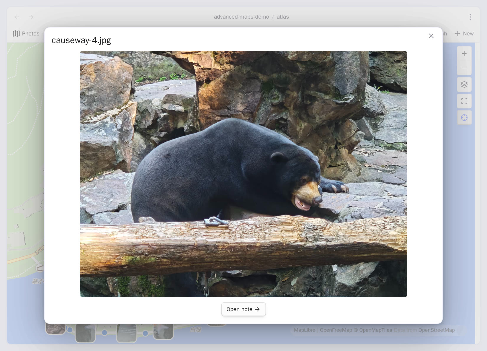

# Photo maps

<!-- nav:start -->

**English** · [简体中文](../zh-cn/photo-maps.md) · [Guide index](README.md)

<!-- nav:end -->

There are two ways to put photos on a map: point your Base at a photo folder, or
leave the folder out and map the photos your notes link to. Either way a photo
gets a marker only when it carries a location — EXIF, the location data a camera
stores inside the photo. A photo without one is left out; no location is ever
invented for it.

## Map a whole photo folder

Start from the complete album recipe in [Getting started](getting-started.md), or
add a photo-folder branch to a Base you already have. A Base is an Obsidian file
that collects the notes and files you filter for and shows them as a table or a
map.

```yaml
- file.inFolder("assets/onedrive/Pictures")
```

JPG, JPEG, PNG, WebP, HEIC, HEIF, and AVIF files work. A photo with a location
gets a dot even when it has no usable embedded thumbnail.

### Put a OneDrive or other external album inside the vault

The photos do not have to be copied into the vault. Make a directory link inside
the vault, let Obsidian index it, then use that vault path in the Base filter.

macOS or Linux:

```bash
mkdir -p "/path/to/MyVault/assets/onedrive"
ln -s "/path/to/OneDrive/Pictures" "/path/to/MyVault/assets/onedrive/Pictures"
```

Windows PowerShell (a directory junction avoids the administrator rights a
symbolic link can need on some systems):

```powershell
$vault = "C:\Users\you\Documents\MyVault"
New-Item -ItemType Directory -Force -Path "$vault\assets\onedrive"
New-Item -ItemType Junction `
  -Path "$vault\assets\onedrive\Pictures" `
  -Target "$env:USERPROFILE\OneDrive\Pictures"
```

Reload the vault, then use the linked vault path in the Base.

> [!IMPORTANT]
> This is a desktop filesystem setup. Make the same link on every desktop that
> should see the album; a phone cannot use a desktop link. Keep cloud files
> available offline, and do not let links point at each other in a loop. The
> photos still live outside the vault, so check whether your backup and sync
> tools follow the link instead of assuming the photos are covered. Your photos
> are read, never modified.

## Map only the photos your notes link to

Keep photo folders out of the Base filter and match notes only:

```yaml
filters:
  and:
    - file.inFolder("places")
views:
  - type: map
    name: Places
    coordinates: coords
    trackWeight: 4
    trackOpacity: 85
    fitMaxZoom: 16
```

Then link photos from a matched note:

```markdown
---
coords: 30.2600,120.1500
---

[[IMG_1234.jpg]]
[[IMG_1235.heic]]
```

Ordinary body links, embeds such as `![[IMG_1234.jpg]]`, and file links in the
note's frontmatter — the properties block at the top of the note — all count.
Each photo appears once. The Base does not need to include the attachment
folder, and you need a real embed only when you also want the image visible in
the note.

### Link single photos outside the vault

An inline Markdown `file:` destination can name a supported photo that Obsidian
does not index. A plain link puts it on the map without showing it in the note;
add `!` to ask Obsidian to show it there too. Both count for the map, though an
external embed does not display on every platform:

```markdown
[desktop photo](<file:///G:\My Drive\Camera\P 20260911 091346.jpg>)

```

These are absolute, device-specific paths. A synced note can carry one
destination per device: the map uses the supported files the device you are on
can read and skips the rest, without dropping that note's tracks or its vault
photos. Naming the same photo as both a link and an embed still maps it once.

On Android a photo outside the vault appears on the map only when Obsidian has
**All files access**. A vault in **Device storage** asks for that permission
during setup; **App storage** does not. Turn it on for Obsidian under Android's
special app access settings before you use a `/storage/emulated/0/...` path. The
`file:` image embed can still look broken in the note on Android, so use a plain
link when only the map needs the photo.

Only inline Markdown links and image embeds in the note body count. Raw HTML,
reference-style links, frontmatter values, web URLs, external tracks, and text
inside code do not. **Set coordinates from a photo** also keeps using vault
attachments only.

> [!IMPORTANT]
> The absolute paths are stored in the note and travel wherever the note is
> synced, so consider whether their folder names disclose anything private. A
> `file:` URL naming a directory is not an album: nothing inside it is
> collected. To bring a whole external folder into a Base on desktop, use the
> [directory link above](#put-a-onedrive-or-other-external-album-inside-the-vault).

A photo outside the vault is not watched for changes. When another program
changes it, it is read again on the next map refresh, or when you reopen the
map.



## Coordinates and display

Photo coordinates stay in WGS-84, the coordinate system your notes use; at the
map boundary they follow the same conversion as note markers and tracks.
**Photo coordinate system** can force WGS-84 or GCJ-02, the system Chinese map
providers publish, when a camera wrote something non-standard without labelling
it.

Zoomed out, thumbnails that would collide thin to a steady few instead of
piling into an unreadable stack; every mapped photo keeps its dot. Zoom in and
the thumbnails that fit come back. **Show photos** and **Show photo
thumbnails** turn the two layers off independently.



## Open a photo or its note

Hover a photo and its owning note appears in a popup, with the photo previewed
inside it, so you can tell which dot is which on a crowded map without opening
anything. Click to open the photo at full size over the map, with an **Open
note** row below it. Ctrl/Cmd-click opens the image file in a new tab.

On a phone a tap goes straight to the full-size photo, so the preview popup is a
step you do not get. The way to the note is still there: **Open note** is inside
the photo you just opened.



**Set coordinates from a photo** reads the same GPS tag into the current note's
`coords` property.

## Photo index and file reads

A large album places faster the next time you open it, because photos that have
not changed are not read again.

**Clear the photo index** discards what was saved. Maps keep working and the
metadata is read again as needed. Your photo files are never modified.
