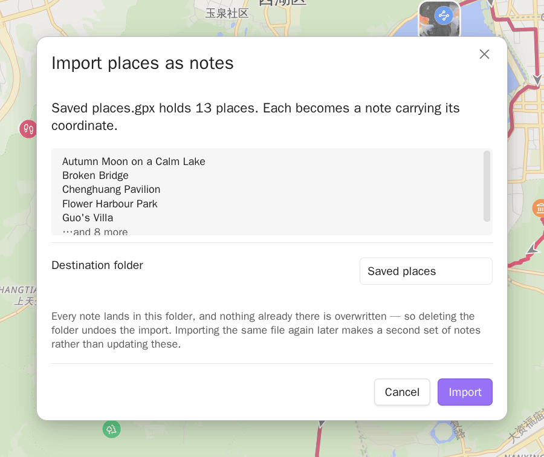
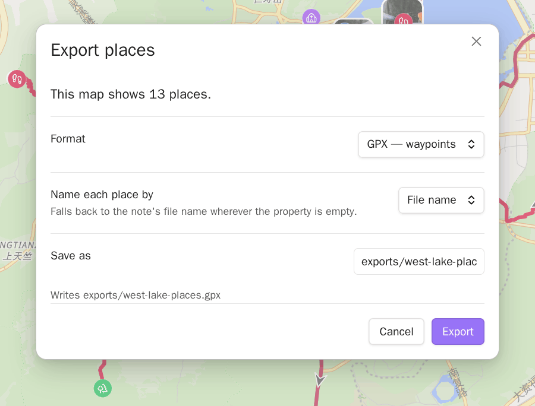

# Places in and out

<!-- nav:start -->

**English** · [简体中文](../zh-cn/places-in-and-out.md) · [Guide index](README.md)

<!-- nav:end -->

A file of saved places can become notes, and the notes a Base matched can become
a file again. A Base is an Obsidian file that collects the notes and files you
filter for and shows them as a table or a map. Both directions stay inside your
vault.

Both directions are one feature and one switch. Turn **Exchange places with
files** off under Settings → **Places in and out** and a track file's ⋮ menu
offers no import and a map's menu no export. Notes you have already imported and
files you have already exported are ordinary vault files and stay as they are.

## Import a file's saved places as notes

Right-click a `.kml`, `.gpx`, or `.geojson` file — in the file explorer, or from
a note's ⋮ menu — and choose **Import places as notes…**. On a phone, long press
opens that menu in the file explorer. The ⋮ menu is where it is.

The dialog says how many places the file holds, shows the first few names, and
asks for a destination folder. It defaults to a folder named after the file,
beside the file. Nothing is written until you confirm.



Each place becomes one note:

```markdown
---
coords: 31.230400,121.473700
---

Go at night. Ask for the set menu.
```

The coordinate goes into the property named in Settings → **Open in map** →
**Coordinate property**, in the same form the other commands write. That block at
the top of the note is its frontmatter. The placemark's own name becomes the
note's file name, and its description becomes the body.

The import follows these rules:

- **Only points are imported.** Routes and areas in the same file are left
  alone. They are already drawn when a note links the file.
- **Nothing is overwritten.** A name already taken gets a numeric suffix, so two
  `Home` placemarks become `Home` and `Home 2`.
- **Names are cleaned up.** Characters a file name cannot hold become spaces. A
  placemark with no name at all is named after the source file and its position
  in it — `restaurants 7`.
- **A description arrives as text.** Map apps write HTML into KML descriptions.
  What lands in the note is the text it renders as, with its line breaks, and no
  markup.
- **The folder is the undo.** Everything the import creates goes inside it, so
  deleting the folder undoes the import.
- **It is a snapshot, not a sync.** Importing the same file again later makes a
  second set of notes rather than updating the first.

The notes are ordinary notes from that moment on. To see them on a map, point a
Base at the folder — see [Getting started](getting-started.md) for the shortest
Base that does that.

## Export the places a Base map shows

Right-click the map itself — long press it on a phone — and choose
**Export places…**.

What gets exported is exactly what the map shows: the rows your Base matched
whose coordinate resolved. A Base matching 16,000 notes of which 300 have a
coordinate exports 300 places.

| Format | Holds                     | For                                       |
| ------ | ------------------------- | ----------------------------------------- |
| GPX    | Waypoints                 | Watches, GaiaGPS, trail apps              |
| KML    | Placemarks                | Google My Maps, Google Earth              |
| CSV    | One row per place, header | Spreadsheets, anything that reads a table |

**Name each place by** decides what the exported name is. It defaults to the
note's file name, and offers every property your Base displays — useful when your
notes are named `20250405162700` and the place name lives in a property. Where
the property is empty for a note, that place keeps its file name, so no place is
exported nameless.

**Save as** is a path inside your vault. A folder that is not there yet is
created. A path that is already taken blocks the export rather than overwriting
the file there, and the written path is reported when it is done.



The CSV also carries each place's note path, so a spreadsheet can lead back to
the note. GPX and KML carry the name and the coordinate.

Two things follow from the file landing in your vault:

- You can sync it, share it, or open it in any app the way you would any other
  vault file.
- A `.gpx` or `.kml` in your vault is also a file the map reads. If a note links
  it, it is drawn. Export somewhere your Base does not match if you would rather
  it were not.

## The file holds the coordinates your notes hold

An export writes the coordinates your notes hold. On a GCJ-02 or BD-09 basemap —
the coordinate system Chinese map providers publish — the markers are shifted
about 500 m so they line up with the tiles. That shift stays on the map and never
reaches the file. The same Base exported over Amap and over OpenStreetMap gives
identical files.

The same is true on the way in: a coordinate read from a file is written to the
note unchanged. A track file is WGS-84, the coordinate system your notes use, and
no map took part in reading it. See
[Coordinates and services](coordinates-and-services.md) for what the coordinate
system setting does and does not touch.
