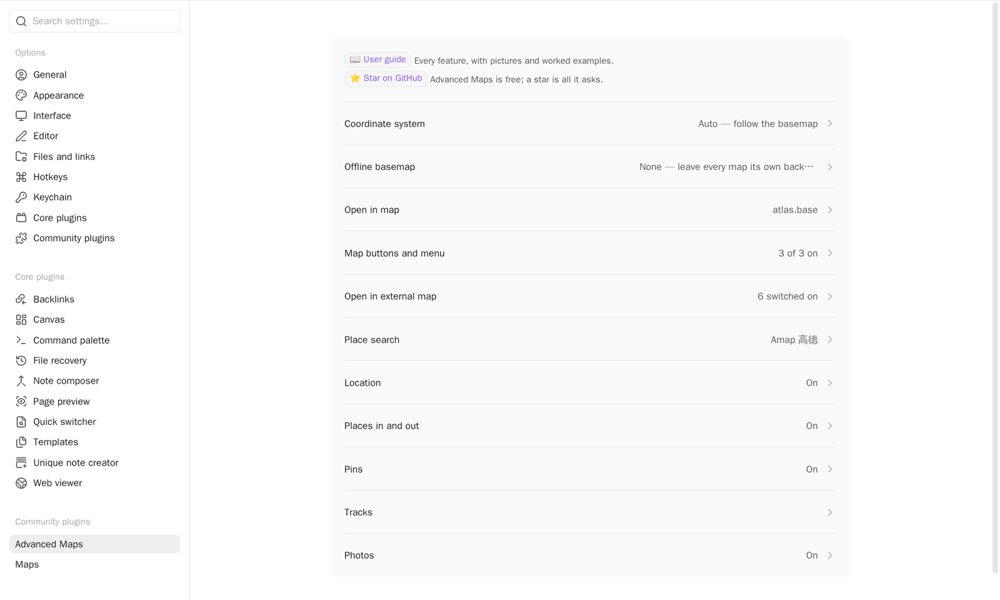

# Reference and privacy

<!-- nav:start -->

**English** · [简体中文](../zh-cn/reference-and-privacy.md) · [Guide index](README.md)

<!-- nav:end -->

What the plugin reads, where each setting lives, how to turn a feature off, and
what leaves your vault. Use [Common questions](common-questions.md) when something
is not working; use this page to look something up.

## Supported files and links

| Input            | Supported forms                                   | What it contributes                                                 |
| ---------------- | ------------------------------------------------- | ------------------------------------------------------------------- |
| Photos           | JPG, JPEG, PNG, WebP, HEIC, HEIF, AVIF            | GPS point, thumbnail when available, time/orientation metadata      |
| Tracks           | GPX, GeoJSON, KML, TCX                            | Routes, waypoints, markers, arrows, and available inline statistics |
| Areas            | GeoJSON and KML polygons                          | Filled regions with outlined boundaries and preserved holes         |
| Note attachments | Normal body links, embeds, frontmatter file links | Linked tracks and photos, de-duplicated per resolved file           |

A supported photo or track file can also be a Base result in its own right. Only a
real track embed creates an inline map. A normal link and a frontmatter link draw
the track on a Base or Around map without putting a second map in the note.

## Where the settings live

**Settings → Community plugins → Advanced Maps** opens on eleven entries, one per
topic. Open one to reach its options. Each entry states what it is set to, so the
pane answers the common questions without being opened.

| Entry                | Holds                                                                                                                                                    |
| -------------------- | -------------------------------------------------------------------------------------------------------------------------------------------------------- |
| Coordinate system    | The default coordinate system for inline maps and for views that set none                                                                                |
| Offline basemap      | Whether local tile packs are used at all, the packs on disk, the zoom levels each holds, and which one is the default                                    |
| Open in map          | Base file, view name, target, coordinate and place properties, zoom, Around view name, menu label                                                        |
| Map buttons and menu | Whether a map carries the follow and measure buttons, which way follow starts, and whether its menu can set a note's coordinates                         |
| Open in external map | The built-in map apps and your own                                                                                                                       |
| Place search         | Search source and, for Amap, where its key is kept                                                                                                       |
| Location             | Device location and the automatic coordinate fill                                                                                                        |
| Places in and out    | Whether places are exchanged with files at all — the import on a track file's menu and the export on a map's                                             |
| Pins                 | How the notes' own markers behave                                                                                                                        |
| Tracks               | Colour, width, opacity, fit zoom, inline height, statistics, profile, markers — and **Track properties**, which names what the statistics command writes |
| Photos               | Photo pins, thumbnails, photo coordinate system, and the photo index                                                                                     |

Anything named in this guide can also be found by typing it into the settings
search, which reaches the options inside these pages the same way it reaches any
other.

## Turning a feature off

Everything this plugin adds to a place you did not open for it can be switched
off, and switching it off takes the whole feature: the menu item, its command, and
the work behind it. A command is not on this list, because it runs only when you
invoked it. A command that belongs to a switched-off feature goes with that
feature.

Nothing is cleared by a switch. What the feature was configured with stays on its
page, showing what it holds and taking no edits, so you can see what switching it
back on gives you.

| Switch                                    | Page                 | With it off                                                                                                                                                 |
| ----------------------------------------- | -------------------- | ----------------------------------------------------------------------------------------------------------------------------------------------------------- |
| **Use offline basemaps**                  | Offline basemap      | No map is drawn on a pack, and a map's background button lists only what Maps itself has. Your packs are kept. It starts off unless you already had a pack. |
| **Open a note in map**                    | Open in map          | No note carries the ⋮ item, and the command leaves the palette.                                                                                             |
| **Insert a map of nearby notes**          | Open in map          | The editor's right-click menu carries no item, and the command leaves the palette. Maps already inserted go on drawing.                                     |
| **Set a note's coordinates from the map** | Map buttons and menu | The map's right-click menu drops that item. Its other items carry the same coordinate they always did.                                                      |
| **Exchange places with files**            | Places in and out    | A track file's ⋮ menu offers no import, and a map's menu no export. Notes and files already written are untouched.                                          |
| **Inline route maps**                     | Tracks               | An embedded `![[route.gpx]]` is the embed Obsidian makes of it, because no track file is claimed at all.                                                    |
| **Offer external maps**                   | Open in external map | Right-clicking a map offers no external app. The order and the ones you switched off are kept.                                                              |

## Which setting owns what

| Question                                                | Defined by                                                                                                       |
| ------------------------------------------------------- | ---------------------------------------------------------------------------------------------------------------- |
| Which notes or direct files participate?                | Base filters                                                                                                     |
| What does a note marker look like?                      | Base formulas and the map view's **Marker icon**/**Marker color** options                                        |
| Where is a note's coordinate?                           | The map view's **Marker coordinates** property                                                                   |
| Which Base powers navigation and Around?                | Advanced Maps **Base file** and **View name** settings                                                           |
| How a specific map draws tracks or converts its basemap | `trackWeight`, `trackOpacity`, `fitMaxZoom`, and `coordSystem` view keys when present; plugin settings otherwise |
| Which background a map opens on                         | The `offlineTiles` view key; the packs themselves are a plugin setting                                           |

## Operational boundaries

- Advanced Maps needs the Maps view that ships with Obsidian. If that view is
  unavailable, the extra features are skipped and Obsidian keeps working.
- A photo without a readable GPS location stays a Base result but gets no marker.
  A geotagged photo whose thumbnail cannot be used still gets a dot.
- A directory link to an external album is desktop filesystem setup. Create an
  equivalent link on every desktop, keep cloud files readable on that machine,
  avoid loops, and check how your backup and sync tools handle the link. Mobile
  cannot reuse a desktop link.
- An Around view still obeys its Base's filters. The embed stores the view name, so
  renaming the view means updating existing embeds.
- Opening a configured Base in a normal tab lets view-option changes be written
  back to the Base file. A pop-up window preserves your layout but has nowhere to
  write those changes.

## What leaves your vault

> [!NOTE]
> Notes, tracks, and photo contents do not leave on their own. The plugin has no
> telemetry, update ping, or server.

| When                     | What leaves                                      | Destination                   |
| ------------------------ | ------------------------------------------------ | ----------------------------- |
| A map is visible         | Tile requests: your IP and viewed area           | The selected basemap provider |
| A map draws a tile pack  | Nothing; the tiles are read from disk            | —                             |
| You search for a place   | Search text, language, and configured key        | The selected geocoder         |
| You reverse-geocode      | The one coordinate you requested                 | The selected geocoder         |
| You open an external map | The clicked coordinate                           | The map app you chose         |
| You use device location  | Nothing from the plugin; the OS supplies the fix | —                             |

A search key can live in Obsidian secret storage, which keeps it out of synced
plugin settings, or in plugin settings for cross-device convenience. Either way the
provider receives it with the request.

## Attribution

Screenshots use third-party basemaps and search services only to demonstrate the
plugin, and provider attribution stays visible in them. No screenshot shows a face
or an identifiable person. The hero image is the author's own vault, with the days
holding photographs of people filtered out of the Base. The remaining images use
synthetic demo notes or the author's own photographs, animals only. The
thumbnail-thinning animation copies those photographs onto real landmark
coordinates, so it can show a large album without publishing where anybody has
been.

The offline-basemap figure is drawn from a tile pack built for it out of
[Sentinel-2 cloudless 2016](https://s2maps.eu) by EOX IT Services GmbH
(Contains modified Copernicus Sentinel data 2016), used under
[CC BY 4.0](https://creativecommons.org/licenses/by/4.0/) — the one basemap here
whose licence allows an offline copy to be made in the first place.

Advanced Maps bundles no map data. Basemap copyright, licensing, and survey
requirements belong to the selected provider and to you. If you hold rights to
reproduced material and want it removed, please
[open an issue](https://github.com/Jin1c-3/obsidian-advanced-maps/issues).
