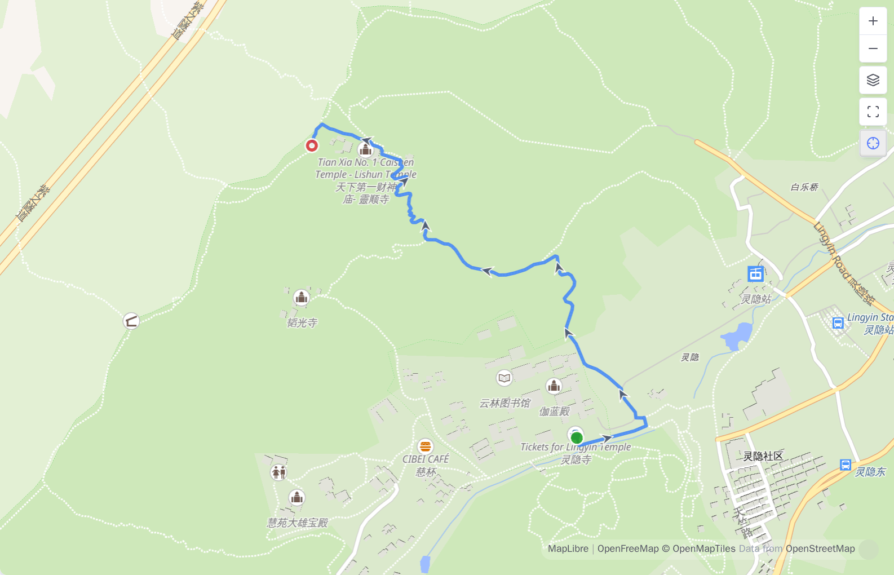
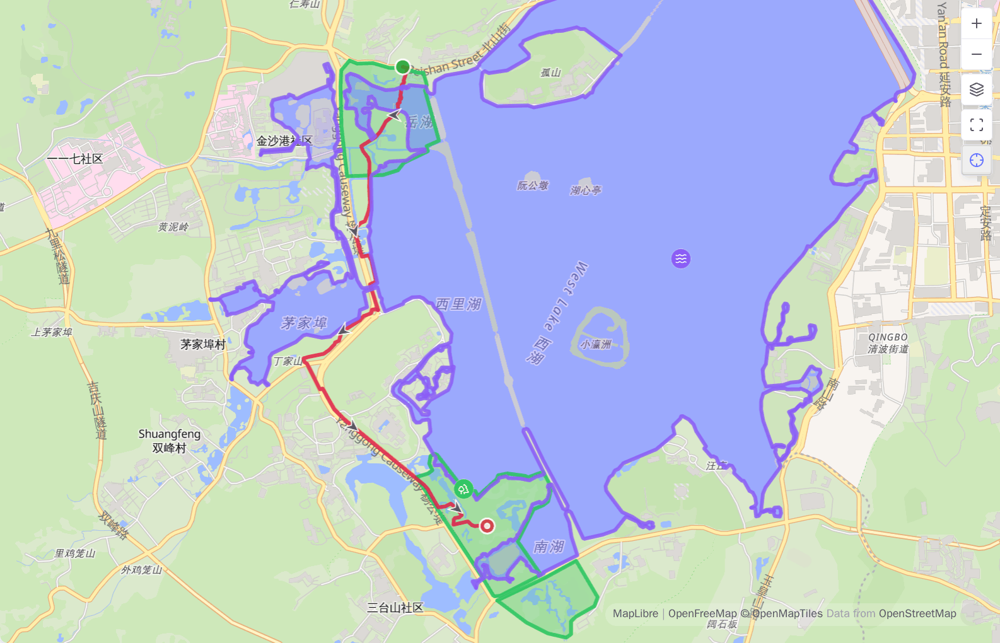
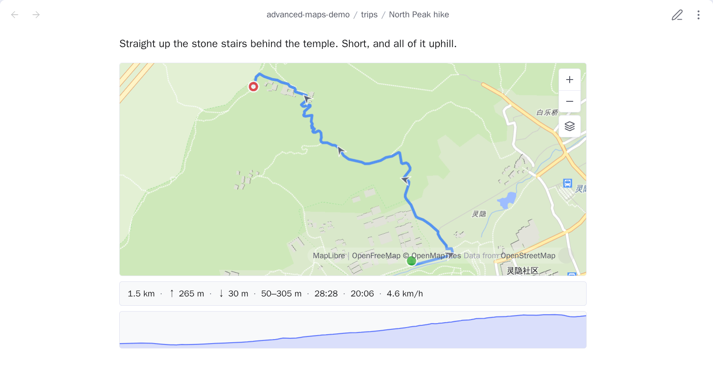
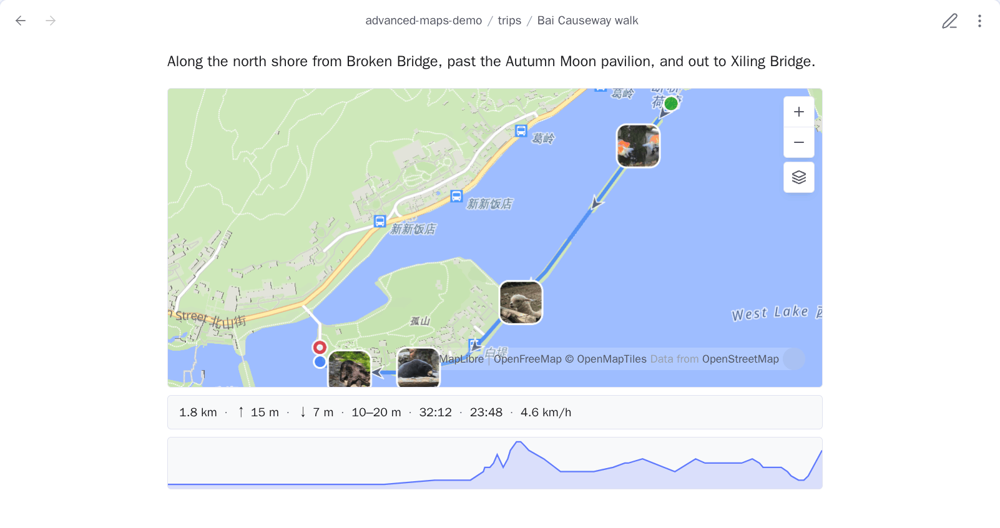
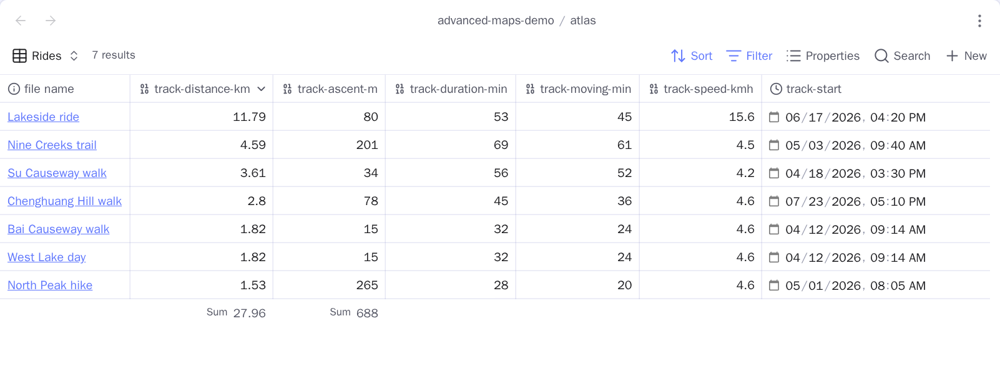

# Tracks and areas

<!-- nav:start -->

**English** · [简体中文](../zh-cn/tracks-and-areas.md) · [Guide index](README.md)

<!-- nav:end -->

Advanced Maps reads GPX, GeoJSON, KML, and TCX files. A track file can be a
direct Base result or be linked from a matched note. Linked files inherit their
owning note's marker colour.

## Draw a route on an existing Base map

Use a normal link—no `!`—when you want the route on the Base map without
creating another map in the note:

```markdown
---
coords: 30.215709,120.130799
---

[[track.gpx]]
```

When the Base includes this note, its map draws the route. A frontmatter link
works the same way:

```yaml
track: '[[track.gpx]]'
```

Use an embed only when you deliberately want a second, inline route map:

```markdown
![[track.gpx]]
```

| Syntax                   | Base or Around map | Inline route map in the note |
| ------------------------ | ------------------ | ---------------------------- |
| `[[track.gpx]]`          | Draws the route    | No                           |
| `track: "[[track.gpx]]"` | Draws the route    | No                           |
| `![[track.gpx]]`         | Draws the route    | Yes                          |

Normal body links, embeds, and file links in frontmatter are resolved
separately and de-duplicated. An actual embed is the only form that creates the
inline map.

## Route markers

Routes get distinct start and end markers, direction arrows, and named
waypoints. **Show track markers** turns these extras off.



## Pointing at a route on a Base map

Hovering a route opens the note's own popup — the same card its pin opens — with
one row added for the thing under the pointer. On a phone, tap the route
instead; the same popup opens, with the same row.

- **A route** adds that one file's distance, climb and elapsed time, labelled
  with the file's own name. A note carrying a morning hike and an afternoon ride
  reports each on its own, rather than summing them into a number that describes
  neither.
- **A named waypoint** adds its name instead. **Show track markers** turns that
  off along with the markers themselves.
- **An area** adds nothing. A boundary is not a distance travelled.

Only the figures a file recorded appear: a GPX with no elevations shows distance
and time, one with no timestamps shows distance and climb. The rest — descent,
elevation range, moving time, pace and the profile — stays under an inline
`![[track.gpx]]`, where there is room for it.

If a note's displayed properties are all empty, the built-in map raises no popup
for it at all, so there is nothing to add a row to. That is its own rule for
pins, and it applies here unchanged.

## GeoJSON and KML areas

GeoJSON and KML can hold an area rather than a route. An area is filled in the
owning note's colour and outlined at the same width, and a hole stays a hole.

An area gets no direction arrows or start/end markers and adds nothing to the
statistics below an inline map. It is also the last thing a click reaches: a
marker, waypoint, or photo inside an area keeps its own click.



## Inline route maps and statistics

An inline `![[track.gpx]]` is a live map with distance, ascent and descent,
elevation range, elapsed and moving time, pace, and an elevation profile.
Missing source data is omitted instead of shown as zero. Hovering the profile
moves a cursor along the route and vice versa. On a phone both directions
answer to a tap: tap the profile and the cursor moves along the route, tap the
route and the profile's readout follows. The reading stays where you put it
until you tap somewhere else, since there is no pointer to leave.



Ascent ignores changes below 5 m to suppress GPS drift. Moving time counts
speeds above 0.9 km/h so slow walking and stairs still count.

**Inline route maps** under settings → **Tracks** decides whether any of this
happens. With it off this plugin claims no track file at all, so an embedded
`![[track.gpx]]` is the embed Obsidian makes of it — the state a vault without
this plugin is in. A note already on screen shows that after you open it again.

An inline track map also draws geotagged photos linked from its host note. Route
statistics continue to describe the route alone.



## Statistics a Base can sort on

Those numbers live in the embed, where no filter can reach them. **Write track
statistics to properties** measures the track files the current note links and
writes the figures into the note's own frontmatter, as numbers:

```yaml
track-distance-km: 13.62
track-ascent-m: 512
track-descent-m: 499
track-lowest-m: 12
track-highest-m: 1850
track-duration-min: 161
track-moving-min: 148
track-speed-kmh: 5.5
track-start: 2024-05-01T09:30
```

| Property             | Unit                           | Source                                    |
| -------------------- | ------------------------------ | ----------------------------------------- |
| `track-distance-km`  | kilometres, 2 decimals         | Every route segment, summed               |
| `track-ascent-m`     | metres                         | Climb past the 5 m noise threshold        |
| `track-descent-m`    | metres                         | The same, downhill                        |
| `track-lowest-m`     | metres                         | Lowest elevation anywhere in the file     |
| `track-highest-m`    | metres                         | Highest                                   |
| `track-duration-min` | minutes                        | Last timestamp minus first                |
| `track-moving-min`   | minutes                        | Intervals above 0.9 km/h                  |
| `track-speed-kmh`    | kilometres per hour, 1 decimal | Distance over moving time                 |
| `track-start`        | local datetime, to the minute  | Earliest timestamp, in this device's zone |

The unit is in the name because a bare number in frontmatter is otherwise
unlabelled. Now a Base can sort a column of rides by distance, filter to
`track-ascent-m > 800`, or total a month. `track-start` stops at the minute for
the same reason: that is the shape Obsidian types as a **Datetime** property,
and with seconds on the end it would be plain text.



Only what the file recorded is written. A GeoJSON route with no elevation and no
timestamps leaves one property; a GPX from a watch leaves all nine. A figure with
nothing behind it this run is removed rather than left saying something the file
no longer says.

Three things worth knowing:

- **It runs when you run it.** Editing a track file afterwards does not rewrite
  the notes that link it — run the command again.
- **A note is one row.** If a note links two track files, one set of properties
  describes both. Distance, climb and moving time add up; `track-duration-min`
  is first stamp to last, so it spans the gap between a morning hike and an
  afternoon ride; and pace is the total distance over the total moving time, so
  pairing a timed GPX with an untimed GeoJSON reads faster than either ride was.
  All of that is exactly what one two-segment file already reports.
- **It owns the names it is currently writing, and nothing else.** Anything
  outside them is never read, written, or removed — and if a name would collide
  with the coordinate or place property, or two figures would share one name, the
  command refuses instead of overwriting anything.

### Choosing which figures are written

Settings → **Tracks** → **Track properties** gives each figure one row: the name
it is written under, and a switch beside it, all nine on to begin with. Turn one
off and the command stops reaching it: nothing is written for it, and a property
already in a note under its name is left exactly where it is — turning a figure
off is a decision about the next write, not permission to delete what you already
have. So a walking log can keep distance and start time and leave the other seven
out of every note it touches.

With every figure switched off there is nothing to write, and the command says
so rather than reporting that it wrote nothing.

### Naming the columns yourself

Each figure's row carries its own name box, greyed out while its switch is off.
**Property prefix**, at the top of the page, decides all of them at once — `ride`
gives `ride-distance-km` and its siblings. A figure's own box decides one, and
what you type there is the whole property name, prefix left out entirely:

```yaml
距离: 13.62
爬升: 512
track-descent-m: 499
```

That is `距离` typed into the distance box and `爬升` into the ascent box, with
descent left empty and so still named from the prefix. Each empty box shows the
name that figure would get, so you can see what leaving it alone means; clearing
a box goes back to that name.

One caveat: renaming a figure does not rename what is already in your notes. The
command only ever touches the names configured now, so the property written under
the old name stays where it is until you remove it — rename first, then measure,
or clean up the old column afterwards.

Linked photos are left out: a photo is one point with no distance, climb, or
duration.
