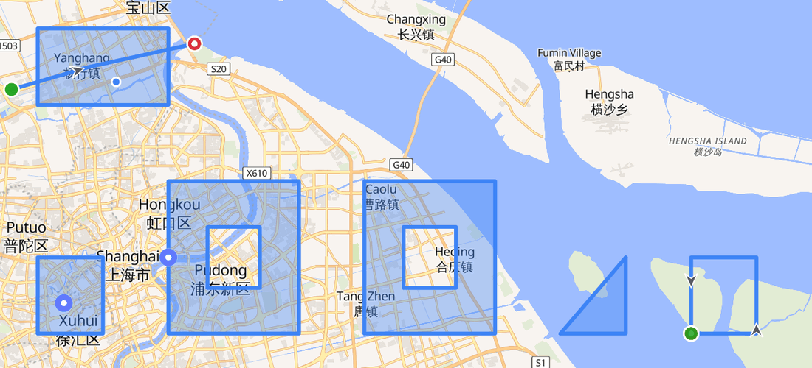
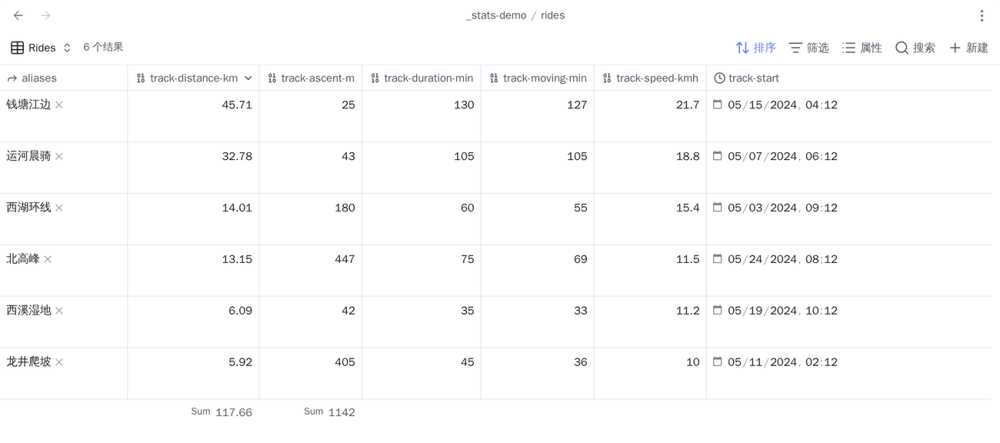

# Tracks and areas

**English** · [简体中文](tracks-and-areas.zh-CN.md) · [Guide index](README.md)

Advanced Maps reads GPX, GeoJSON, KML, and TCX files. A track file can be a
direct Base result or be linked from a matched note. Linked files inherit their
owning note's marker colour.

## Draw a route on an existing Base map

Use a normal link—no `!`—when you want the route on the Base map without
creating another map in the note:

```markdown
---
coords: 30.215709,120.130799
---

[[track.gpx]]
```

When the Base includes this note, its map draws the route. A frontmatter link
works the same way:

```yaml
track: '[[track.gpx]]'
```

Use an embed only when you deliberately want a second, inline route map:

```markdown
![[track.gpx]]
```

| Syntax                   | Base or Around map | Inline route map in the note |
| ------------------------ | ------------------ | ---------------------------- |
| `[[track.gpx]]`          | Draws the route    | No                           |
| `track: "[[track.gpx]]"` | Draws the route    | No                           |
| `![[track.gpx]]`         | Draws the route    | Yes                          |

Normal body links, embeds, and file links in frontmatter are resolved
separately and de-duplicated. An actual embed is the only form that creates the
inline map.

## Route markers

Routes get distinct start and end markers, direction arrows, and named
waypoints. **Show track markers** turns these extras off.


## GeoJSON and KML areas

GeoJSON and KML can hold an area rather than a route. An area is filled in the
owning note's colour and outlined at the same width, and a hole stays a hole.

An area gets no direction arrows or start/end markers and adds nothing to the
statistics below an inline map. It is also the last thing a click reaches: a
marker, waypoint, or photo inside an area keeps its own click.



## Inline route maps and statistics

An inline `![[track.gpx]]` is a live map with distance, ascent and descent,
elevation range, elapsed and moving time, pace, and an elevation profile.
Missing source data is omitted instead of shown as zero. Hovering the profile
moves a cursor along the route and vice versa.


Ascent ignores changes below 5 m to suppress GPS drift. Moving time counts
speeds above 0.9 km/h so slow walking and stairs still count.

An inline track map also draws geotagged photos linked from its host note. Route
statistics continue to describe the route alone.


## Statistics a Base can sort on

Those numbers live in the embed, where no filter can reach them. **Write track
statistics to properties** measures the track files the current note links and
writes the figures into the note's own frontmatter, as numbers:

```yaml
track-distance-km: 13.62
track-ascent-m: 512
track-descent-m: 499
track-lowest-m: 12
track-highest-m: 1850
track-duration-min: 161
track-moving-min: 148
track-speed-kmh: 5.5
track-start: 2024-05-01T09:30
```

| Property             | Unit                           | Source                                    |
| -------------------- | ------------------------------ | ----------------------------------------- |
| `track-distance-km`  | kilometres, 2 decimals         | Every route segment, summed               |
| `track-ascent-m`     | metres                         | Climb past the 5 m noise threshold        |
| `track-descent-m`    | metres                         | The same, downhill                        |
| `track-lowest-m`     | metres                         | Lowest elevation anywhere in the file     |
| `track-highest-m`    | metres                         | Highest                                   |
| `track-duration-min` | minutes                        | Last timestamp minus first                |
| `track-moving-min`   | minutes                        | Intervals above 0.9 km/h                  |
| `track-speed-kmh`    | kilometres per hour, 1 decimal | Distance over moving time                 |
| `track-start`        | local datetime, to the minute  | Earliest timestamp, in this device's zone |

The unit is in the name because a bare number in frontmatter is otherwise
unlabelled. Now a Base can sort a column of rides by distance, filter to
`track-ascent-m > 800`, or total a month. `track-start` stops at the minute for
the same reason: that is the shape Obsidian types as a **Datetime** property,
and with seconds on the end it would be plain text.



Only what the file recorded is written. A GeoJSON route with no elevation and no
timestamps leaves one property; a GPX from a watch leaves all nine. A figure with
nothing behind it this run is removed rather than left saying something the file
no longer says.

Three things worth knowing:

- **It runs when you run it.** Editing a track file afterwards does not rewrite
  the notes that link it — run the command again.
- **A note is one row.** If a note links two track files, one set of properties
  describes both. Distance, climb and moving time add up; `track-duration-min`
  is first stamp to last, so it spans the gap between a morning hike and an
  afternoon ride; and pace is the total distance over the total moving time, so
  pairing a timed GPX with an untimed GeoJSON reads faster than either ride was.
  All of that is exactly what one two-segment file already reports.
- **It owns its prefix and nothing else.** **Track property prefix** in the
  settings decides the names, `track` by default. Anything outside that prefix is
  never read, written, or removed — and if the prefix would collide with the
  coordinate or place property, the command refuses instead of overwriting it.

Linked photos are left out: a photo is one point with no distance, climb, or
duration.
