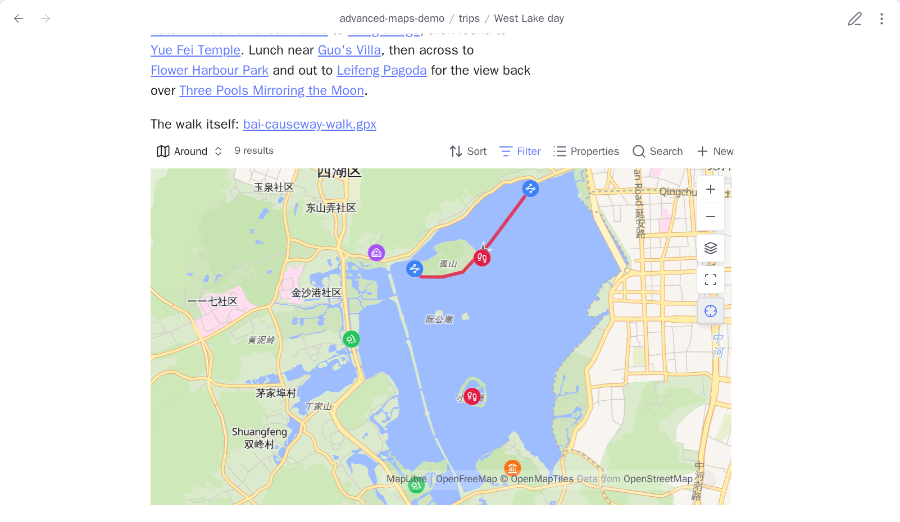
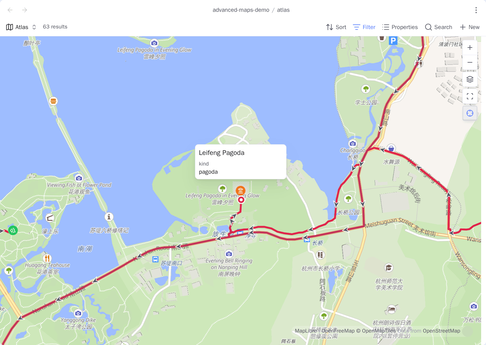
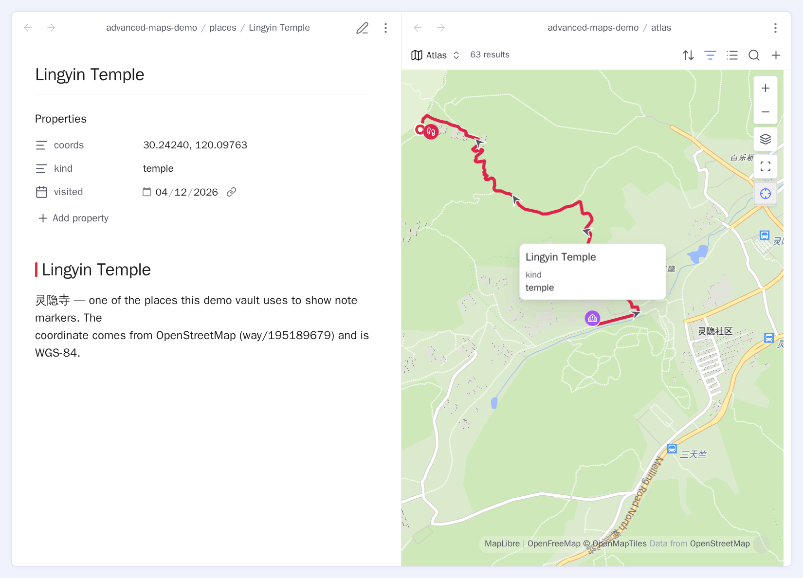
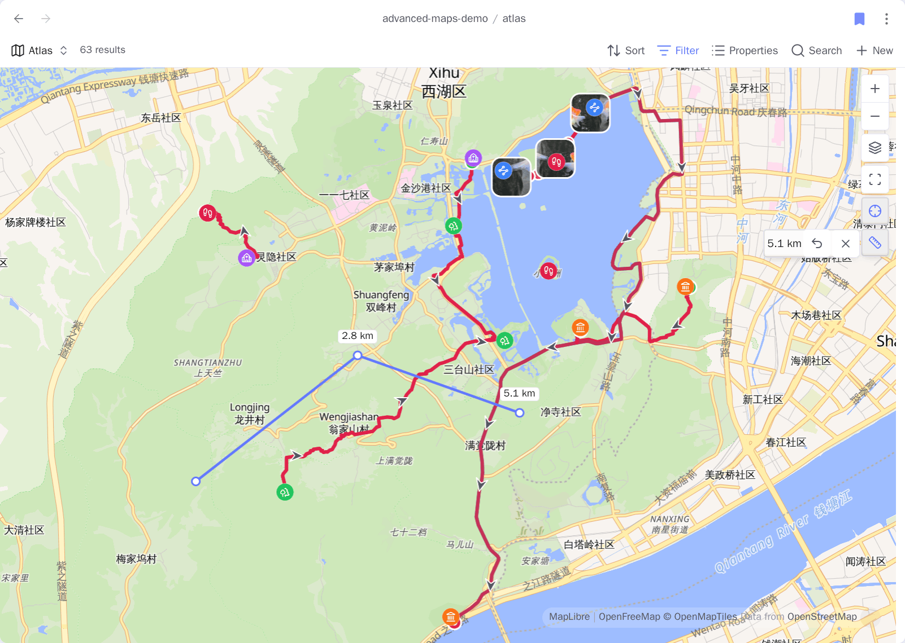

# 周围视图与导航

<!-- nav:start -->

[English](../en/around-and-navigation.md) · **简体中文** · [指南首页](README.md)

<!-- nav:end -->

配置好一个 Base，就能让它同时驱动相关笔记的内嵌地图、在完整集合中打开笔记，以及跟随
你切换的笔记。

## 只显示本篇周围的笔记

先在 Advanced Maps 设置的**在地图中打开**里选好复用的 **Base 文件路径**，再运行**插
入本篇相关笔记的地
图**。命令会按需向该 Base 添加「周围」地图视图，并插入：

```markdown
![[places.base#周围]]
```

这个视图只保留：

- 放置嵌入的本篇笔记；
- 本篇链接到的笔记；
- 链接到本篇的笔记。

这些命中笔记所链接的轨迹和照片随后照常绘制。一篇旅行索引可以简单到：

```markdown
# 西湖周末

[[断桥]]
[[雷峰塔]]
[[灵隐寺]]
[[weekend.gpx]]

![[places.base#周围]]
```

`weekend.gpx` 没有 `!`，所以正文只有一张周围地图，GPX 线画在这张地图上，不会在链接下
面再生成第二张地图。



周围视图取「关联关系」与 Base 全局筛选条件的交集。被 Base 排除的笔记不会被周围视图强
行带回来。嵌入还保存了视图名；如果重命名视图，已有嵌入也要同步修改。

## 一个 Base，处处复用

在 Advanced Maps 设置 →**在地图中打开**里指定一次 **Base 文件路径**和**视图名称**。
同一个 Base 随后驱
动「在地图中打开」、跟随当前笔记和周围嵌入。

| 问题                         | 由什么决定                                         |
| ---------------------------- | -------------------------------------------------- |
| 哪些笔记或直接照片文件参与？ | Base 筛选器                                        |
| 笔记图钉长什么样？           | Base 公式和地图视图的**标记图标**/**标记颜色**选项 |
| 笔记坐标在哪个属性？         | 地图视图的**坐标**属性                             |

## 在地图中打开

带坐标属性（默认 `coords`）的笔记，菜单里会出现**在地图中打开**。它打开配置好的 Base，
把镜头移到这篇笔记并弹出气泡。

**打开方式**可以选择普通标签页——直接打开 Base 文件本身，在地图上改动的视图选项会被
保存；也可以选择弹窗——不打乱当前布局，但改动没有地方写回去。



## 跟随当前笔记

按下「缩放到全部」旁边的 ⊹，这张地图就会跟随你切换的笔记。它保留当前缩放，也不会改写
Base 查询。

设置 →**地图按钮**里的**新地图默认跟随**决定刚打开的地图上这个按钮朝哪边；地图关掉后不
会记住。同一页把**跟随当前笔记**关掉，按钮就没了——已经开着的地图和之后再开的都一样。



## 测距

按下 ⊹ 下面的尺子按钮，地图就变成一把尺。点一下放一个点，第一个之后的每个点旁边都会
标上从起点算起的距离；虚线的那一段跟着鼠标走，标的是加上它之后的总数，而尺子按钮旁边
展开的那个读数只算已经放下的点。

↺ 或 **Backspace** 撤销上一个点。再按一次尺子，读数会收起来，测量本身还留在地图上；再按
一次又展开，显示的是到那时为止量到的数。收着的时候照样可以继续点。

✕ 或 **Esc** 才是收起尺子。全程不写任何笔记，收起时这次测量就没了。

从来不量距离？在设置 →**地图按钮**里关掉**测距**，尺子按钮就一起没了。



尺子拿出来的时候，点击就归它：点在图钉上是加一个点，而不是打开那篇笔记，也不会弹出气
泡挡住正在量的地面；双击是放两个点，而不是放大。

把鼠标挪到地图上已有的点附近，那个点上会出现一个圈：笔记的图钉、轨迹的途经点或起终点
图钉、照片的位置，或者这次测量里自己早先放下的点。这时点击，落下的是那个东西自己的坐
标，而不是你能点中的那个像素——「这篇笔记离那张照片多远」因此是准的，一圈路线也能正
好收在起点上。刚放下的那个点不会被吸附，因为从一个点量到它自己不是测量。按住 **Alt**
再指、再点，就完全不吸附，量的就是那块地面本身。

量的是你点的那几个地点之间的大圆距离，不是沿路走的长度——要后者就把路线画成轨迹，读
[它的数据](tracks-and-areas.md)。在国内底图上，尺子量的是偏移瓦片背后真实的坐标，所以
中途换底图，测量结果不会跟着变。

## 位置重合的图钉

近距离下，完全相同坐标的笔记会散成一圈，让每个图钉都能单独悬停和打开；缩小后又合回真
实的共享位置。笔记不会被写入，复制坐标的结果也不会变化。**散开位置重合的图钉**可以关
闭它。
