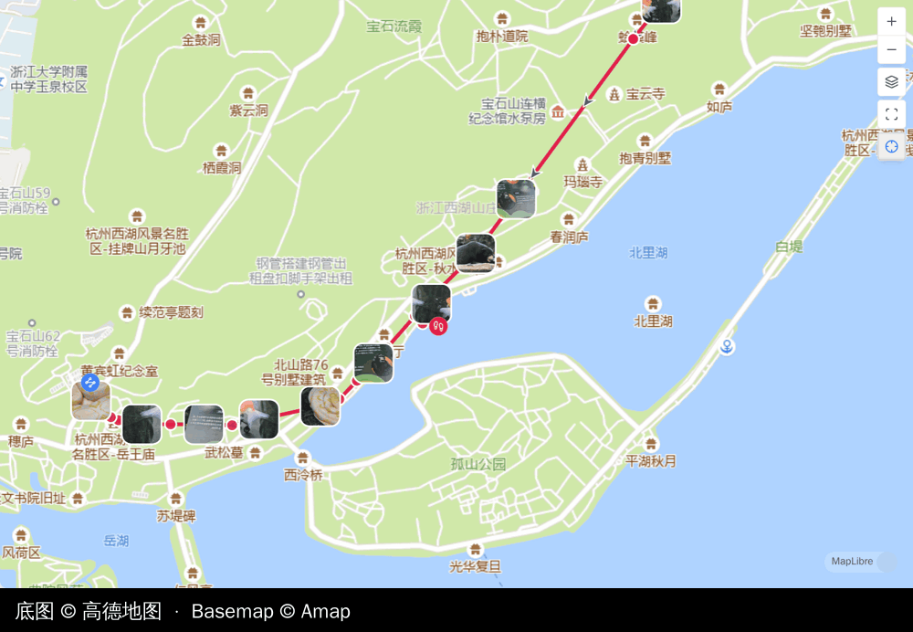
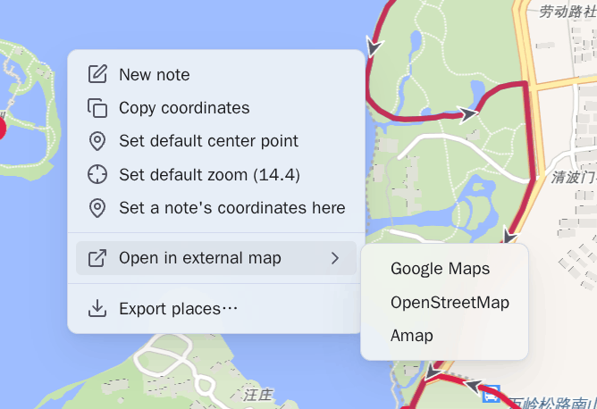
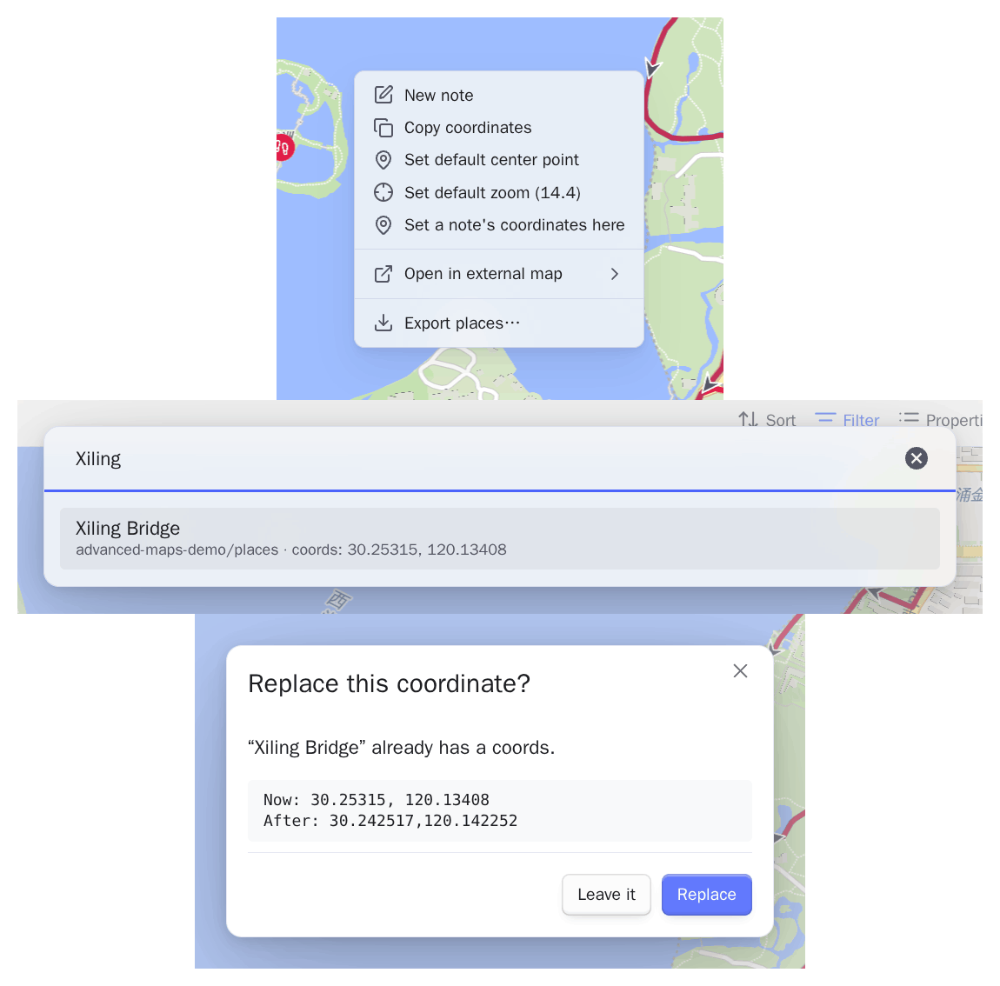
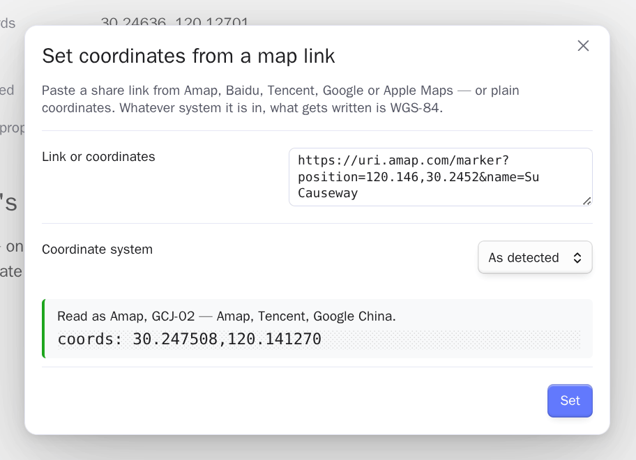
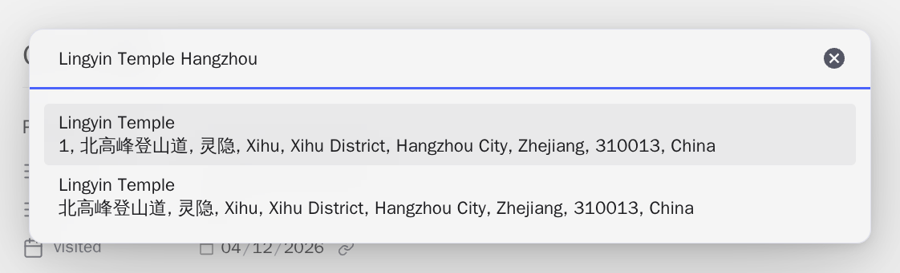

# 坐标与地图服务

<!-- nav:start -->

[English](../en/coordinates-and-services.md) · **简体中文** · [指南首页](README.md)

<!-- nav:end -->

## 坐标系

库里的坐标和支持的轨迹文件始终保持 WGS-84。**自动**会识别常见国内瓦片服务，只在地图
边界换算为 GCJ-02 或 BD-09。可以全局指定默认值，也可以在代理 URL 隐藏了服务商时，按
视图强制指定。



## 在其他地图应用里打开

右键地图，选择**用外部地图打开**。高德、百度、腾讯、Google、Apple Maps 和
OpenStreetMap 会收到各自真正期望的坐标系。内置服务可以排序或关闭，自定义 URL 可以使
用 `{lat}` 和 `{lng}`：

```text
https://ul.waze.com/ul?ll={lat},{lng}&navigate=yes      WGS-84
https://uri.amap.com/marker?position={lng},{lat}        GCJ-02
om://map?v=1&ll={lat},{lng}                             WGS-84
```

`waze://`、`iosamap://` 这类应用协议在装了对应 App 的设备上同样可用。坐标系需要明写而
不是猜测：国内服务商的镜像域名看上去和普通站点没有区别，猜错也不会报错，只会把图钉放
到隔壁几条街。



## 给已经写好的笔记落点

地图右键菜单可以在点击处新建一篇笔记，**把某篇笔记的坐标设成这里**是它的另一半：笔记
几个月前就写了，只是没坐标，而你现在正看着它该在的位置。

在那个位置右键，选这一项，再挑笔记。每一行会显示所在目录，笔记已经有坐标的话还会显示
那个值——模糊匹配在被采纳之前就能核对，而不是之后。选中没有坐标的笔记会直接写入；选中
已经有坐标的，会先把旧值和新值一起摆出来，因为属性没有撤销。

模板不会出现在列表里，目录取自核心**模板**插件里配置的那个。模板不是一个地点，坐标写
进去之后，以后由它生成的每一篇笔记都会带上。

只写坐标属性。如果这篇笔记不在那张地图自己的查询范围里，图钉不会出现——那是 Bases 的
筛选，不是失败——两种情况下通知都会说清写的是哪篇笔记、写进了什么。



## 从地图链接填写坐标

**从地图链接设置坐标**认识常见国内外分享链接、`geo:` URI、Plus Code、度分秒和普通
`lat,lng`，会先预览并始终写入 WGS-84。

Plus Code —— 形如 `8FVC9G8F+6W`，直接粘贴或粘 `plus.codes` 链接都行 —— 按 WGS-84
读取，这是该格式本身的定义。指不到单个地点的码会被拒绝并说明原因：`9G8F+6W` 这种简
写码丢掉了说明它在世界哪一片的那几位，`8FVC0000+` 这种补位码指的是几公里见方的一片
区域。



## 搜索与反向地理编码

- **搜索地点并设置坐标**可以使用开放的全球服务，也可以使用你自己的高德 key。
- **从坐标填写地名**把当前坐标反向解析到指定地名属性。



搜索和反向解析会把查询发送给选中的服务商。哪些内容会离开库、服务商 key 可以存在哪
里，见[参考与隐私](reference-and-privacy.md)。

## 设备定位

**用当前位置填写坐标**向操作系统询问位置，桌面端和移动端都可用，也不需要任何 API
key。打开**启用定位**后，存在但为空的 `coords:` 可以自动填写，已有值绝不会被覆盖；
**跳过路径包含**（默认 `templates`）保证模板里的空值仍然是空的。
