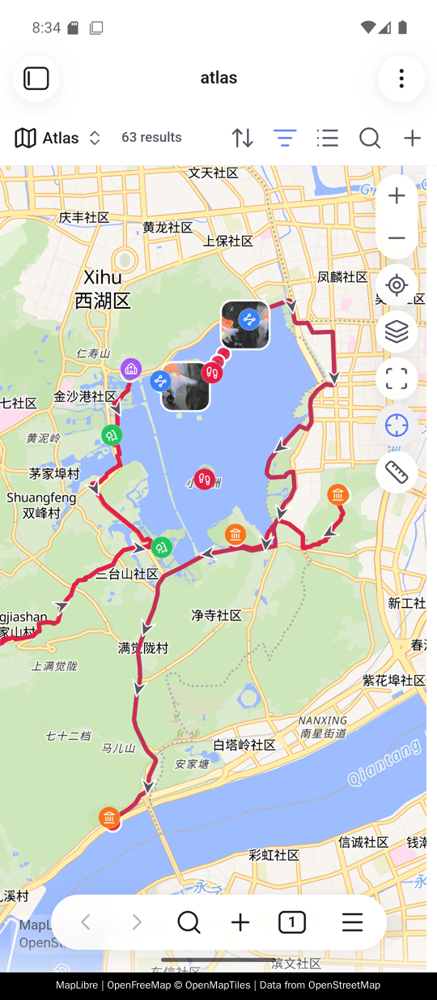
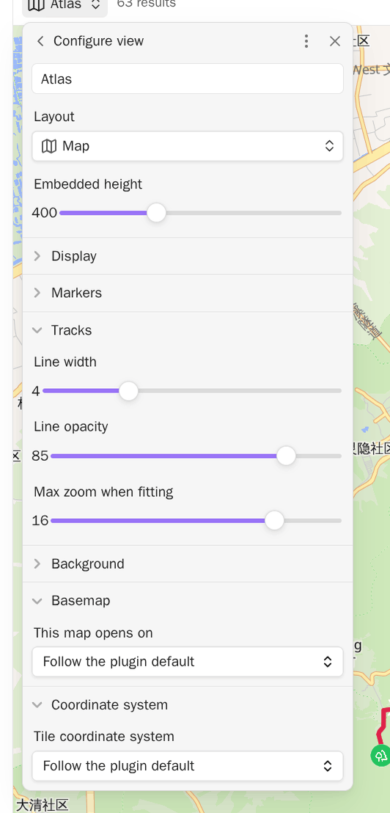

# 快速开始

<!-- nav:start -->

[English](../en/getting-started.md) · **简体中文** · [指南首页](README.md)

<!-- nav:end -->

Advanced Maps 把 Obsidian 的 Maps 视图变成照片相册和轨迹地图。装好插件，让一个
Base 选中一些笔记或照片，地图就出现了。这一页带你走完这两步，最后还有一份可以直接
复制的 base 文件。

## 环境要求

> [!IMPORTANT]
> 需要 Obsidian 1.13.1 或更高版本，并启用 **Bases** 和内置的 **Maps** 插件。
> Advanced Maps 是在这个 Maps 视图上做增强，不替换它：地图本身、控件、图钉、气泡
> 和各种视图选项仍然由 Maps 提供。找不到 Maps 视图时，增强功能会被跳过，Obsidian
> 本身照常可用。

## 安装

Advanced Maps 已经上架 Obsidian 的社区插件市场。

1. 打开 **设置 → 第三方插件**。
2. 如果 Obsidian 正处于**安全模式**，先关掉它。Obsidian 会先说明第三方插件能在你的
   设备上做什么，再请你允许它们。
3. 在**社区插件市场**这一行点**浏览**，搜索 `Advanced Maps`。
4. 点**安装**，再点**启用**。

市场页面也可以在网页上看：
[community.obsidian.md/plugins/advanced-maps](https://community.obsidian.md/plugins/advanced-maps)。

<details>
<summary>安装市场里还没有的版本</summary>

- **Release：**从 [Releases](https://github.com/Jin1c-3/obsidian-advanced-maps/releases)
  下载 `main.js`、`manifest.json` 和 `styles.css`，放进
  `<库>/.obsidian/plugins/advanced-maps/`，然后启用插件。
- **BRAT：**添加 `Jin1c-3/obsidian-advanced-maps` 作为测试版插件。

</details>

打开**设置 → Advanced Maps**，设置首页顶部会显示已安装的版本和一句话更新摘要。
下方的历史记录默认折叠，展开后可以补看旧版本的摘要；完整更新记录链接提供详细说明。

## 在手机上

手机端画出的是同一张地图：带图标和颜色的笔记图钉、带方向箭头的 GPX、GeoJSON、KML
和 TCX 轨迹、摆在拍照位置上的照片缩略图、卷尺，以及带统计和高程剖面的
`![[track.gpx]]` 内联地图。



手机没有鼠标，所以本指南里有两个词在手机上要换个做法。

- 凡是写**右键**的地方，用**长按**。地图自己的菜单这样打开，文件列表里某个文件的
  菜单也是。
- 凡是写**悬停**的地方，**点一下**。点轨迹会打开气泡，点高程剖面会移动游标。有两
  处比悬停走得更远：点笔记的图钉是直接打开那篇笔记，而不是先给你看一眼；点照片是
  直接打开照片本身，**打开笔记**在照片里面。

[离线底图](offline-basemap.md)在手机上一样画得出来，读的是设备自己存储里的瓦片。

## Base 怎样变成地图

Base 是 Obsidian 里用来收集文件的一种文件：你写筛选条件，它把命中的笔记和文件显示
成表格或地图。筛选条件就是地图的边界——它选中什么，什么才可能出现在地图上。

Advanced Maps 再往上加东西。命中一篇笔记，就带上这篇笔记链接的轨迹和照片。照片或
轨迹文件本身也可以直接成为 Base 结果；整目录的照片相册就是这样来的。

下面是完整的 `.base` 文件。把它作为 `相册.base` 保存到库根目录，替换两个目录路径，
打开文件并切换到地图视图。之后仍然可以在 Bases 界面继续改筛选条件和视图选项。

```yaml
filters:
  or:
    - file.inFolder("places")
    - file.inFolder("assets/onedrive/Pictures")
views:
  - type: map
    name: 相册
    coordinates: coords
    trackWeight: 4
    trackOpacity: 85
    fitMaxZoom: 16
```

第一个分支取一个目录里的笔记，把每篇笔记的 `coords` 属性变成一个图钉。这个属性写在
笔记的 frontmatter 里，也就是笔记开头那段属性。第二个分支直接取照片文件，支持 JPG、
JPEG、PNG、WebP、HEIC、HEIF 和 AVIF。

这里的「所有照片」准确地说是**所有带位置的照片**。相机把位置写在照片内部，这就是
EXIF 数据。没有位置的照片仍然留在 Base 结果里，但地图上不会有它的图钉——不会为它编
一个位置。有位置、但内嵌缩略图用不了的照片，仍然会有一个普通圆点。

## Advanced Maps 添加的视图键

示例里的后三个键，是 Advanced Maps 追加到 Bases 界面**轨迹**和**坐标系**分组下的
选项。省略时由插件设置决定。

| 键             | 视图中的选项 | 作用                     |
| -------------- | ------------ | ------------------------ |
| `trackWeight`  | 线宽         | 轨迹线画多粗             |
| `trackOpacity` | 线条透明度   | 轨迹线有多透明           |
| `fitMaxZoom`   | 自动缩放上限 | 自动取景最多放大到哪一级 |
| `coordSystem`  | 瓦片坐标系   | 留空则跟随插件默认值     |



## 接下来

- [照片地图](photo-maps.md)：显示整个照片目录，或显示笔记链接的照片。
- [轨迹与区域](tracks-and-areas.md)：选择普通链接还是内联地图。
- [周围视图与导航](around-and-navigation.md)：配置一份供笔记导航复用的 Base。
- [坐标与地图服务](coordinates-and-services.md)：修掉偏了几条街的底图，或把某个地点
  交给其他地图应用打开。
