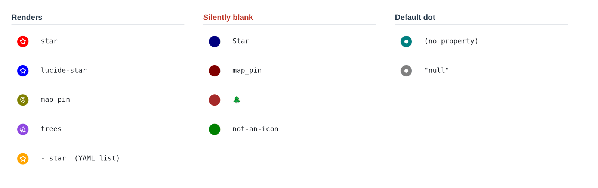

# 给 Bases 地图的图钉设置图标和颜色

<!-- nav:start -->

[English](../en/marker-icons-and-colors.md) · **简体中文** · [指南目录](README.md)

<!-- nav:end -->

**Marker icon** 和 **Marker color** 是 Obsidian 第一方 Maps 视图自带的选项，不属于
Advanced Maps。不装本插件它们照样能用，装了本插件也不会改动它们。

本页整理这两个选项各自接受什么值、哪些图标名画得出来、哪些会静默画成空心圆，以及
怎么用 Base 公式统一驱动它们。基础用法 Obsidian 官方在
[Maps 插件的示例库](https://github.com/obsidianmd/obsidian-maps/tree/main/examples)
里给了一份完整例子。

## 选项在哪

打开一个 Base，切到地图视图，点视图名，展开 **Markers**。

两个选项填的都是**属性**，不是字面值。任何笔记属性或 Base 公式都行，只要它的值能
当纯文本读。

| 选项             | 填什么                               | 期望的值                                                 |
| ---------------- | ------------------------------------ | -------------------------------------------------------- |
| **Marker icon**  | `note.icon`、`formula.我的图标` 之类 | [Lucide 图标库](https://lucide.dev/icons/)里的一个图标名 |
| **Marker color** | `note.color` 之类                    | 任何合法的 CSS 颜色值                                    |

两个属性都不设的笔记也有图钉：一个填了 `--bases-map-marker-background`（地图的默认
图钉色）的圆，中间一个小圆点。

## 画得出来的图标名，和静默画不出来的

图标名必须和 Lucide 自己的拼写**完全一致**。不一致时，既不会报错，也不会退回小圆
点——你得到的是一个**什么都没有的实心圆**，控制台里也不会有任何输出。



| 属性里的值                     | 结果                                       |
| ------------------------------ | ------------------------------------------ |
| `star`                         | Lucide 的 `star` 图标                      |
| `lucide-star`                  | 同一个图标——`lucide-` 前缀是被接受的       |
| `map-pin`                      | Lucide 的 `map-pin` 图标                   |
| 只有一项 `star` 的 YAML 列表   | `star` 图标——单项列表会按它自己的文本读取  |
| `Star`                         | **空心圆**——名字区分大小写                 |
| `map_pin`                      | **空心圆**——Lucide 用 `-` 连词，从不用 `_` |
| `🌲`                           | **空心圆**——emoji 不是图标名               |
| 任何 Lucide 没有的名字         | **空心圆**                                 |
| 属性缺失或为空                 | 默认的小圆点                               |
| 字面量文本 `null`、`undefined` | 默认的小圆点                               |

所以空心圆是"名字拼错了"的症状，小圆点是"值没填"的症状。看一眼图钉就知道错在哪。

## 颜色

**Marker color** 的值原样交给 CSS，所以 CSS 认得的写法都能用：

```yaml
color: red
color: '#e03131'
color: rgb(224 49 49)
color: var(--color-purple)
```

`var()` 颜色是按当前主题解析的，所以它自己就会跟着亮色/暗色模式变。想和 Obsidian
其余部分保持一致，用它自带的强调色和颜色变量最省事。

CSS 解析不了的值同样不会报错。`not-a-color`、`#zzz`，以及指向一个不存在的变量的
`var()`，最后都会解析成**主题的正文文字颜色**——亮色主题下是接近黑的图钉，暗色主题
下是接近白的。所以图钉变成一个突兀的纯色，说明是拼写错了；属性没填是另一回事，那
会给你默认的蓝色。

图钉**内部**的图标颜色不是按笔记走的。所有图标统一用
`--bases-map-marker-icon-color` 画，一张地图一个值，可以用 CSS 片段改：

```css
.workspace-leaf-content[data-type='bases'] {
  --bases-map-marker-icon-color: #fff8e7;
}
```

## 用公式驱动

这两个选项填属性而不是填值，就是为了能接公式。有了公式，笔记本身可以一个图标都不存。

按另一个属性判断：

```js
if(note.rating >= 4, "star", "circle")
```

从链接的笔记继承，这样改一篇类型笔记就能重设所有指向它的图钉：

```js
list(type)[0].asFile().properties.icon;
```

然后把公式选成对应属性。写进 `.base` 文件是这样：

```yaml
formulas:
  Rated icon: if(note.rating >= 4, "star", "circle")
views:
  - type: map
    name: Map
    coordinates: note.coordinates
    markerIcon: formula.Rated icon
    markerColor: note.color
```

公式也是修数据的办法。如果有些笔记已经写成了 `Star` 或者一个 emoji，写一条把这些值
映射到真实 Lucide 名的公式，就能一次修好所有图钉，一篇笔记都不用改。

## 装了 Advanced Maps 之后

Advanced Maps 是往原生地图上加图层，不替换原生图钉。你的图标和颜色仍然由 Obsidian
按你配置的样子绘制。有两点值得知道：

- 会重叠的笔记图钉会散开成环，每个图钉保留自己的图标和颜色。散开只是屏幕上的偏移，
  图钉存的坐标不会变；**Fan out overlapping pins** 可以关掉它。见
  [周围视图与导航](around-and-navigation.md)。
- 照片缩略图和轨迹线是各自独立的图层，所以一个 Base 里同时放笔记、照片和 GPX，三者
  都会显示，而你的图钉不受影响。

## 图钉不对劲的时候

| 现象                     | 原因                                                    |
| ------------------------ | ------------------------------------------------------- |
| 实心圆，里面什么都没有   | 图标名不是 Lucide 的名字。检查大小写，以及 `-` 和 `_`。 |
| 本该有图标，却是个小圆点 | 这篇笔记的属性是空的，或者解析成了 `null`。             |
| 一个突兀的近黑或近白图钉 | 颜色值不是合法 CSS，被解析成了主题的文字颜色。          |
| 所有图钉一个颜色         | **Marker color** 没设，所有图钉都用了地图默认色。       |
| 改完笔记没有任何变化     | 属性写了，但没在 **Markers** 里选上。                   |

以上均针对第一方 Maps 插件 0.2.2 实测。
