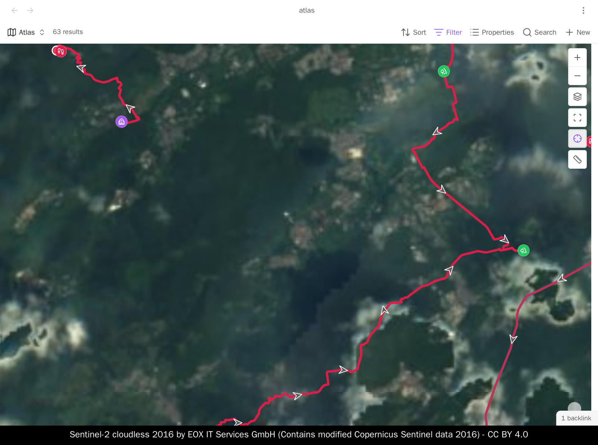
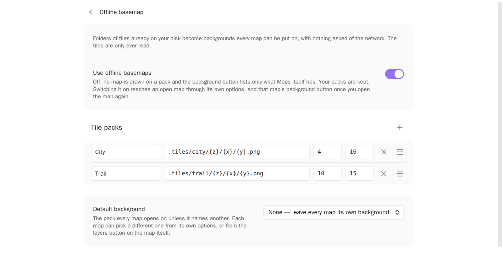
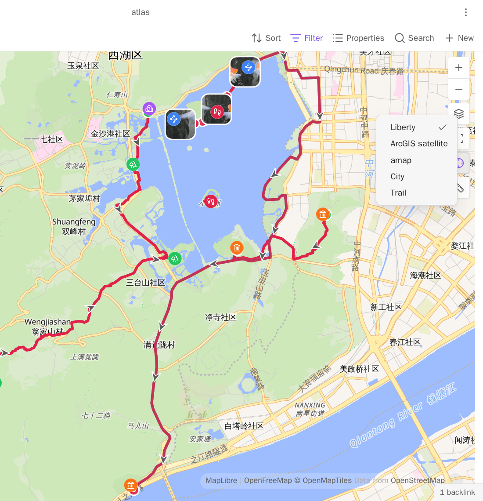
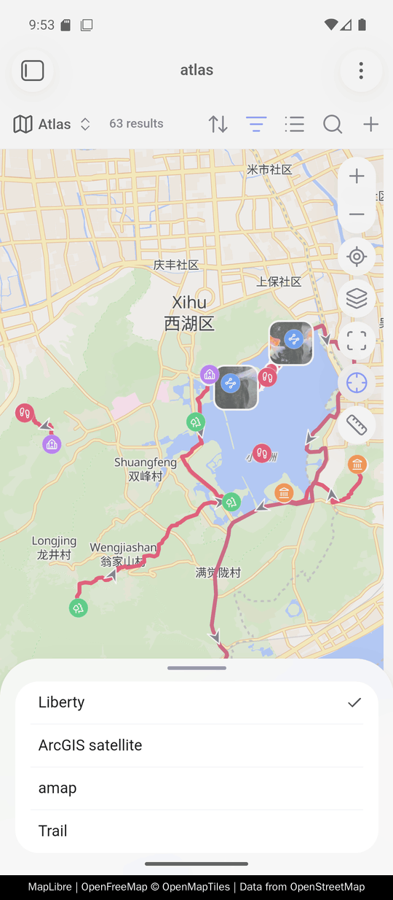

# 离线底图

<!-- nav:start -->

[English](../en/offline-basemap.md) · **简体中文** · [指南目录](README.md)

<!-- nav:end -->

把地图指向磁盘上已有的一整套瓦片，笔记底下那层地图就不再需要网络了。其他部分本来就
是离线的 —— 笔记、轨迹、照片和缩略图都是仓库里的文件 —— 所以这是最后一块。



可以配不止一套。一份瓦片总是有地域的，所以有一套的人往往有两套：常住的城市，和常走
的那条路线。每套起一个名字，靠名字来选。

Advanced Maps **不下载瓦片**。批量抓取某家服务商的瓦片是人家授权的事，不是这个插件
替你决定的事。这里做的只是指向你已经有的那套瓦片，然后读它。

## 什么算一套瓦片

一个按 `z/x/y` 排布的图片文件夹，也就是所有滑动地图的寻址方式：

```text
tiles/
  6/
    52/
      25.png
      26.png
  7/
    104/
      50.png
```

能解压成这个形状的都可以。单文件的 `.mbtiles` 或 `.pmtiles` 目前还不行。`.pmtiles`
正在做，卡住它的是 Obsidian 安卓端的一个 bug，不是格式本身。在它落地之前，先把压缩
包解成目录树，解出来的就是一套瓦片。

> [!WARNING]
> 每套瓦片都要放在**索引不到的地方**——一份区域瓦片动辄十万个文件，被索引了会拖慢
> 搜索、链接和你所有的 Base。下面两种摆法都能避开索引；怎么选，取决于插件设置会不
> 会在设备之间同步。

| 你的设置       | 瓦片放在               | 路径写                   |
| -------------- | ---------------------- | ------------------------ |
| 只在这一台     | 这台机器上任何位置     | 绝对路径                 |
| 在设备之间同步 | 仓库里一个点开头的目录 | `.tiles/{z}/{x}/{y}.png` |

路径只有一个字符串，设置一旦同步，每台设备读到的就是同一条——而绝对路径只可能在你敲它
的那台机器上是对的。点开头的目录绕开的正是这一点：名字以点开头的目录 Obsidian 会跳
过，和它跳过 `.obsidian` 一样，所以这些瓦片不会被索引、不会被搜到、不会成为任何 Base
的结果，文件列表里也看不见；而同一条相对路径，每台设备都对着自己的仓库去解析。

设置不同步的话，这里就没有要解决的问题——每台设备各写各的绝对路径就好。手机上具体长什
么样，见[在手机上](#在手机上)。

## 添加一套

**设置 → 第三方插件 → Advanced Maps → 离线底图。**

第一行是**使用离线底图**，除非你在这个版本之前就配过瓦片包，否则它**默认是关的**。先
把它打开：关着的时候下面那些瓦片包只显示、不能输入，因为没有地图会去画的瓦片包，这一
页也没有理由继续收。之后再关掉，配过的每一套都原样留着。

打开之后点**添加瓦片包**，一行四个框：

| 框       | 填什么                                                      |
| -------- | ----------------------------------------------------------- |
| 名称     | 你想叫它什么 —— `城区`、`步道`。之后就是靠这个名字选它      |
| 瓦片路径 | `/home/you/tiles/{z}/{x}/{y}.png`，也就是你的文件的寻址形状 |
| 最低层级 | 这套瓦片的 `z` 目录里编号最小的那个                         |
| 最高层级 | 编号最大的那个                                              |

路径可以是绝对路径，也可以相对于仓库。`{z}`、`{x}`、`{y}` 会逐块替换；TMS 行序排布
的瓦片用 `{-y}` 也认。

> [!WARNING]
> 这里填的是文件系统路径，不是 URL。插件会在建地图的时候把它变成 URL —— 因为那个
> URL 需要的前缀每次启动 Obsidian 都会重新生成，手写的 URL 能用到下次重启为止。

列表下面的**默认底图**，是所有地图在没有另行指定时打开就用的那一套。保持在**不用**，
你配好的瓦片就只是配着、随时可选，在你主动选之前不会改变任何一张地图。



每套起一个自己的名字。名字相同的两套，对所有引用它的地方来说就是同一套，后一套会被
略过。

一行没法被指向的时候，它自己会在几个框下面说出来：名字和另一行重了、填了路径却没名
字、路径少了三个占位符之一。这样的行会留在原地等你改，改好之前哪儿都不会提供它。

### 那两个层级

它们就是这套瓦片两端的文件夹名字，各挡住一种不同的问题：

- **最高层级**约束瓦片本身。再往里放大时，地图会把已有的最深瓦片放大接着画，而不是
  去要根本不存在的文件。填小了会损失本来有的清晰度；填大了地图会为超出范围的每一块
  瓦片默默发一次读取失败。
- **最低层级**约束镜头。往外缩到这里就停住，而不是变成空白 —— 因为你最低那层之上没
  有东西可以放大了。

如果这套瓦片覆盖 `z0`–`z14`，就填 0 和 14。每套各带自己的一对；地图当下画的是哪一套，
就被哪一套约束。

## 在地图上直接切换

你配的瓦片包会出现在地图自己的**图层**按钮里 —— 右上角那个叠起来的方块，也就是 Maps
插件列它自己那些底图的同一个菜单。每套按你起的名字排在它们旁边。



选中一套就画它，用的是这套自己的层级边界。选中 Maps 插件的某个底图，地图就换成那个，
而且会一直留在那里：选了什么就是什么，直到你再选一次，中间不会有任何东西把瓦片包重
新垫回来。

图层按钮在有一个以上底图可选时才出现。如果你在 Maps 插件里一个底图都没配，配一套瓦
片就足以让它出现，菜单里还会多一项**默认底图** —— 也就是回到"完全不用瓦片包时这张地
图会画什么"的那条路。

在这里选的，只在这张地图开着的期间有效——本来从这个菜单选底图就是这样。关掉标签页再
打开，地图回到它自己视图指定的那个底图。什么都不会写进文件。

## 按地图区分

地图视图选项里多了**底图**一节，只有一行**这张地图打开时用**，列出所有可选的底图：插
件默认、Maps 插件提供的每一个、以及你的每一套瓦片包。所以同一个 base 文件里，可以一
个视图用城区瓦片，另一个视图走网络。

| 选择                         | 这个视图打开时用什么               |
| ---------------------------- | ---------------------------------- |
| 跟随插件默认设置             | **默认底图**指的那一套             |
| 不用，保留这个视图自己的底图 | 完全不用瓦片包时这张地图会画的东西 |
| 某个底图或某套瓦片包         | 就是它                             |

视图自己的**地图瓦片**设置从来不会被改写。瓦片包是在建地图的那一刻替换进去的，所以在
某个视图上选"不用"，那个视图原本配的东西会原样回来，没有什么需要撤销。

如果某个视图指的那套瓦片你后来改了名或删了 —— 或者一个在别的仓库里写好的 base 文件，
指的是这个仓库没有的底图 —— 地图会退回到"不用瓦片包会画的东西"，而那一行会把话说明
白：`步道 —— 已不存在`。不会有东西悄悄变成别的东西。

内联 `![[route.gpx]]` 地图没有自己的视图选项，跟随插件默认。

## 坐标系

本地路径里没有服务商域名，所以**自动**会把这套瓦片当成 WGS-84 —— 对绝大多数基于
OpenStreetMap 的瓦片来说这是对的。如果你这套是从国内服务商那里解包来的，它是
GCJ-02，而自动模式看不出来：在设置 →**坐标系**里说明，或者用视图自己的**瓦片坐标系**
选项。见[坐标与地图服务](coordinates-and-services.md)。

## 在手机上

同一份设置，在 Obsidian 手机端画同样几套瓦片，上面那两种摆法一样成立，图层按钮里也一
样能切。不用另填一个手机端的路径。



**设置不同步。** 给手机写它自己的绝对路径，比如
`/sdcard/Download/tiles/{z}/{x}/{y}.png`，也就是文件管理器给你看的那个。安卓上推荐这一
种：瓦片就放在手机本来存大文件的地方，跟仓库不发生任何关系。

**设置要同步。** 那就所有设备统一用 `.tiles`，包括这台手机。手机上要是拿到的是桌面端
那条绝对路径，地图画出来只有一片背景色和你自己的图钉——路径是解析出来了，瓦片根本不在
那儿，而且没有任何提示告诉你。

把瓦片包弄到手机上这一步本插件插不上手：一根数据线，或者本来就在搬你这个仓库的那个同
步工具。

这是在安卓上实测的。地址是问正在运行的应用要的，不是照着平台名拼出来的，所以 iOS 理
应也能用；但没有测过，本页也就不这么说。

## 什么都没画出来的时候

地图变成一片背景色，图钉和轨迹还在。按顺序检查：

1. **路径。** 要填到瓦片本身，含 `{z}/{x}/{y}` 和扩展名，不是它们上面那层文件夹。把
   数字代进去 `ls` 一下；那个文件不在，瓦片就不在。
2. **扩展名。** `.png`、`.jpg`、`.webp` 都行，但必须是你的文件实际用的那个。
3. **两个层级。** 最低层级比地图当前位置还深，镜头会被顶住；最高层级填成 0，整个世
   界就只剩一块瓦片。
4. **是哪一套。** 地图现在画的可能是另一套 —— 打开图层按钮看哪一项打着勾，或者看视图
   的**这张地图打开时用**那一行。

## 关掉之后

关掉就是一台没有瓦片包的机器该有的样子，而且是真的关：这个功能没有一点会碰到地图。
Maps 插件自己的底图按钮列出的就是 Maps 自己那几个——因为它手上拿着的就是 Maps 自己那个
列表。要把你的瓦片包塞进那个菜单，就得把一个由本插件维护的列表交给那个按钮；这样一来，
你在 Maps 设置里新加的底图，要等下一次配置重载才会进到已经打开的地图的菜单里，而不是
下次点开菜单就有。这个开关，就是让你可以不接受这笔交换。

地图自己的视图设置里也不再有**本图使用的底图**那一行。Base 文件里已经写着的瓦片包名字
原样留在文件里、没人去读；等你重新打开这个开关，它又算数了。

重新打开时，已经开着的地图在那一行里立刻能选。地图上的底图按钮要等你重开这张地图才跟
上——按钮手上的列表是建图那一刻交给它的，只交一次。

## 这个功能会动什么

什么都不动。瓦片只被打开读取，不会被写入、移动或删除，也没有任何一步会去服务商那里
抓瓦片。你的瓦片包出现在 Maps 插件自己的菜单里，但不会被写进它的设置。地图在画瓦片
包的时候，完全不向网络发瓦片请求 —— 什么东西会离开仓库，见[参考与隐私](reference-and-privacy.md)。
