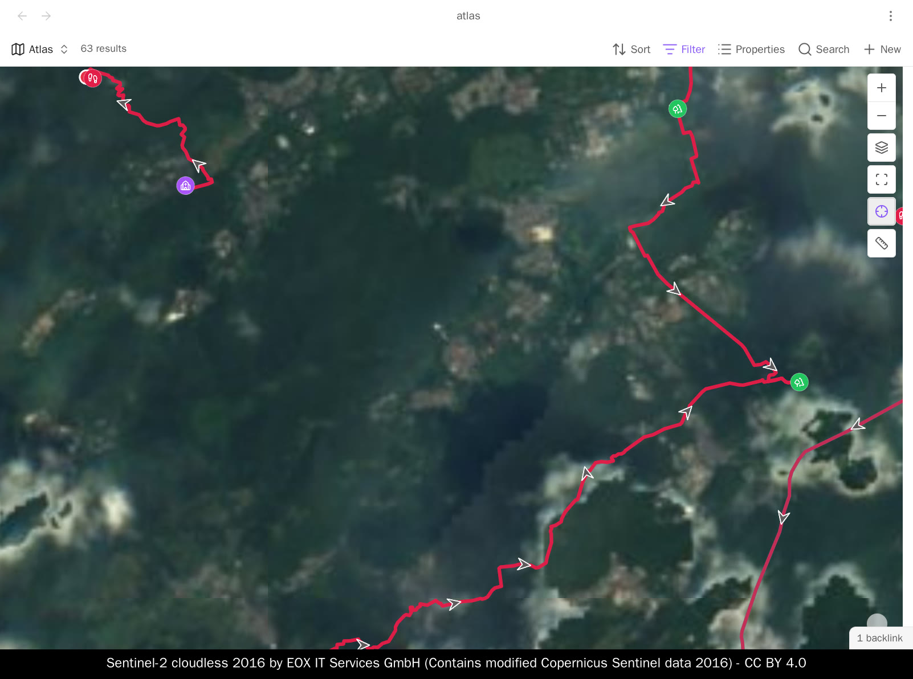
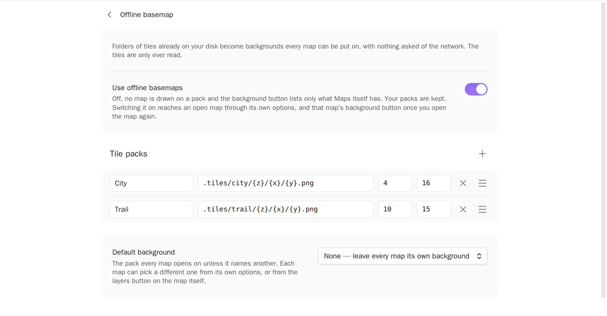
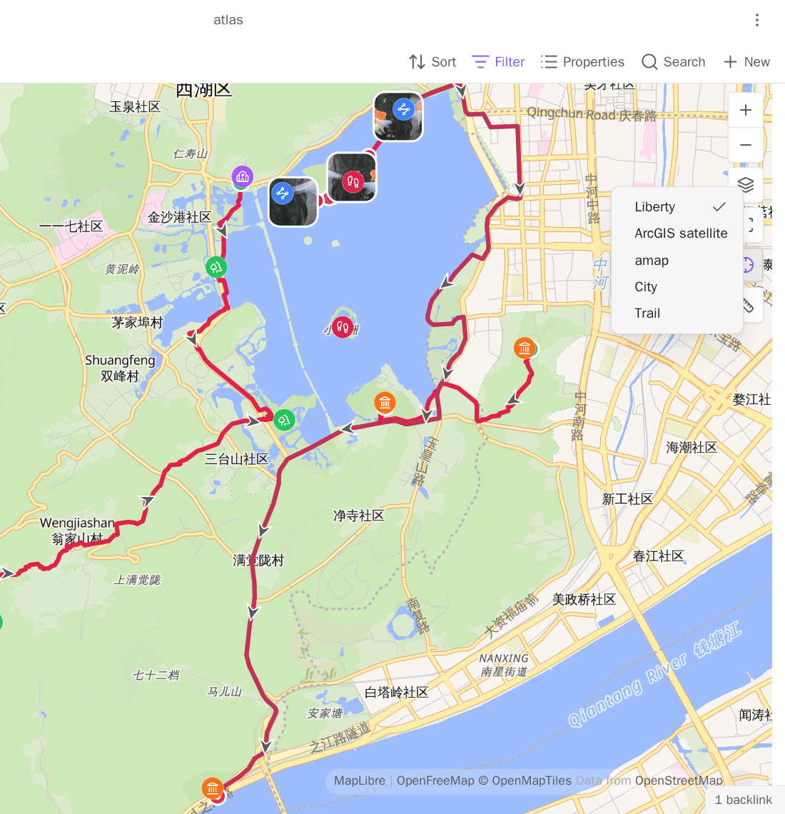
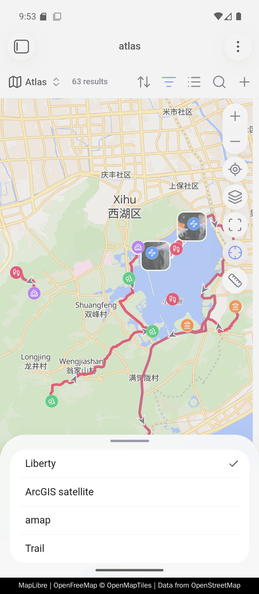

# 离线底图

<!-- nav:start -->

[English](../en/offline-basemap.md) · **简体中文** · [指南首页](README.md)

<!-- nav:end -->

把地图指向磁盘上已有的一批瓦片，笔记下面的那层地面就不再需要网络了。笔记、轨迹和照片
本来就是你库里的文件，所以底图是最后一块。



可以同时配好几套。瓦片包是按地区来的，所以有一套的人通常有两套：自己住的城市，和常走
的那条路线。每套起一个名字，切换时就靠这个名字认。

Advanced Maps 不下载瓦片。批量抓取服务商的瓦片需要服务商许可，不是插件能替你做的
事。它做的是读你已经有的一套。

## 瓦片包是什么

瓦片包就是一个按 `z/x/y` 层级摆好小图片文件的目录：一级目录是缩放级别，二级是列，文
件是行。在线地图都用这种方式给瓦片编号：

```text
tiles/
  6/
    52/
      25.png
      26.png
  7/
    104/
      50.png
```

任何能展开成这个形状的工具都行。单文件的 `.mbtiles` 或 `.pmtiles` 归档目前还不行。
`.pmtiles` 卡在 Obsidian 在 Android 上的一个 bug，不是格式本身的问题。在那之前，把归档
展开成目录树一次，结果就是一个瓦片包。

> [!WARNING]
> 一定要让瓦片包避开库的索引。一个地区的瓦片包动辄十万个文件，被索引之后会拖慢搜索、
> 链接和你的每一个 Base。下面两种放法都能避开这个代价，按你的插件设置是否在设备间同步
> 来选。

| 你的设置         | 瓦片包放哪             | 路径怎么写               |
| ---------------- | ---------------------- | ------------------------ |
| 只在这台设备上用 | 这台设备的任意位置     | 绝对路径                 |
| 在设备间同步     | 库内的一个点开头的目录 | `.tiles/{z}/{x}/{y}.png` |

路径只有一个字符串，所以同步的设置会把同一个字符串交给每台设备，而绝对路径只可能在写它
的那台机器上是对的。点开头的目录就是绕开这件事的办法：Obsidian 会跳过名字以点开头的目
录，就像跳过 `.obsidian` 一样，所以瓦片永远不会被索引、不会被搜索、不会成为 Base 结
果，也不会出现在文件列表里；而每台设备会用自己的库去解析这同一个相对路径。

如果你的设置不搬家，那就没什么要解决的：给每台设备各写一个绝对路径。手机上的做法见
[在手机上](#在手机上)。

## 添加一套瓦片包

打开**设置 → 第三方插件 → Advanced Maps → 离线底图**。

第一行是**使用离线底图**。除非你这个版本之前就配过瓦片包，它默认是**关**的。先把它打
开：关着的时候，下面那些瓦片包会显示但改不了，因为不会有地图去画它们。之后再关掉，每
套瓦片包都原样留着。

它下面的**添加瓦片包**会给出一行四个框：

| 框名         | 填什么                                              |
| ------------ | --------------------------------------------------- |
| 名称         | 你想叫它什么——`城市`、`徒步`。切换时认的就是它      |
| 瓦片路径     | `/home/you/tiles/{z}/{x}/{y}.png`——你文件的摆放方式 |
| 最低缩放层级 | 这套瓦片包的 `z` 目录中最小的那个数字               |
| 最高缩放层级 | 最大的那个数字                                      |

路径可以写绝对路径，也可以相对库写。`{z}`、`{x}`、`{y}` 会按瓦片逐个填入；按 TMS 行序
摆放的瓦片包用 `{-y}` 也可以。

> [!WARNING]
> 要填的是文件系统路径，不是 URL。插件在建地图时会把它变成 URL，因为那个 URL 需要的前
> 缀每次 Obsidian 启动都会重新生成——手写的 URL 能用到下次重启，然后就失效了。

列表下方的**默认底图**决定每张地图打开时用什么背景，除非某张地图自己指定了。留成
_无_，那几套瓦片包就配着、可选，但不会改变任何一张地图，直到你主动去选。



每套瓦片包都要有自己的名字。重名的两套会被当成一套，第二套被忽略。

某行暂时用不了时，框下面会直接说明原因：名字和别的行重复、有路径没名字，或者路径少了
三个占位符之一。这一行会留在原处等你改，改好之前不会出现在任何可选列表里。

### 两个缩放层级

它们就是这套瓦片包两端的目录名，各挡一种问题。

- **最高缩放层级**限制的是瓦片本身。放大越过它时，地图继续画，把已有的最深那层瓦片放
  大，而不是去找不存在的文件。填低了，你会丢掉本来有的清晰度；填高了，越过末尾的每个
  瓦片都是一次失败的读取。
- **最低缩放层级**限制的是镜头。往小缩到它附近时，地图会停在那里而不是变成空白，因为
  比最低层级更外的范围没有东西可放大。

一套瓦片包覆盖 `z0` 到 `z14`，就填 0 和 14。每套各有自己的一对，当前画哪套，就受哪套的
限制。

## 在地图上切换

你的瓦片包会出现在地图自己的**图层**按钮里——右上角那叠方块，也就是 Maps 插件列自己
背景的那个菜单。每套瓦片包按你起的名字排在里面。



选一套就画它，同时套用它的缩放范围。选 Maps 插件的某个背景，地图就改用那个，并且一直
用着，直到你再选一次；不会有东西悄悄把瓦片包塞回你底下。

有多个背景可选时，图层按钮才会出现。如果你在 Maps 插件里没有配背景，那么一套瓦片包就
足以让它出现，菜单里还会多出一项**默认底图**——回到「不用瓦片包时地图本来会画的样子」
的入口。

在这里做的选择只在地图显示期间有效。关掉标签页再打开，地图回到它视图里指定的背景。
不写任何文件。

## 按地图分别指定

地图视图选项里的**底图**分区有一行**这张地图打开时用**，列出所有可选背景：插件默认、Maps
插件提供的每个背景，以及你的每套瓦片包。所以同一个 base 文件里可以有一个视图用城市瓦
片包，另一个走网络。

| 选什么                       | 这个视图打开时用什么背景       |
| ---------------------------- | ------------------------------ |
| 跟随插件默认设置             | **默认底图**指定的那个         |
| 不用，保留这个视图自己的底图 | 不用瓦片包时地图本来会画的样子 |
| 某个背景，或某套瓦片包       | 就是它                         |

视图自己的**地图瓦片**设置不会被覆盖。瓦片包是在建地图时替换进去的，所以在视图上选
_无_，拿回来的正是这个视图原本配好的东西，不需要撤销什么。

如果某个视图指定了你后来改名或删掉的一套瓦片包——或者别的库里写的 base 文件指定了本库
没有的背景——地图会退回不用瓦片包时的背景，这一行也会写明：`徒步 —— 已不再配置`。不会
悄悄变成别的背景。

内联的 `![[route.gpx]]` 地图没有自己的视图选项，所以跟随插件默认。

## 坐标系

本地路径不指向任何服务商，所以**自动**会把瓦片包按 WGS-84 读，这对几乎所有瓦片包（它们
来自 OpenStreetMap）都是对的。如果你的那套是从国内服务商展开出来的，它是 GCJ-02，自动
模式分辨不出来，要在设置 → **坐标系**里说明，或在视图自己的**瓦片坐标系**选项里指定。
见[坐标与地图服务](coordinates-and-services.md)。

## 在手机上

手机端用同样的设置画同样的瓦片包，两种放法同样适用，图层按钮也一样提供它们。没有单独
的移动端要填的行。



**设置只留在本机。**给手机填它自己的绝对路径，比如
`/sdcard/Download/tiles/{z}/{x}/{y}.png`，就是文件管理器显示给你的那种。Android 上应
该选这种：瓦片包放在手机本来存大文件的地方，跟库完全不沾边。

**设置要同步。**每台设备都用 `.tiles`，手机也一样。手机拿到桌面端的绝对路径时，只会在
背景色上画出你自己的图钉——路径是通的，只是那里没有瓦片，而且不会报错说这件事。

把瓦片包弄到手机上要靠你自己：一根线，或者本来就同步你库的那套同步。

手机上的路径是向正在运行的应用问来的，不是按平台名拼出来的。这个结论在 Android 上实测
过。iOS 上同一套瓦片包按理也能画，但 iOS 没有实测；如果画不出来，地图上就是你自己的图
钉加背景色。

## 画不出来的时候

地图会退回背景色，你的图钉和轨迹照常显示。按顺序检查：

1. **路径。**要填到瓦片本身，包含 `{z}/{x}/{y}` 和文件扩展名，而不是它上面那一层。把
   占位符换成真实数字去打开那个文件；文件不在，瓦片就不在。
2. **扩展名。**`.png`、`.jpg`、`.webp` 都可以，但必须是你那些文件真正用的那个。
3. **缩放层级。**最低层级高于地图当前所在级别，会把镜头钉住；最高层级填 0，等于全世界
   只有一个瓦片。
4. **选的是哪一套。**地图可能正在用另一套。打开图层按钮看勾中的是哪一个，或者读这个视
   图的**这张地图打开时用**那一行。

## 关掉之后

关着，就是没有瓦片包的库所处的状态，而且是真关：这个功能的任何东西都不会碰到地图。
Maps 插件的底图按钮里只剩 Maps 自己那几个，因为那份列表本来就是 Maps 的。把你的瓦片包
放进那个菜单，意味着把按钮交给一份由本插件维护的列表；于是你在 Maps 设置里新加的背景
要到地图下次重新加载配置时才生效，而不是下次打开菜单时。这个开关就是为了让你能拒绝这
件事。

地图自己的选项里也没有**这张地图打开时用**这一行了。base 文件里已经写着的那个瓦片包名字留着，
只是不被读取；重新打开开关的那一刻它又算数了。

打开开关会通过上述那一行作用到已经打开的地图上。那张地图的底图按钮要等你重新打开地图
才跟上——按钮只在建地图时被交给一次列表。

## 它动了什么

什么都没动。瓦片包以只读方式打开，不会被写入、移动或删除，这个功能的任何部分都不会从
服务商那里抓瓦片。你的瓦片包只是被放进 Maps 插件自己的菜单里，不会被写进 Maps 的设置。
地图正在画瓦片包时，完全不发出任何网络请求——会离开本机的东西见
[参考与隐私](reference-and-privacy.md)。
