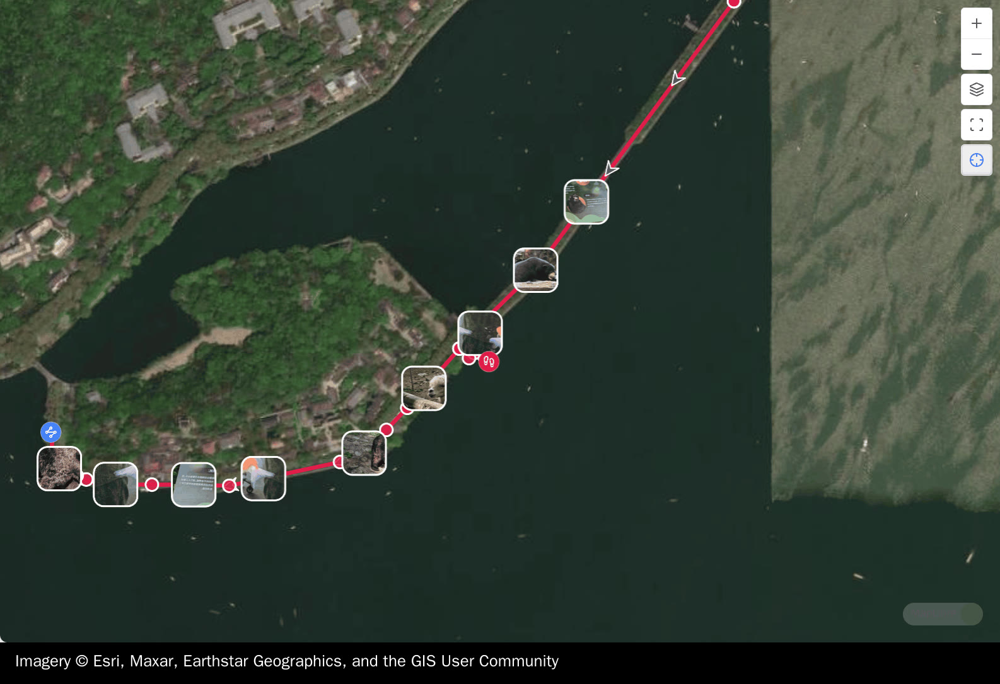
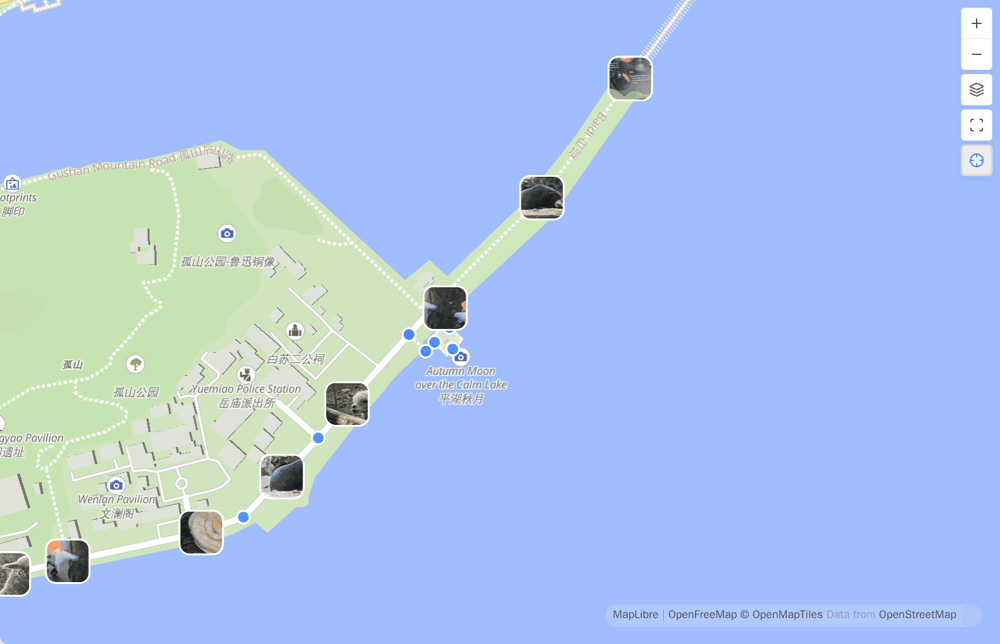
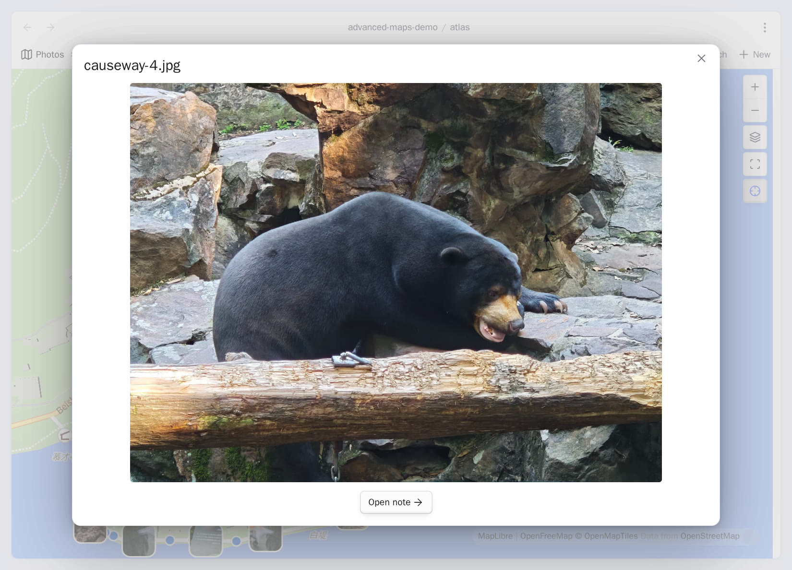

# 照片地图

<!-- nav:start -->

[English](../en/photo-maps.md) · **简体中文** · [指南首页](README.md)

<!-- nav:end -->

照片文件直接成为 Base 结果，或者被命中的笔记链接时，Advanced Maps 都可以把它放到地
图上。两种情况下都只有可读 GPS 标签才会产生位置；插件绝不会编造位置。

## 渲染整个照片目录

可以直接使用[快速开始](getting-started.md)里的完整地图相册配方，也可以给已有 Base
增加一个照片目录分支：

```yaml
- file.inFolder("assets/onedrive/Pictures")
```

JPG、JPEG、PNG、WebP、HEIC、HEIF 和 AVIF 文件可以直接参与。照片只要带 GPS，即使
没有可用的内嵌缩略图，仍会显示为一个圆点。

### 把 OneDrive 等库外相册接进 Obsidian

不用把照片复制进库。在库内建立一个指向外部目录的软链接，让 Obsidian 建立索引，再把这
个库内路径写进 Base 筛选器即可。

macOS 或 Linux：

```bash
mkdir -p "/path/to/MyVault/assets/onedrive"
ln -s "/path/to/OneDrive/Pictures" "/path/to/MyVault/assets/onedrive/Pictures"
```

Windows PowerShell（目录联接通常不需要符号链接可能要求的管理员权限）：

```powershell
$vault = "C:\Users\you\Documents\MyVault"
New-Item -ItemType Directory -Force -Path "$vault\assets\onedrive"
New-Item -ItemType Junction `
  -Path "$vault\assets\onedrive\Pictures" `
  -Target "$env:USERPROFILE\OneDrive\Pictures"
```

重新加载库，再把这个库内路径写进 Base。

这是桌面文件系统配置。每台需要看到相册的桌面设备都要建立对应链接；移动端不能复用桌面
链接。请让云端文件保持本机可读，避免链接形成目录循环，并把源目录当作外部数据：先确认
自己的备份与同步服务如何处理目录链接，不要默认库会覆盖它。Advanced Maps 只读照片，绝
不会修改照片。

## 只渲染命中笔记所链接的照片

不要把照片目录放进 Base，只筛选笔记：

```yaml
filters:
  and:
    - file.inFolder("places")
views:
  - type: map
    name: 地点
    coordinates: coords
    trackWeight: 4
    trackOpacity: 85
    fitMaxZoom: 16
```

然后在命中的笔记里链接照片：

```markdown
---
coords: 30.2600,120.1500
---

[[IMG_1234.jpg]]
[[IMG_1235.heic]]
```

正文普通链接、`![[IMG_1234.jpg]]` 这种嵌入，以及属性里的文件链接都算。同一张解析成功的
照片只参与一次。Base 不需要包含附件目录；只有希望照片本身也显示在笔记里时，才需要加
`!` 做实际嵌入。



## 坐标与显示

照片坐标在库中保持 WGS-84，只在地图边界与笔记图钉、轨迹一起换算到底图坐标系。某台相
机把未标注的坐标写成了非标准格式时，可以用**照片坐标系**强制指定 WGS-84 或 GCJ-02。

缩小地图时，互相碰撞的缩略图会稳定地变稀疏，不会堆成看不清的一团；每张已定位照片仍有
一个圆点。放大后，有空间的缩略图会回来。**显示照片**和**显示照片缩略图**可以
分别关闭这两个图层。



## 打开照片或所属笔记

悬停照片会显示它所属笔记的卡片（如果有），卡片里还会带上这张照片本身的预览，密集的地
图上不用点开就能认出是哪一张。点击会在地图上方打开原图，并提供**打开笔记**；Ctrl/Cmd
点击则在新标签页打开图片文件。

手机上点一下就直接到原图，所以中间那张预览卡片是拿不到的一步。去笔记的路并没有断：
**打开笔记**就在你刚打开的那张照片里。



**从照片填写坐标**可以把同一个 GPS 标签写进当前笔记的 `coords` 属性。

## 照片索引与文件读取

首次扫描每张照片最多只读开头 64 KiB。解析出的坐标、时间、方向和缩略图可用性会被缓
存，之后打开大型相册时，无需再次读取每一个没有变化的文件。

**清空照片索引**只会删除这份可重建缓存。地图继续工作，需要时会重新读取元数据；照片字
节绝不会被修改。
