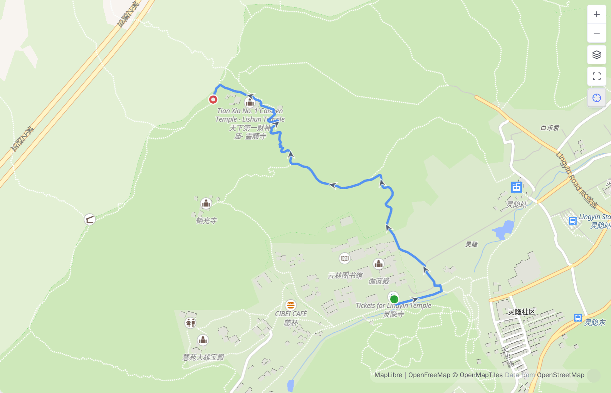
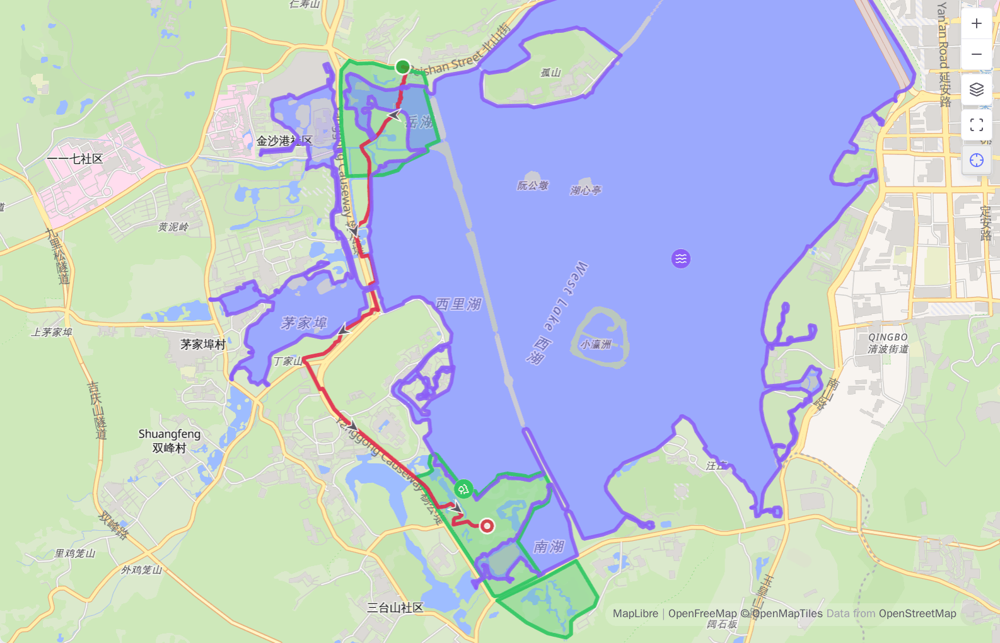
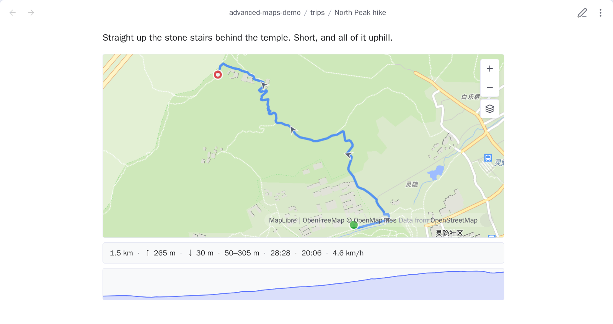
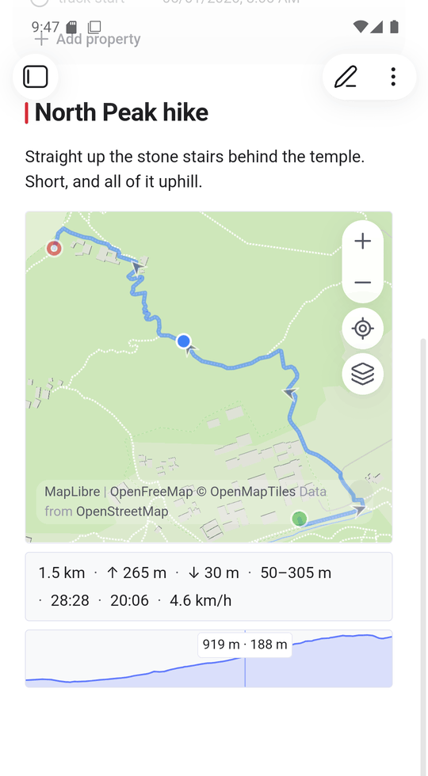
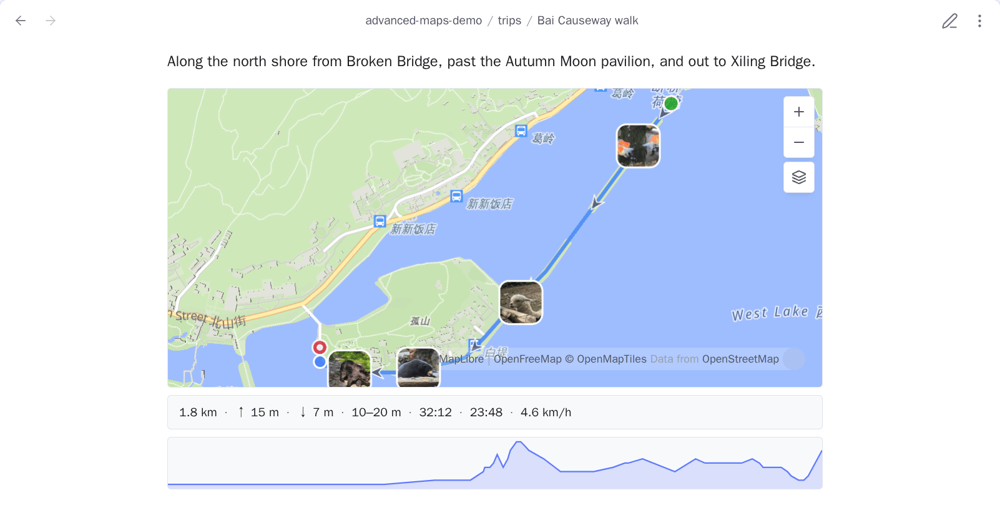
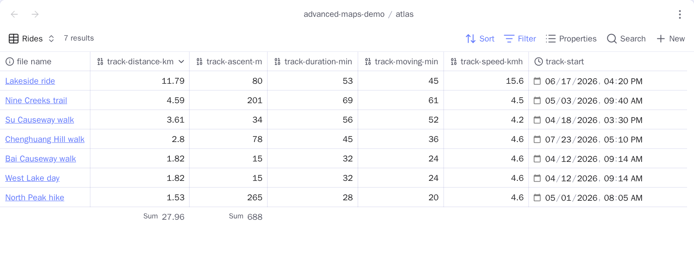

# 轨迹与区域

<!-- nav:start -->

[English](../en/tracks-and-areas.md) · **简体中文** · [指南首页](README.md)

<!-- nav:end -->

在笔记里链接一个 GPX、GeoJSON、KML 或 TCX 文件，地图就会把它画出来。轨迹文件也可以自己成
为 Base 的一条结果——Base 是 Obsidian 里的一类文件，把你筛出来的笔记和文件收在一起，用表
格或地图展示。被笔记链接的轨迹文件，用这篇笔记的图钉颜色绘制。

## 把轨迹画在已有 Base 地图上

想让轨迹出现在 Base 地图上、又不想在笔记里再多一张地图，就用普通链接，不加 `!`。下面
的 `coords` 那一行是 frontmatter，也就是笔记顶部的属性区。

```markdown
---
coords: 30.215709,120.130799
---

[[track.gpx]]
```

只要 Base 包含这篇笔记，地图就会画出轨迹。写在属性里的链接也一样：

```yaml
track: '[[track.gpx]]'
```

只有确实想在正文里再放一张轨迹地图时，才用嵌入：

```markdown
![[track.gpx]]
```

| 写法                     | Base 或周围地图 | 笔记里的内联轨迹地图 |
| ------------------------ | --------------- | -------------------- |
| `[[track.gpx]]`          | 绘制轨迹        | 无                   |
| `track: "[[track.gpx]]"` | 绘制轨迹        | 无                   |
| `![[track.gpx]]`         | 绘制轨迹        | 有                   |

正文链接、嵌入和属性里的文件链接会分别读取，然后去重。只有实际的嵌入会创建内联地图。

## 轨迹标记

轨迹带有不同的起点与终点标记、方向箭头和具名途经点；**显示轨迹标记**可以关闭这些附
加元素。



## 在 Base 地图上指着一条轨迹

悬停轨迹会打开这篇笔记自己的气泡——和它的图钉打开的是同一张卡片——卡片里多出一行，说
的是指针底下的那个东西。手机上点一下轨迹，打开的是同一张卡片，多出来的也是同一行。

- **一条轨迹**：加上这一个文件的距离、爬升和总时长，标题就是文件自己的名字。一篇笔记
  里上午一段徒步、下午一段骑行，两个文件各报各的，不会加在一起。
- **一个具名途经点**：改为显示它的名字。**显示轨迹标记**关掉后，名字和标记一起消失。
- **一个面**：什么也不加。面没有距离、爬升和时间可以报。

只有文件真正记录过的项才会出现：没有海拔的 GPX 显示距离和时间，没有时间戳的显示距离
和爬升。其余的——下降、海拔范围、移动时间、配速和高程剖面（沿路线画出的高度曲线）——留
在内联的 `![[track.gpx]]` 里。

如果一篇笔记要显示的属性全为空，内置地图根本不会为它弹出气泡，也就没有可加那一行的气
泡。这是它对图钉本来的规则，这里照旧。

## GeoJSON 与 KML 区域

GeoJSON 和 KML 里装的可以是面，而不是轨迹。面用所属笔记的颜色填充，边界用同样的线宽
描出，洞仍然是洞。

面不带方向箭头，也没有起点终点标记，不计入内联地图下方的统计。点击时它排在最后：落在
面里的图钉、途经点或照片，点击仍然归它们自己。



## 内联轨迹地图与统计

内联的 `![[track.gpx]]` 是一张实时地图，下面显示距离、累计爬升与下降、海拔范围、总时
长与移动时间、配速和高程剖面。源文件没有的数据直接省略，不会显示成 0。悬停剖面时，地
图上的游标会沿轨迹移动；悬停轨迹时，剖面的读数会跟着移动。手机上两个方向都听点击的：
点剖面，游标沿轨迹移动；点轨迹，剖面的读数跟着走。没有指针可以离开，所以读数会一直停
在你点的地方，直到你点向别处。





累计爬升会忽略 5 米以内的变化，GPS 漂移因此不计入；移动时间统计 0.9 km/h 以上的速度，
慢走和爬楼梯仍然算作移动。

这一整套要不要发生，由设置 → **轨迹**里的**内联轨迹地图**决定。关掉之后，`![[track.gpx]]`
显示的就是 Obsidian 自己做的那个文件嵌入。已经打开的笔记要重新打开才会变。

内联轨迹地图还会绘制宿主笔记链接的定位照片。下方统计仍然只描述轨迹本身。



## 能被 Base 排序的统计

上面这些数字只活在嵌入里，任何筛选都够不着。**把轨迹数据写进属性**会统计当前笔记链
接的轨迹文件，把结果作为数字写进这篇笔记自己的属性：

```yaml
track-distance-km: 13.62
track-ascent-m: 512
track-descent-m: 499
track-lowest-m: 12
track-highest-m: 1850
track-duration-min: 161
track-moving-min: 148
track-speed-kmh: 5.5
track-start: 2024-05-01T09:30
```

| 属性                 | 单位                     | 来源                     |
| -------------------- | ------------------------ | ------------------------ |
| `track-distance-km`  | 公里，两位小数           | 所有轨迹段之和           |
| `track-ascent-m`     | 米                       | 超过 5 米噪声阈值的爬升  |
| `track-descent-m`    | 米                       | 同上，下降               |
| `track-lowest-m`     | 米                       | 文件里出现过的最低海拔   |
| `track-highest-m`    | 米                       | 最高海拔                 |
| `track-duration-min` | 分钟                     | 最后一个时间戳减第一个   |
| `track-moving-min`   | 分钟                     | 0.9 km/h 以上的时间段    |
| `track-speed-kmh`    | 公里/小时，一位小数      | 距离除以移动时间         |
| `track-start`        | 本地日期时间，精确到分钟 | 最早的时间戳，按本机时区 |

单位写在属性名里，是因为属性里的裸数字本身不说明自己是什么。这样 Base 就能按距离排
序、筛出 `track-ascent-m > 800`，或者把一个月加起来。`track-start` 只精确到分钟也是同
一个道理：Obsidian 只把这种写法认成**日期时间**属性，后面再加上秒就变成纯文本了。



> [!WARNING]
> 只写文件真有的东西。没有高程也没有时间戳的 GeoJSON 只留下一个属性，同时带有高程和
> 时间戳的 GPX 则可以写满九项。以后再次运行命令时，某个已开启的数据项如果算不出来，
> 旧属性会被删除，避免留下过期值。

三件需要知道的事：

- **它只在你运行时运行。**之后再改轨迹文件，不会自动回头改写链接它的笔记——再运行一
  次即可。
- **一篇笔记就是一行。**笔记链接两个轨迹文件时，一组属性描述两者。距离、爬升和移动时
  间相加；`track-duration-min` 是首尾时间戳之差，因此会把上午徒步和下午骑行之间的空档
  也算进去；配速是总距离除以总移动时间，所以一个带时间的 GPX 配上一个没有时间的
  GeoJSON，读出来会比实际快。这两段装在同一个文件里时，报出来的也是同样的数字。
- **它只管当前正在写的这些名字。**这些之外的属性它从不读、不写、也不删；如果某个名字
  正好撞上坐标属性或地名属性，或者两项数据用了同一个名字，命令会拒绝执行，而不是覆盖
  过去。

### 挑要写哪几项

设置 → **轨迹** → **轨迹属性**里，每项数据占一行：它写出来叫什么，旁边一个开关，九项
默认全开。关掉某一项，命令就完全够不着它了：不会为它写任何东西，笔记里已经按它的名字
写好的属性也原样留着。关掉一项决定的是下一次怎么写，不是去删已经有的东西。一本走路的
流水账关掉七项之后，就只写距离和出发时间。

全部关掉时就没什么可写了，命令会直接这么说，而不是报告自己写了 0 个属性。

### 自己给这些列起名

每项数据那一行上都有自己的名字框，开关关掉时它是灰的。页面顶上的**属性前缀**一次决定
所有——填 `ride` 就是 `ride-distance-km` 那一套。某一行自己的框决定它自己，而且你填进
去的就是完整的属性名，前缀不再往前面拼：

```yaml
距离: 13.62
爬升: 512
track-descent-m: 499
```

这是在「距离」那一行填了 `距离`、「爬升」那一行填了 `爬升`，而下降那一行留空，所以仍
然按前缀命名。留空的框里会显示这一项将会用的名字，好让你看清留空意味着什么；把框清空
就回到那个名字。

有一点要注意：改名不会去改笔记里已经写好的东西。命令只碰当前配置的这些名字，所以按旧
名字写进去的属性会一直留在那儿，要自己删——要么先改名再统计，要么事后清理掉旧的那一
列。

链接的照片不参与统计：一张照片只有一个点，没有距离、爬升和时长。
